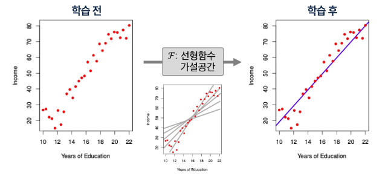

### AI, ML, DL의 정의
AI(Artificial Intelligence): 주어진 환경/데이터를 인지, 학습, 추론을 통해 목표를 달성하도록 예측, 행동 선택, 계획하는 시스템

ML(Machine Learning): AI 범주 내에서 데이터로부터 학습하여 목적을 달성하는 접근 방법론
- 언어 모델, 이미지 분류 모델, 추천 시스템

DL(Deep Learning): ML 범주 내에서 신경망(Neural Network)함수를 사용한 학습 방법론

AI - ML(ML이 아닌 AI 시스템)의 예
- 규칙 기반 시스템
- 휴리스틱 기반(최적화) 알고리즘

### 데이터와 학습의 이해
#### 데이터 구성 요소(Feature/Label)
데이터의 중요성: 머신러닝은 규칙을 직접 코딩하지 않고, 데이터에서 규칙을 학습
- 데이터(Feature, Label)의 분포와 관계가 머신러닝의 학습 결과를 결정

Feature(피쳐, 특성)
- 모델이 예측에 사용하는 입력정보
- 예측, 판단의 근거/단서

Label(라벨, 목표값)
- 모델이 예측하려는 정답
- 학습의 목표값

#### ML 실생활 예시
1. 유튜브 추천
- Feature: 영상들의 정보(장르, 크리에이터, 조회수), 사용자 정보(시청 이력, 구독채널)
- Label: 영상에 대한 사용자 피드백(시청 여부, 좋아요 여부)

2. 스팸메일 분류
- Feature: 메일 제목, 발신자, 단어 빈도
- Label: 스팸/ 정상

### 단일 피쳐 기반 학습
#### 1D 피쳐 기반 학습
1D 피쳐 기반 학습
- 1D: 1차원
- Feature가 하나일 때 머신러닝이 학습하는 가장 단순한 형태

income = f*(미지의 참 함수, Years of Education) + ε(측정 오차)
- 데이터셋 D: 30명의 Years of Education(피쳐)와 Income(라벨) 쌍

미지의 함수(f*)
- Feature와 Label 사이의 실제 평균 관계
- 하지만 직접 관측할 수 없음
- 오차가 포함된 데이터(점)만 관측 가능

측정 오차(ε)
- 데이터에는 주로 측정 오차가 섞여 있음
- 원인: 측정 기기의 한계, 환경적 요인 등
- 따라서, 데이터 = 참 함수 + 오차(f* + ε)

#### 모델과 가설공간
학습(Learnig)
- 입력(Feature) → 출력(Label) 관계를 찾는 과정
- 평균 관계를 하나의 함수로 표현함
- 하지만 관계를 표현할 수 있는 함수는 무수히 많음

가설 공간(Hypothesis Space)
- 관계를 표현할 수 있는 모든 후보 함수들의 모음
- 피쳐 공간과 라벨 공간위에서 정의된 함수들의 집합 F

모델(Model)
- 가설 공간 F에 속한 특정함수 f

#### 학습이란
학습
- 주어진 데이터와 성능척도를 바탕으로 가설공간 F의 후보들 중 최적의 모델을 선택하는 과정
- 데이터 D → 가설공간 F → 선택된 모델 f

### 복수 피쳐 기반 학습
#### 2D 피쳐 기반 학습
income = f*(미지의 참 함수, Years of Education, Seniority, ...) + ε(측정 오차)
- 파란색 Surface(미지의 참 함수 *f)는 관측 불가능
- 빨간색 점들(=데이터)만 관측 가능함
- 학습 전: 어떤 가설공간 F을 사용할지 선택
- 학습 후: 데이터를 활용하여 어떤 모델 f을 선택

#### 일반적 용어 정리 및 모델 가정
Income = f*(미지의 참 함수, Years of Education, Seniority, ...) + ε(측정 오차) → Y = f*(X) + ε
- Income: 우리가 예측하려는 라벨(반응/목표)변수 → Y로 표기
- Years of Education: 첫번째 피쳐(입력/예측)변수 → X1로 표기
- Seniority: 두번째 피쳐(입력/예측)변수 → X2로 표기
- 다른 i번째 피쳐가 있다면 역시 Xi로 표기
- 일반적인 p차원 피쳐(총 p개의 피쳐) 벡터: X = [X1. X2,...]
- 모델(함수형): f*, Y = f*(X) + ε
- 측정오차ε: ε는 피쳐 X와 독립 및 ε의 평균 = 0으로 가정함

#### 왜 f(x)를 학습하는가
예측
- 잘 학습된 f가 있으면, 새로운 입력 X = x에서 반응/목표 Y를 예측할 수 있음

중요 특성 파악
- 피쳐들 X = (X1, X2, ..., Xp)의 어떤 특성이 Y를 설명하는데 중요하고, 어떤 것은 덜 중요(무관)한지 알 수 있음

해석 가능성
- f의 복잡도에 따라 각 구성요소 Xj가 Y에 어떻게 영향을 미치는지(증가/감소 방향, 민감도 등) 이해할 수 있음

### 지도학습의 개념
데이터
- 입력(특성)과 정답(라벨)이 쌍으로 있는 데이터

목표
- 새 입력이 들어오면 정답을 잘 맞추는 규칙을 학습

지도학습의 종류
- 회귀: 예측값이 숫자(가격, 점수, 온도)
- 분류: 예측값이 범주(스팸/정상, 질병 유/무)

특성(Feature, x)
- 예측에 쓰는 설명 변수

라벨(Label, y)
- 맞춰야 하는 정답

예측값(y_hat)
- 모델이 내놓은 결과(숫자 또는 범주)

오류(Error)
- 예측값(y_hat)과 라벨(y)의 차이: y_hat - y

### 회귀(Regression)
라벨 및 예측 모델의 출력
- 연속적인 수치

평균제곱오차(Mean Squared Error)
- 각 데이터에서 정답(y)과 예측(y_hat)의 평균 제곱 차이값

해석
- 큰 오류를 더 크게 벌려주므로, 전체 오류 수준을 한눈에 봄

참고
- 데이터와 같은 단위를 쓰고 싶으면 RMSE(MSE의 제곱근)도 사용

결정계수(R^2)
- 라벨의 분산 중에서 특성으로 설명되는 비율
- 평균만 쓰는 단순한 예측(y_a)보다 얼마나 더 잘 맞추는지를 0~1 사이로 나타낸 값
- R^2 = 1 - (y - y_hat)^2 / (y - y_a)^2

해석
- 1에 가까울수록 설명력이 높고, 낮을수록 설명력이 낮음

질문
- R^2이 음수가 나올수 있는가? → 나올 수 있음. 예측값들이 평균값보다 못하다면

### 분류(Classification)
라벨
- 범주 라벨(이진/다중)

정확도
- 전체 중 맞춘 비율

정확도만 보면 발생하는 문제
- 불균형 데이터(양성 1%. 음성 99%)에서는 전부 음성이라 해도 정확도가 99%로 보일 수 있음

결론
- 정확도만 보지 말고 다른 지표도 함께 봐야 안전

혼동행렬
- 예측과 실제 값 사이의 관계를 행렬 형태로 표현
- TP: 실제 양성, 예측도 음성
- TN: 실제 음성, 예측도 음성
- FP: 실제는 음성인데, 양성이라 함(오탐)
- FN: 실제는 양성인데 음성이라 함(누락)

정밀도(Precision)
- 양성이라 판정한 것 중 진짜 양성의 비율 = TP/(TP+FP)

재현율(Sensitivity or Recall)
- 진짜 양성 가운데 잡아낸 예측 양성 비율 = TP/(TP+FN)

F1-score
- 정밀도와 재현율의 조화평균
- F1 = 2 * (정밀도 * 재현율) / (정밀도 + 재현율)

### 학습의 목적
학습의 목적은 테스트 예측(일반화)
- 학습 모델의 성능 평가는 모델이 처음 보는(학습에 사용되지 않은) 데이터로 평가
- 훈련 데이터에서 성능이 아무리 좋아도, 새로운 데이터에서 성능이 떨어지면 실전에는 사용할 수 없음
- 일반화 성능을 추정(검증/교차검증)하는 방법이 있음

오버피팅(overfitting)
- 훈련 데이터의 우연한 패턴/잡음까지 외워버려서(초록색 함수) 훈련에서는 잘 맞지만 테스트에서는 성능이 나빠지는 현상
- 현상: 훈련 오류 급격히 낮음, 테스트 오류 높음/요동

오버피팅이 안좋은 이유
- 표본(sample) 의존, 불안정: 훈련 데이터는 모집단의 일부 표본이라 우연한 잡음이 섞임. 이 것에만 과하게 맞추어 학습하면 샘플 몇 개만 바뀌어도 예측이 크게 흔들림(분산↑)
- 일반화 실패: 보지 못한 데이터(테스트) 오류가 커짐, 모(population)집단 성능과 격차가 벌어짐

오버피팅 ≠ 분포 변화(distribution shift)로 인한 에러 증가
- 분포 변화로 인한 오류: 훈련 데이터 분포와 테스트 분포가 다름으로 (환경, 계절, 센서 변경 등) 성능이 떨어지는 현상
- 분포 변화로 인한 에러 증가는 모델이 과적합하지 않아도 발생 가능

오버피팅 vs 언더피팅(군형잡기)
- 오버피팅: 모델이 너무 복잡 → 잡음까지 학습(테스트 성능이 나쁨)
- 언더피팅: 모델이 단순하거나 학습이 완료되지 않음 → 중요한 패턴을 놓침(오류 큼)

해결 실마리
- 더 많은 데이터, 테스트 데이터를 활용한 모델 선정, 교차 검증

### 테스트 성능 평가
훈련 오류 vs 테스트 오류
- 훈련 오류: 모델을 학습시킨 같은 데이터에 다시 적용해 계산한 오류
-테스트 오류: 학습에 쓰지 않은 새 관측치에 대해 모델을 적용했을 때의 평균 예측오류
- 보통 훈련 오류는 테스트 오류와 다르며, 특히 훈련 오류는 테스트 오류를 (심하게) 과소평가하는 경우가 많음

- 파란색 선: 훈련 오류
- 빨간색 선: 테스트 오류
- 훈련 오류는 계속 ↓, 테스트 오류는 U자형
- 목적: 테스트 오류의 U자형의 바닥이 되도록하는 적절한 모델 찾기

테스트 예측오류 계산
- 이상적 케이스: 충분히 큰 별도 테스트 데이터셋 → 현실에선 구하기 어려움
- 현실에서는 테스트만을 위한 데이터를 갖기에 데이터 자체가 부족할 수 있음

대안: 재표본화(resampling)를 통한 테스트 오류 측정
- 데이터를 나눠 여러 번 훈련 → 평가 를 반복해 테스트 오류를 나눔
- 방법: 검증셋(hold-out), K겹 교차검증(K-fold Cross-Validation)
- 장점: 별도의 테스트 데이터 없이 데이터를 더 효율적으로 사용하여 일반화 오차 수정

### 검증셋(validation set) 접근
검증셋(홀드아웃) 방법
- 가용 샘플들을 무작위로 훈련셋과 검증셋(hold-out)으로 분할
- 훈련셋으로 모델 적합, 검증셋으로 예측 후 검증 오류를 계산
- 검증 오류는 보통 정량 반응은 MSE, 범주 반응은 오분류율(또는 F1-score)을 측정한다.

검증 절차
- 데이터 순서 무작위 셔플링 후 두 부분으로 분할: 왼쪽(파랑)=훈련셋, 오른쪽(주황)=검증셋
- 학습은 훈련셋에서, 성능평가는 검증셋에서 수행

검증셋 접근의 한계
- 어떤 표본이 훈련/검증에 들어가느냐에 따라 검증 기반 테스트 오류 추정치가 매우 가변적
- 검증 접근에서는 훈련셋(=전체의 일부)만으로 모델을 적합하므로, 전체 데이터로 학습했을 때보다 성능이 낮게 추정(즉, 테스트 오류를 과대 추정)될 수 있음
  - 학습에 데이터를 부분만 사용하기 때문에 테스트 오류를 과대 추정하는 경향이 있음

### K-겹 교차검증 (K-fold Cross-Validation)
K-겹 교차검증 (K-fold Cross-Validation)
- 테스트 오류 추정의 표준적 접근
- 추정치는 모델 선택과 최종 모델의 테스트 오류 규모 파악에 활용
- 데이터 전체를 크기 동일한 K개 폴드로 무작위 분할 → 폴드 k를 검증, 나머지 K-1개를 훈련에 사용
- k=1,...,K에 대해 반복 후, 평균 오류로 테스트 오류를 추정

K-겹 교차검증 단계
- 데이터를 먼저 셔플링한 뒤, 총 n개의 데이터를 겹치지 않는 K개 그룹으로 분할
- 각 그룹이 번갈아 검증셋(주황), 나머지는 훈련셋(파랑)
- K개의 MSE를 평균해 테스트 오류를 추정

K-겹 교차검증 오류 계산

- K = n이면 Leave-One-Out 교차검증(LOOCV)

Leave-One-Out 교차검증
- 훈련셋(파랑): 관측치 하나만 제외한 나머지 전부
- 검증셋(주황): 제외한 1개 관측치
- 이 과정을n번 반복해 나온 n개의 MSE 평균으로 테스트 오류를 추정

시뮬레이션: 참/추정 테스트 MSE
- 파랑: 참(test) MSE
- 검은 점선: LOOCV 추정
- 주황: 10-겹 CV 추정
- 10-겹 CV 추정: 테스트 성능에 추정의 좋은 대안

### 비지도 학습
비지도 학습
- 정의: 레이블(정답)없이 데이터의 구조, 패턴, 집단(잠재 서브그룹)을 찾아내는 학습
- 대표 과제: 군집화(clustering), 차원 축소(PCA 등), 밀도추정/이상치 탐지
- 출력: 정답 예측이 아니라 구조/요약/표현(embedding)

핵심 질문
- 무엇을 비슷함/다름으로 볼 것인가(거리, 유사도 선택)
- 전처리(스케일 표준화 등)를 어떻게 할 것인가
- 출력: 정답 예측이 아니라 구조/요약/표현(embedding)

비지도 vs 지도학습
- 지도학습: 입력+라벨로 예측 모델 학습
- 비지도학습: 입력만으로 구조 학습
- 비지도학습 예
  - 클러스터링: 서로 비슷한 데이터끼리 묶어 동질 그룹 만들기

### 클러스터링(Clustering)
클러스터링(Clustering)
- 클러스터링: 데이터 안에서 하위 집단(클러스터)을 찾는 기법들의 총칭
- 목표: 집단 내부는 서로 유사, 집단 간은 상이하도록 데이터를 분할
- 유사/상이 정도는 도메인 맥락에 따라 정의가 달라질 수 있음
- 문제, 데이터 특성에 의존

예시: 마케팅 세그먼테이션
- 다수의 지표(가구 소득, 직업, 도심 거리 등)를 가진 많은 사람들에 대해 특정 광고/상품에 더 반응할 하위집단을 식별하고자 함
- 시장 세분화 작업 자체가 클러스터링에 해당

두 가지 대표 클러스터링 기법
- K-평균(K-means): K(클러스터 수)를 미리 정해 분할
- 계층적 군집(Hierarchical): K를 사전에 고정하지 않음

### K-means 클러스터링
K-means 클러스터링 결과 예시
- 패널: K=2,3,4에서 각 K-means 결과(점 색상=할당된 클러스터)
- 클러스터 결과에서 특정 색상은 의미가 없고, 점들이 다른 색이라는 것은 서로 다른 클러스터에 속해있다는 의미

K-means의 표기(군집 집합)
- 관측치 인덱스 집합을 C1,...,Ck라 하면:
  - 각 관측치는 적어도 하나의 군집에 속함
  - 모든 다른 클러스터 k ≠ k'에 대해 교집합은 없음. 즉, 겹치지 않음
- i번째가 k번째 군집이면 i ∈ Ck(비중첩 분할)

K-means의 핵심 아이디어
- 좋은 군집화=클러스터 내부 변동(Within-Cluster Variation)이 작은 분할
- 목표: 클러스터 내부 변동의 합이 최소가 되도록 분할을 찾는다
- 모든 클러스터의 내부 흩어짐 총합이 가장 작은 분할

K-means 알고리즘
1. 초기화: 관측치들에 무작위로 1,...,K 클러스터를 임시 부여
2. 반복(할당이 더 이상 바뀌지 않을 때까지):
  1. 각 클러스터의 중심(centroid) 계산(특성 평균 벡터)
  2. 각 관측치를 가장 가까운 중심의 클러스터에 재할당(거리 예=유클리드)

K-means 알고리즘 특성
- 위 반복은 매 단계 목표함수 값을 감소시킴(군집 내 평균 제곱거리의 성질 때문)
- 단, 전역(global) 최솟값 보장은 아님 → 초기값에 따라 지역 최솟값으로 수렴 가능

다른 초기값의 영향
- 서로 다른 초기 레이블에서 최종 분할과 목표값(패널 상단 숫자)이 달라짐
- 초기화의 중요성: 여러 번 시도 권장

### 계층적 군집(Hierarchical Clustering)
K-means 클러스터링 vs 계층적 군집(Hierarchical Clustering)
- K-means는 클러스터 수 K를 미리 지정해야 하는 단점이 존재함
- 계층적 군집은 K를 고정하지 않고 전체 구조를 덴드로그램으로 제공
- 상향식(agglomerative): 잎 → 몸통으로 병합

덴드로그램에서 수평선 높이(거리)를 기준으로 가위질하여 K개 군집을 얻음

.png)

계층적 군집 병합 진행 예
- 데이터들이 점차 큰 클러스터로 합쳐지는 과정
- 매 단계에서 클러스터들끼리의 병합이 이루어짐
- 1개의 단일 클러스터가 될 때까지 진행

계층적 군집의 계산량: 매 단계에서 모든 클러스터 쌍 간의 거리를 계산해야 함. 데이터의 수가 많은 경우 K-means에 비하여 계산량이 많음

링크(link)의 유형
- single(최소 거리) 링크: 두개 클러스터 내 데이터 쌍별 거리 중 최소값을 군집 간 거리로
- Complete(최대 거리) 링크: 두개 클러스터 내 데이터 쌍별 거리 중 최대값을 군집 간 거리로
- Average(평균 거리) 링크: 두개 클러스터 내 데이터 쌍별 거리의 평균을 군집 간 거리로

링크 유형에 따른 계층적 군집 결과
- 같은 데이터라도 링크 선택에 따라 클러스터링 결과(덴드로그램)가 달라질 수 있음
- 하나의 링크만 시도하는 것이 아니라 다른 종류의 링크도 사용 권장

### 클러스터링 주의점
클러스터링 체크리스트
- 스케일링: 표준화(평균 0, 표준편차 1로 입력 변수 변환)이 필요함 → 변수 단위 차이 영향이 큼
- 몇 개의 클러스터가 적합한지 정해진바 없음 → K-means, 계층적 모두 합의된 정답 없음
- 단일 시도가 아닌 여러 번 시도 권장됨