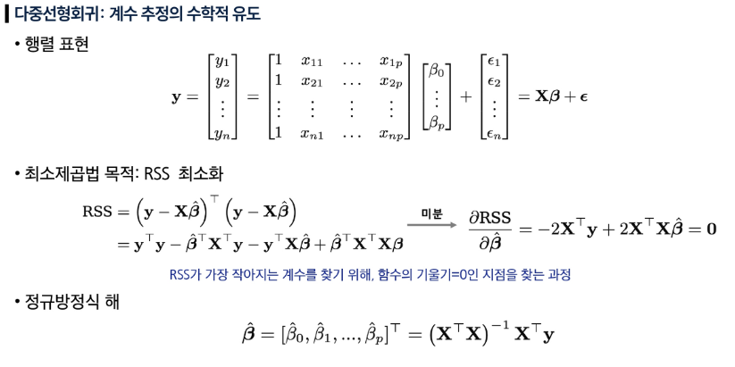
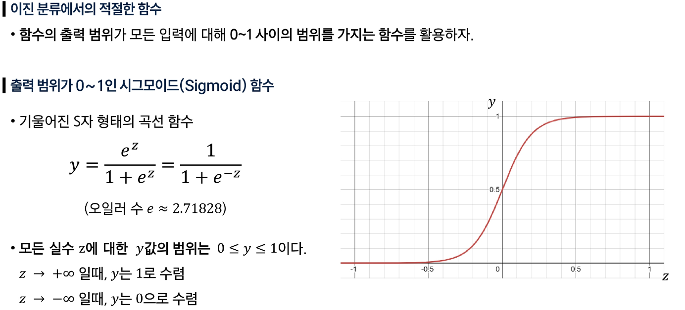

## easy
### EDA(Exploratory Data Analysis)
- 탐색적 데이터 분석 EDA은 거창한 전문적 분석 뿐만이 아닌, 데이터를 살펴보는 행동
- EDA 작업은 주로 Pandas와 Seaborn으로 하는 것이 편리

### seaborn
- dataframe 생성: df = seaborn.load_dataset(data)
- 데이터 프레임 정보 확인: df.info()
- 데이터 통계 확인 : df.dexcrobe()
- data 점으로 출력: seaborn.scaterplot(data=df, x=x_label, y=y_label)
- 선형 회귀선 출력: seaborn.regplot(data=df, x=x_label, y=y_label)

- 상관계수(Correlation coefficient): 두 변수가 얼마나 상관이 있는지에 관한 수치
  - 상관계수는 -1 ~ 1 사이의 값을 갖습니다.
  - 값 예시
    - +1 : 완전한 양의 상관관계, 무조건 같이 오름 (무게 UP시, 가속도 UP)
    - +0.7 : 강한 양의 상관관계, 거의 같이 오름
    - 0 : 상관없음
    - -0.7 : 강한 음의 상관관계, 거의 반대로 동작
    - -1 : 완전한 음의 상관관계, 무조건 반대로 동작 (무게 UP시, 가속도 Down)
- 상관계수 계산: corr = seaborn.corr(numeric_only=(True or False))
  - numeric_only: True인 경우에는 int, float과 같은 연속된 숫자 입력만 사용
- 히트맵 출력(상관계수를 행렬로 출력): seaborn.heatmap(corr, mask=mask annot=True, cmap='coolwarm', linewidths=1)
  - 메타변수
    - corr: 데이터
    - mask: 특정영역 가리기
    - annot: 값 표시 여부(True 사용시 칸에 상관계수 값 출력)
    - cmap: 색상 팔레트(coolwarm:놓으면 빨간색, 낮으면 파란색)
    - linewidths: 셀 사이 경계선 두께

### 분포(Disribution)
- 분포: 데이터가 퍼져있는 모양
- 히스토그램 시각화(분포 확인 시 사용): df = sns.load_dataset(data)

### 분산
- 분산: 평균 기준으로 얼마나 퍼져있는지를 나타내는 수치
- 표준편차: 분산의 제곱근

### pairplot(): 한방 차트
```python
import seaborn as sns
import matplotlib.pyplot as plt

df = sns.load_dataset("mpg")

# 마력에 결측치 제거 (pairplot은 결측치(NaN)값 있으면 에러 납니다.)
df = df.dropna(subset=["horsepower"])

# pairplot 시각화
sns.pairplot(df[["weight", "horsepower", "acceleration"]], corner=True, kind="reg", plot_kws={'line_kws': {'color': 'red'}})
```

### scikit-learn: 머신러닝 대표 라이브러리
  - 1. Scikit-Learn : 머신러닝 대표 라이브러리
  - 2. TensorFlow : 머신러닝 중 딥러닝에 특화된 라이브러리
  - 3. PyTorch : 머신러닝 중 딥러닝에 특화된 라이브러리 (코드 간결성이 더 높음)

- 선형회귀
```python
import numpy as np
import seaborn as sns
import matplotlib.pyplot as plt
from sklearn.linear_model import LinearRegression

# 1. 데이터 불러오기
tips = sns.load_dataset("tips")
X = tips["total_bill"].values.reshape(-1, 1)  # 2차원으로 변환, -1 은 'n' 이라는뜻 입니다.
y = tips["tip"].values

# 모델 생성 및 학습
model = LinearRegression() # 아직 학습 안된 모델객체 생성
model.fit(X, y) #X, y로 학습시작 (내부적으로 GD 안하고 정규방정식으로 한방에 최적 a, b를 계산함)

# 예측
y_hat = model.predict(X)

# 시각화
plt.scatter(X, y, color='blue', alpha=0.6, label='Actual Data')
plt.plot(X, y_hat, color='red', linewidth=2, label='Regression Line')

plt.xlabel("Total Bill ($)")
plt.ylabel("Tip ($)")
plt.title("Linear Regression: Total Bill vs Tip")
plt.legend()
plt.show()
```

- 로지스틱 회귀
```python
import numpy as np
import pandas as pd
import matplotlib.pyplot as plt
from sklearn.linear_model import LogisticRegression

# 공부 시간 (입력값)
X = np.array([1,2,3,4,5,6,2,3,4,5,6,7,1,2,3,4,5,6,7,8,2,3,4,5,6,7,8,9,10]).reshape(-1, 1)

# 합격 여부 (출력값)
y = np.array([0,0,0,1,1,1,0,0,1,1,1,1,0,0,0,1,1,1,1,1,0,0,1,1,1,1,1,1,1])

model = LogisticRegression()
model.fit(X, y)

X_new = np.linspace(0, 11, 200).reshape(-1, 1) # 0~11시간까지 세밀하게
y_hat = model.predict_proba(X_new) # [탈락확률, 합격확률]
y_hat = y_hat[:, 1] # 합격 확률만 추출

plt.figure(figsize=(8, 5))
plt.plot(X_new, y_hat, color='red', linewidth=2)
plt.xlabel("Study Time")
plt.ylabel("Pass Probability")
plt.grid(True)
```

### 표준화(전처리)
- 표준화: 데이터를 평균 0, 표준편차 1 형태로 바꾸는 전처리
  - 정규화는 값의 범위를 조율하는 행동 자체를 말합니다.
  - 표준화는 "평균 0, 표준편차 1"로 정규화 하는 것을 말합니다.
  - 표준화는 정규화 행동 중 하나입니다.
```python
import seaborn as sns
import matplotlib.pyplot as plt
from sklearn.preprocessing import StandardScaler

tips = sns.load_dataset("tips")

X = tips["total_bill"].values.reshape(-1, 1)  # 2차원으로 변환 (n, 1)
y = tips["tip"].values.reshape(-1, 1)

# 표준화를 해주는 객체만 생성
scaler_X = StandardScaler()
scaler_y = StandardScaler()

# 표준화 하기
scaler_X.fit(X) # fit : 평균과 표준편차 계산하여 내부 변수에 저장해둠
scaler_y.fit(y)
X_std = scaler_X.transform(X) # 변환 (변환 수식에 원본의 평균과 표준편차 값이 필요)
y_std = scaler_y.transform(y)
```

### 모델 평가
- 모델 평가 이유: 학습 도중에 중간 평가를 하여, 학습을 조율하기 위함 (더 나은 학습을 위해)

- 평가를 하려면, 학습에 사용하지 않은 데이터로 평가를 해야합니다.
- 일반적인 AI 학습에서는 전체 데이터를 3개의 데이터로 나누는 것이 일반적입니다.
  - **Train Set**
    - 학습용 데이터로 80% 정도 사용합니다.
  - **Validation Set**
    - 검증용 데이터, 학습 중간 중간 평가를 하여 학습 방법을 조율합니다.
    - Validation Set 결과로 학습률(lr.. 점프거리)를 조율하거나 학습을 중단하기도 합니다.
  - **Test Set**
    - 처음보는 데이터로 모델을 평가

```python
import seaborn as sns
from sklearn.linear_model import LinearRegression
from sklearn.model_selection import train_test_split

tips = sns.load_dataset("tips")
X = tips["total_bill"].values
y = tips["tip"].values

print(f'원본 개수 : {X.size}개')

# 데이터를 2개로 분리
# X_train, Y_train = 0.8 (80%)
# X_test, Y_test = 0.2 (20%)
X_train, X_test, y_train, y_test = train_test_split(X, y, test_size=0.2, random_state=42) # 랜덤으로 섞어줌
```

- 선형회귀 모델에서 대표적인 평가지표
    - MSE와 R²이 있습니다.
    - MSE
    - 오차의 제곱한 값들의 평균입니다.
    - 0에 가까울수록 성능이 가장 좋습니다.
    - Loss(Error)를 계산할 때도 쓰이지만, 모델을 평가할 때도 쓰일수 있습니다.
    - R²(결정계수)
    - 모델이 데이터의 흐름을 잘 예측하고 있는지 평가합니다.
    - 결과는 0 ~ 1 값인데, 1에 가까울수록 성능이 좋습니다.
    - 상세한 내용은 Easy 교안에서 다루지 않습니다.

- 로지스틱 회귀에서 대표적인 평가 지표
  - Accuracy, F1-score, AUC 가 있습니다.
  - 참고로 크로스엔트로피는 Loss 함수로는 자주 쓰이지만, 평가용으로 쓰기에는 출력값을 설명하기 모호하여 사용하지 않습니다.
    - Accuracy(정확도)
      - 전체 테스트 데이터 중에 모델이 정답을 얼마나 맞췄는지 비율입니다.
      - 결과는 0 ~ 1 값인데, 1에 가까울수록 성능이 좋습니다.
    - F1-score
      - 모델이 정확히 1(합격)이라고 맞춘 것과, 1을 놓치지 않은 것의 비율입니다.
      - 결과는 0 ~ 1 값인데, 1에 가까울수록 성능이 좋습니다.
    - AUC (ROC-AUC)
      - 모델이 0(탈락)과 1(합격)을 잘 구분하는 정도를 나타냅니다.
      - 결과는 0 ~ 1 값인데, 1에 가까울수록 성능이 좋습니다.
      - 0인데 1로 잘못된 예측을 한것과, 실제 1로 맞춘 비율을 선으로 그렸을 때 아래 면적 크기를 나타냅니다.

## hard
### 선형회귀: 입력과 출력의 선형 관계를 찾는 방법
선형회귀
- 입력 변수와 출력 변수 사이의 관계를 직선 형태로 근사하여, 예측하는 통계적 방법
- 지도학습의 가장 기초가 되는 접근 중 하나
- 단순해 보이지만, 선형회귀는 개념적으로도, 실무적으로도 유용


### 단순선형회귀: 하나의 입력 변수로 출력 예측하기
단순선형회귀(Simple linear regression)
- 한 개의 설명변수(X)와 하나의 반응변수(Y) 사이의 선형(직선) 관계를 찾는 방법
- 목표: 데이터를 가장 잘 설명하는 직선을 찾아 예측(y_hat)에 활용
- 단일 설명변수를 이용한 단순선형회귀
  - 모형 가정: Y = β0 + β1X + ε
    - β0 : 절편
    - β1 : 기울기
    - ε  : 관측 오차
  - hat 표기는 추정값을 의미

최소제곱법(least squares)
- 실제 관측값과 예측값의 차이(전차, residual)를 제곱해 합한 값(RSS, 잔차제곱합)을 최소화하는 방법
- 목표: 데이터를 가장 잘 설명하는 직선을 찾기 위해 계수 β0, β1을 추정

- 잔차(residual) 정의: ei = yi - yi_hat (예측값 yi_hat =  β0_hat + β1_hat * xi)
- RSS(잔차제곱합) 정의: RSS = e1^2 + e2^2 + ... + en^2

- 계수를 측정하기 위한 공식: closed-form solution(공식으로 바로 계산할 수 있는 해) 존재


단순선형회귀 사례
- 파란 직선: 최소제곱법으로 계산한 회귀선
- 빨간 점: 실제 관측 데이터
- 회색 세로선(빨간 점에서 파란 선까지): 잔차(residual)
- RSS(잔차제곱합)를 최소화할 때, 최적의 β0_hat + β1_hat이 결정됨


단순선형회귀 결과 해석
- 계수 해석
  - 절편(Intercept) = 7.03
  - TV 광고비 계수 = 0.0475


- 유의성 검정
  - 계수의 p-value < 0.0001 (매우 작음, <<0.05)이므로 통계적으로 매우 유의함 → TV광고비와 매출 간 관계 존재
- 모형 적합도(R^2 높을 수록, 1에 가까울 수록 좋음)
  - R^2=0.612 → 판매량 변동의 약 61%를 광고비로 설명 가능

### 다중선형회귀: 여러 입력 변수를 활용한 예측
단순 선형 회귀 vs 다중 선형 회귀
- 단순 선형 회귀: 한가지 관계만 고려
- 다중 선형 회귀: 복수 요인을 함께 고려


다중선형회귀의 개념
- 독립 변수(설명 변수, Feature)가 여러 개 존재할 때 사용하는 회귀 분석 기법
- 단순 선형 회귀는 하나의 변수만 고려하지만, 다중 선형 회귀는 여러 독립 변수(X1, X2,...)를 동시에 고려하여, 종속 변수(Y)와의 관계를 구함




### 선형회귀 주의사항: 변수 상관(다중공선성), 상관과 인과 구분
선형회귀 결과 검증 및 테스트 성능
- 훈련 데이터에서의 성능
  - 회귀식을 만들 때 최소제곱 해는 훈련 데이터만 보고 계산됨
  - 헉습에 사용된 훈련 데이터(X, Y사이에 평균적인 선형관계가 있다면)에서는 적합(fitting)이 잘 되어 있을 것
  - 테스트 성능을 과소평가할 가능성이 높음
- 테스트 선능 평가 필요
  - 선형회귀도 변일반화 성능을 확인하려면 훈련에 사용되지 않은 새로운(테스트) 데이터에 적용해 봐야 함
  - 수가 많거나 고차항을 사용하면 과적합(over fitting)문제가 여전히 발생할 수 있음
  - 검증/교차검증을 통해서 적절한 적합을 찾을 수 있음

선형회귀를 통해 대답할 수 있는 질문들
- 이상적 상황: 변수들이 연관(correlation)되지 않고, 독립적일 때 → 계수 해석이 명확함
- 문제 상황: 변수들이 서로 연관되어 있다면 → 계수 추정이 불안정해지고 해석에 혼동이 발생할 수 있음
- 주의: 관찰 데이터의 상관관계로 인과 관계를 주장해서는 안 됨

### 분류(Classification)
#### 분류
- 분류: 정해진 범주(카테고리) 중 하나로 지정하는 것
- 범주형 변수: 수치의 크고 작음이 아니라 유한한 범주(성별, 혈액형, 지역 등)로 표현하는 변수

분류 함수의 목표
- 입력(X, 특성 벡터): 눈동자 이미지, 이메일 내용/제목
- 출력(Y ∈ C, 범주): 예, 눈동자 색, 이메일, 순서 없는 집합(set)
- 분류 함수의 목표
  - 분류 함수 f(X)를 학습하여 입력 X가 속할 범주(카테고리)를 예측
  - 범주의 직접 예측보다 각 범주에 속할 확률P(Y=k|X)를 추정하는 것이 더 유용할 때가 많음

#### 예시: 신용카드 연체


#### 분류 모델에서 선형 회귀의 한계
- 선형회귀는 선형함수를 계산하는 문제로 예측 값이 (Y값 기준) 제한된 값을 갖게 못함
- 따라서 선형 회귀는 예측 확률이 0보다 작거나 1보다 크게 예측 될 수 있어 확률로 쓰기 부적절함


다중 범주 분류 문제
- 선형회귀는 정수형 코딩(1, 2, 3)에 따라 범주 간 순서와 동일한 거리를 가정
- 범주(카테고리) 변수는 순서가 없는 라벨이므로 부적절함


분류 문제에서 선형 회귀의 대안 - 로지스틱 회귀
- 시그모이드(sigmoid) 함수를 활용해 0 ~ 1 범위 내 확률값 예측 보장
- 순서가 없는 범주를 확률로 직접 예측하는 적절한 분류 방법

### 로지스틱 회귀(Logistic Regression)
#### 로지스틱(Logistic) 회귀의 모형식



#### MLE 활용 모수 추정
우도(Likelihood)
- 확률을 추정하는 모델을 결정했으니, 모수()를 추정하는 방법
- 선형회귀에서 현재 함수가 데이터와 오차가 작은지를 평가하기위해 평균 제곱 오차(MSE: Mean Square Error)를 지표로 삼았듯, 확률을 계산하는 함수를 평가하기 위해 우도(Likelihood)를 지표로 삼는다.
- 우도란 현재 확률 함수가 데이터를 얼마나 잘 설명하는지를 나타낸 지표
  - 모델의 학습은 우도 값을 높여 최대화가 되도록 하는 것이 목표이며 이를 Maximum Likelihood Estimation(MLE)라 한다.


log-likelihoood로 변형하여 최대화하는 β를 구해도 되는가?
- log함수는 단조(monotone) 증가 함수
- 따라서, log-likelihood를 최대화하는 β와 likelihood를 최대화하는 β는 같다


- log L(β)를 미분하여 도함수=0에 근접하도록 수치적(반복) 최적화를 통해 β들을 찾아 나간다.

#### 로지스틱 회귀 결과: 신용카드 연체 데이터

### Shallow 네트워크
#### 구조 및 활성화함수


#### 조각별 선형(piecewise linear) 표현


#### 표현력/보편적 근사 정리


### Deep Network
#### 네트워크 합성과 층별 출력, 접기(folding) 직관


#### Shallow vs Deep 비교


#### 행렬, 벡터 수식화와 도식
