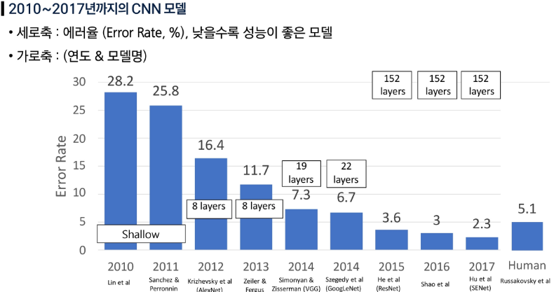
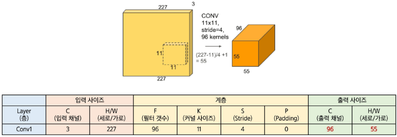
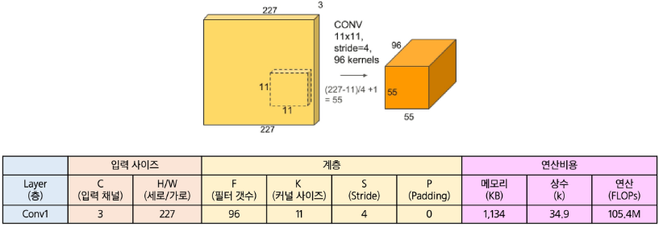

## Easy
### 토큰화 임베딩
#### 토크나이저
토크나이저: 문장을 토큰 단위로 자르고, 수로 변환해주는 툴

#### 토크나이저를 쓰는 이유
모델의 입력값은 수(y = ax + b, x값)이므로 문장을 수로 변환하여 입력

#### 토크나이저 기본 원리
동작원리
- 토크나이저
  - 미리 완성되어있는 Vocabulary(사전)을 준비
    - 각 단어는 토큰이라 부르고, 토큰은 index 번호 형태로 저장되어 있음
  - 입력 데이터를 Vocabulary(사전)을 참고하여 토큰의 indesx 번호로 변환

Vocabulary(사전)를 학습할 때 쓰이는 대표적인 알고리즘
- 사전을 만드는 작업을 Tokenizer Training 이라고 함
  - World Piece
    - 글자 단위로 분할 후, 자주 함께 등장하는 글자 조합을 토큰으로 선정
    - 빈도를 활용한 점수를 측정하여 좋은 조합을 찾아냄
  - Byte-Level BFE
    - Byte 단위로 분할 후, 자주 함께 등장하는 Byte 조합을 토큰으로 선정
    - 빈도가 높은 조합을 찾아냄

#### BERT 토크나이저 실습
- 완성된 토크나이저 툴, 모델을 open source로 공개하는 사이트: 허깅페이스
- 허깅페이스의 공식 Library = transformers(트렌스포머스): 허깅페이스에 있는 툴, 모델을 쉽게 다운, 사용 가능

BERT 토크나이저 : Word Piece 알고리즘으로 만든 Vocabulary를 사용하는 토크나이저

#### Byte-Level BPE 토크나이저
- 대규모 LLM 은 보통 이 Byte-Level BPE(Byte Pair Encoding)을 사용
- Byte-Level BPE는 정확히 Vocabulary를 생성하는 알고리즘
- Byte-Level BPE 알고리즘은 '단어' 기준이 아니라 'Byte' 기준으로 동작
- 영어는 한 글자당 1 Byte 이고, 한글, 중어와 일어는 3 Byte, 이모지는 4 Byte
  - AI에서는 UTF-8 유니코드을 사용하기에, UTF-8 기준 크기
  - BERT 토크나이저는 영어에 맞춰 만들어져 있어, 한글에 사용하기엔 별도 학습이 필요
  - Byte-Level BPE를 쓰면 모든 언어에서 잘 동작되어 별도 학습이 없어도 됨. 대규모 모델에는 Byte-Level BPE 가 사용됨

#### 임베딩 모델 개념
임베딩 모델: 단어를 "의미공간"이라는 벡터 공간에 맵핑해주는 모델
- 단어를 벡터 값으로 바꿔주는 것
  - 의미공간: 같은 의미를 가진 값은 비슷한 벡터 값을 갖게 해주는 공간
- 토큰의 ID를 입력으로 넣는 것과, 임베딩 벡터를 거친 값을 입력으로 넣는 것 중 어느것이 더 성능이 더 잘나올지 예측 필요

#### 임베딩 후 Pooling
Pooling: 여러개 벡터값을 하나로 합체하는 것
- 문장에 사용된 모든 단어의 벡터를 합치는 것
- 합체할때는 보통 평균으로 합체를 많이 사용: Mean Pooling

#### 임베딩 벡터 시각화
- 시각화를 위해 차원 축소가 필요: 4차원 이상의 데이터는 시각화 불가능
- 머신러닝 알고리즘 중 차원축소(PCA) 사용
  - 3차원 도형을 정사영을 사용해 2차원으로 축소하는 것과 같음

#### Cos 유사도
유사한 정도를 계산하는 방법: Cos 유사도
- 벡터는 방향과 크기, 이 중에서 방향이 중요
  - 방향만 비슷하다면 크기는 단지 스칼라배 차이일 뿐
- 두 벡터 사이의 방향 차이를 Cos 유사도라는 수식을 적용하면 쉽게 구할 수 있음

Cos 유사도(A, B) 수식 = A · B / |A| · |B|(내적 / 스칼라곱)

- 스칼라곱이 1이라면 수식이 간단해짐 -> L2정규화

L2 정규화(L2 Normalization): 행렬의 크기를 1로 만들고 방향만 남기는 것

L2 정규화 사용하는 곳
- 이미지 검색, 텍스트 검색: 유사성을 찾는 것으로 크기 정보가 검색에 방해됨
- LLM 언어모델: 크기정보가 삭제되어서 사용하지 않음

## Hard
### CNN
#### CNN vs FCN
완전 연결층(Fully-Connected Layer)
- 입력을 받아서 출력으로 변환하는 신경망의 기본 모듈

합성곱 레이어(Convolution Layer)
- 입력 이미지를 필터와 연산하여 특징 맵(feature map)을 뽑아내는 모듈
- 1차원 구조로 변환하는 FCN과 달리 3차원 구조를 그대로 보존하면서 연산
- Convolution(컨볼루션): 필터를 이미지 상에서 이동시키면서 내적을 반복 수행, 내적으로 구한 모든 값을 출력 제공
- 출력 해상도 = 입력 해상도 - 필터 해상도 + 1

#### 모델 구조
합성곱 레이어
- 비선형 블록(Conv[Linear] + ReLU[비선형 변환])과 함께하면 모델링 파워 향상

필터 시각화
- 학습된 필터 시각화를 통해 각 모델(구조)가 학습한 정보를 이해 가능

중첩과 수용영역
- CNN 레이어는 이미지 작은 부분인 지역 정보를 추출하는데 유리하게 설계
- 이미지 활용하는 다양한 작업에서 이미지 전체 의미 파악 필요
- 수용 영역
  - CNN이 이미지를 처리하면서 한 번에 볼 수 있는 영역의 크기
  - 네트워크의 시야
  - 일반적으로 네트워크가 깊어질 수록 수용영역도 넓어짐 -> 폭 넓은 맥락 이해 가능
- 고해상도 이미지 처리시, 많은 레이어를 통과해야 함
- 연산, 비용, 학습 가능성을 고려할 때 비실용적
- 실제 해법: 입력 사이즈를 줄여 모델에 입력함

풀링: 효율적인 연산 및 위치 변화의 강건성 확보
- CNN 레이어의 출력을 줄여 연산 효율성을 확보: 입력 크기가 줄면 CNN의 연산량이 크게 줄어듦
- 위치 변화 강건성: 입력 내 객체 위치가 다소 변해도 동일한 출력을 제공
- 사실상 저해상도 정보에 근거하여 작업 수행하므로 몇 화소 이동은 무시됨
- 맥스풀링: 정해진 커널 사이즈로 이미지를 나누어 각 영역 내 가장 큰 값을 선택하는 연산

스트라이드 합성곱: 풀링 한계 개선
- 일반 합성곱: 필터를 1칸씩 이동하면서 연산 수행(출력값 계산)
- 스트라이드 합성곱: 필터를 스트라이드 값만큼 이동한 후 출력 연산
- 효과: 풀링처럼 입력 해상도를 줄임(연산 효율과 위치 강건성)
  - 풀링 vs 스트라이드 합성곱: 풀링은 학습상수가 없지만 스트라이드는 커널을 동시에 학습
  - 스트라이드 합성곱은 해상도 저하로 인한 정보 손실이 적고, 풀링+합성곱을 하나의 레이어로 대체함
  - 고도화된 CNN에서는 스트라이드 합성곱을 풀링 대신 활용되는 경향

### CNN 기반 모델 변천사

#### AlexNet
5개의 합성곱 계층과 3개의 완전연결 계층으로 구성된 8계층 CNN 모델
- 모델 구조 특징
  - 5개 합성곱 레이어
  - 맥스 풀링
  - 3개 연결층 레이어
  - ReLU 비선형 활성화

AlexNet 출력 사이즈 계산법
- 출력 채널 수 = 현재 레이어의 필터(커널) 개수
- 출력 해상도 W' = 1 + (W - K + 2P)/S

AlexNet 연산비용 계산법
- 출력 활성 메모리(KB) = C * H' * W' = 96 * 55 * 55 = 290,400
- 출력값 메모리 사용 4Byte -> 4Byte * 290,400 = 1,134KB
- 상수k(파라미터 수)
- 총 개수 = 출력 채널 수 * 입력 채널 수 * K^2(필터 웨이트) + 출력 채널 수(바이어스 웨이트) -> 96 * 3 * 11 * 11 + 96 = 34,944
- FLOPs(연산량) - 총 연산(곱하기만 고려) = 출력 원소 수 * 출력 원소별 연산 = (H' * W') * (Cin * K * K * Cout) -> (55*55)*(3*11*11*96)*2 = 105.4M FLOPs

#### VGGNet

#### ResNet

잘 알려진 ResNet 학습 레시피
- 모든 Conv 레이어 적용 시 배치정규화 수행
- Xavier 초기화(He 초기화) 적용 / 그레디언트 소실 문제 다룸
- SGD + 모멘텀(0.9) 사용
- 학습 비율 0.1 적용, 단 Val 오류가 정체되면 1/10로 비율 축소
- 미니 배치 사이즈는 256 사용
- 웨이트 디케이 1e-5
- 드롭 아웃 미사용

최종 요약
- 깊은 모델 학습을 위한 중요한 전진 (100+레이어 학습 가능)
- 깊은 모델의 강력함을 다시 확인
- 제안 당시 모든 벤치마크에서 최고 성능 달성
- 지금도 CNN 기반 구조 중 가장 활발하게 활용

#### MobileNet

### CNN의 한계
#### CNN의 구조 및 장점

#### 한계

### 시퀀스 데이터: RNN
#### 순차 데이터 처리 방식

#### 단순 RNN 한계

#### 대안 모델

### 긴거리 의존성: 어텐션/ViT
#### 어텐션 메커니즘

#### ViT 위치 인코딩
