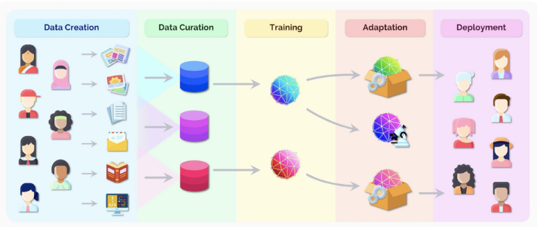

## easy
### Computer Vision
- 영상 처리 : 조도에 따라 인식 차이가 나서 전처리 작업이 필요
 - 영상처리하는 대표적인 방법은 커널을 사용하는 겁니다.
  - "커널" 이라고 불리우는 행렬이 있습니다. 이 행렬을 각 픽셀 중심으로 곱하고 더하기 하면 됩니다. (슬라이딩 윈도우 알고리즘)
    - 기존 픽셀에 "곱하고 더해서" 새로운 픽셀을 만드는 것을 **컨볼루션(합성곱)** 연산이라고 합니다.
    - CNN에 C가 바로 컨볼루션
  - 2중 for문 돌면서, 각 픽셀당 '커널'을 곱하고 합해주면 다음과 같은 것을 얻어낼 수 있습니다.
    - 테두리 추출 (아래 이미지)
    - 가우시안 필터 (뿌연 블러 효과)
    - 가로 only / 세로 only 테두리선 추출
    - 윤곽선 강조
    - 흑백으로 만들기
    - 특정 컬러만 출력하기

### AlexNet 이후 사물인식의 큰 축
- ResNet (Residual Network, 2015년, Microsoft)
  - 발음 : 레즈넷
  - **CNN 기반에서 개선한 구조**
  - 당시 NN에서 Layer 층수가 깊어질수록, 오히려 성능이 떨어진다는 이슈가 있었습니다.
  - ResNet은 Layer수를 152층까지 연결하여 ImageNet에서 1위를 차지했습니다.
  - Layer를 늘려 더 좋은 성능을 낼수 있음을 입증하였고, 이후 CNN은 대부분 ResNet 기반으로 만들어집니다. (YOLO, EfficientNet 등)

- ViT (Vision Transformer, 2020년, Google)
  - 발음 : 브이 아이 티
  - **ViT는 CNN 구조가 아닙니다. Transformer 구조입니다.**
  - Transformer를 Vision에 적용하여, ImageNet에서 1위를 차지했습니다.
  - Transformer 구조가 Image에서도 쓸 수 있다는 것을 입증했습니다.
  - 이후 사물인식은 Tranformer가 대세가 되었습니다.

### CNN 동작 원리
- 먼저 Color 이미지는 RGB 값으로 표현됩니다.
- 그렇다면 width 500 x height 500 픽셀의 이미지는 3(RGB) x 500 x 500 행렬로 표현할 수 있겠습니다.
- 이미지가 여러장을 한 배치로 사용합니다.
  - 배치 : 모델에 입력시키는 묶음 단위
- 예시: 이미지 배치 = 5(배치크기) x 3(RGB) x 500 x 500
- 컨볼루션 연산 후에도, 이미지 크기가 5 x 5 가 유지되도록 하기 위해서 테두리에 0으로 패딩값을 넣습니다.
- 여기에 활성화 함수를 적용합니다.
  - 단순 커널을 적용한 선형 수식이 아니라, 비선형방정식으로 다루기위해 ReLU를 적용시킵니다.
- 아직 데이터 너무 많습니다. 중요한 데이터만 남기고, 나머지는 삭제하고자 합니다.
- 특징이 강한(Max값)을 남기는 방식으로, 합체 (Pooling) 합니다.
  - 테두리가 남는 곳은 버립니다. (이미지라서 버려도 괜찮습니다.)
- 신경망에 넣어주기 위해, 행렬을 flatten
- 이렇게 1개 벡터가 완성됩니다. (이미지 1개당 1개 벡터)
- 이후에 MLP 돌리면 완료
  - 비선형 방정식을 Sequential하게 연결했던 그 MLP 입니다.
  - CNN 에서는 MLP(Multi-Layer Perceptron)이라고 부르지 않고, **Fully Connected Layer (FC)** 라고 부릅니다.

### Fine-tuning
파인튜닝은 **전이학습**(Transfer Learning, 한 작업에서 학습한 지식을 다른 작업으로 활용하는 것)을 구현하는 방법 중 하나 입니다.
- **파인튜닝**은 이미 훈련된 모델에, 새로운 데이터를 추가로 학습시키는 방법입니다.
  - 파인튜닝을 왜 해야하는 가는, 너무나 당연해서 말할 필요가 없을 정도입니다. 불필요한 노력이 덜 들어가거든요.
  - 비유
    - (모델을 처음서부터 만들기) vs (세계 최고의 모델 + 적은 데이터로 추가 학습)
    - (웹프레임워크 없이 개발하기) vs (웹프레임워크 + 코드 추가로 개발하기)
- 파인튜닝의 범위로 다음과 같이 구분할 수 있습니다.
  1. Full Fine-tuning
      - 추가학습시, 모델 전체 파라미터가 변경되도록 합니다.
      - **성능이 잘 나올만큼 신규 데이터를 많이 구하기 어려워서, 이 방법은 사용하지 않습니다.**
  2. Partial Fine-tuning
      - 추가학습시, 일부 Layer의 파라미터가 변경되도록 합니다.
      - 데이터는 적게 필요하지만, 그 만큼 성능 향상이 제한적이고 많은 실험이 필요합니다.
      - 데이터를 많이 넣어도 그 만큼 성능이 잘 안나와서, 효율적인 파인튜닝 대비 가성비가 떨어집니다.
      - **가성비는 떨어지지만, 파인튜닝 개념을 익히기에는 좋습니다. 
  3. 효율적인 Fine-tuning
      - 추가학습시, 모델 대부분을 변경하지 않고 추가 Layer에 학습 후 연결만 합니다.
      - Parameter-Efficient Fine-tuning(효율적 파인튜닝, PEFT) 라고부릅니다.
      - **현재 Fine-tuning 이라고 말하면, 보통 이 방식을 의미합니다.**

### Linear Proving
- Partial Fine-tuning 중에 가장 변경 범위를 좁혀 사용하는 방법입니다.
- 마지막 Linear Layer의 가중치만 초기화 후, 새롭게 학습시킵니다.

## Hard
### AI 파운데이션 모델 개념
#### AI 파운데이션 모델
- AI 모델
  - 함수 또는 프로그램
  - 입출력을 연결해주는 함수 + 데이터로 학습된 함수 + 학습 때 보지 못했던 데이터에 대해서도 작동해야하는 의무

- 이상적인 ai 모델: 세상 모든 데이터와 그 데이터의 설명을 기억
  - 내가 얻고 싶은 답과 유사한 답이 이미 db에 저장되어 있을 확률이 높음 -> 검색 엔진과 유사
  - 예시: 최근접 이웃 탐색(Nearest)
  - 비용적으로 불가능

- 현실적인 기계학습 모델
  - 학습 = ai모델에 데이터를 패턴화 하여 압축
  - 이 과정에서 비슷함과 다름을 파악, 패턴을 익히면서 새로운 데이터에 대한 일반화 능력이 생김

- 파운데이션 모델
  - 대규모 데이터를 폭넓게 학습한 후, 다양한 문제에 빠르게 적응할 수 있는 범용 대형 ai 모델
  - 기존 딥러닝 개발 패러다임: 아기와 같이 언어, 시각, 청각, 촉각 등 기본적인 것들부터 배워 나가야 함
  - 파운데이션 모델 패러다임: 거대 모델(커다란 뇌) + 대규모 데이터 학습(많은 지식과 경험) 기반

- 파운데이션 모델의 특징
  - 특징1[대규모]: 트랜스포머 모델 + 대규모 언어 데이터 학습
    - 비지도학습으로 훈련된 모델들도 많이 등장: 쉬운 데이터 수집을 할 수 있어야 함
  - 특징2[적응성]: 높은 파인튜닝 성능(높은 태스크 적응 성능)
    - 믿고 쓸 수 있는 모델
  - 특징3[범용성]: 다양한 작업, 한정되지 않는 출력 지원
    - 예시: 물체 판별
  
- 파운데이션 모델에 의한 ai 모델 개발의 변화
  - 과거에는 매번 모델을 새로 학습했지만, 이제는 잘 학습된 모델들을 얼마나 잘 활용하는지가 핵심
  - 파운데이션 모델 하나 확보하는데 투여되는 계산 리소스는 일부 대규모 인프라 이외에는 불가
  - 적응 활용(활용되는 기법 들): 프롬프트(엔지니어링 튜닝), 전이학습, 
  적응(adaptation)학습, 파인튜닝

### 대표적 ai 파운데이션 모델(clip)
#### agi를 향해
- human's intelligence = perception + higher cognitive process(언어모델)

- 시각언어모델 = 언어모델 + 시각센서

#### clip
- ai가 언어와 시각을 통합해서 이해하는 방식을 보여준 패러다임 전환 제시
- 파운데이션 모델으로써의 특징
  - 입력: 학습하지 않은 새로운 도메인의 입력 데이터에 대해서도 좋은 성능을 발휘(제로샷 전이)
  - 출력: 자연어를 이용해 한번도 본적이 없는 카테고리도 텍스트 설명만으로 출력 정의 가능(언어 인터페이스)

- 대조 학습 기반의 언어-이미지 사전 학습
  - 인터넷 데이터를 통한 지도 학습을 통해 자연어 기반 시각 개념 학습
  - 다양한 이미지-자연어 쌍으로 학습
- remind - transformer
  - 트랜스포머 구조 = 인코더 + 디코더

- remind - vision transformer
  - 이미지를 작은 패치로 나눔
  - 각 패치를 1D로 flatten
  - learnable position embedding 사용
  - transformer encorder: 패치 처리
  - MLP head를 통해 분류 작업 수행

#### siglip
- softmax 대신 sigmoid 기반 손실함수
- 기존 clip에서 사용한 대조학습의 한계: 어느 정도 이미 멀게 배치한 음성 데이터들에 대해서도 계속 거리를 벌리기 위해 학습이 진행됨
- siglip: clip과 달리 일치하지 않는 음성 데이터에 제한된 영향만 받도록 손실함수 디자인을 고침
  - sigmoid 함수의 역할: 어느정도 커지면 고려 안함

#### 멀티모달 정합
- 서로 다른 두 가지 이상의 모달리티 간의 공통된 임베이딩 벡터 공간을 구성하는 것
- 서로 다른 모달리티 임베이딩 간 유사도(연관성) 비교 가능

#### LLaVA
- vision과 language 모델을 결합한 모델(VLM)로 텍스트와 이미지를 동시에 이해
- 주요 특징
  - 이미지 인식과 텍스트 생성을 결합하여 이미지 설명 또는 시각적 질문 응답 작업에서 뛰어난 성능
  - 이미지, 명령, 답변이 주어진 데이터셋을 구축하여 instruction turning으로 학습

- LLaVA 모델 특징
  - 효율적인 메모리 사용: 적은 자원으로 큰 모델을 효과적으로 학습
  - 다중 모달 학습: 텍스트와 시각 데이터를 결합하여 응담을 생성
  - Fine-tunig: 특정 작업에 맞춰 모델을 미세조정하여 사용

step1: 사전학습
  - 표현 공유
    - 이미지를 텍스트 표현을 변환하는 선형 레이어를 학습하여 텍스트와 이미지를 공통된 토큰 표현으로 처리
    - 전체 모델을 다시 훈련하지 않으므로 자원과 시간 절감
  - 효율적인 학습
    - 적은 파라미터만 학습
step2: Fine-tuning
  - 표현 공유
    - 특정 작업에 맞춰 선형레이어와 언어모델 등 필요한 부분만 미세 조정으로 강화
  - 효율적인 학습
    - FP16과 같은 정밀도 최적화를 통해 적은 메모리로 큰 모델 학습 가능
    - 저비용 학습 기법을 통해 메모리 사용향 절감