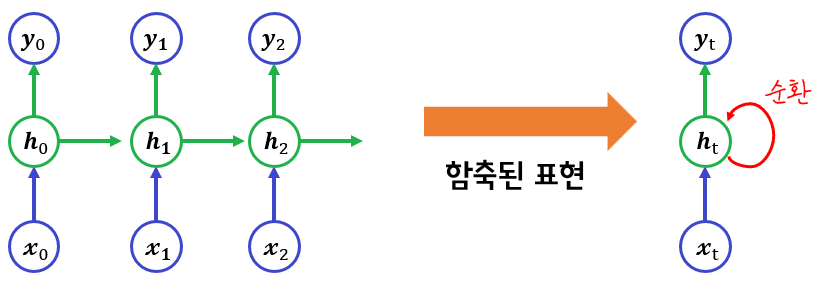

## easy
### 시계열 모델(RNN)
- 시계열 데이터: 시간의 흐름 또는 순서에 따라 기록된 자료
  - 주식차트, 음성데이터, 문장 등

- RNN(Recurrent Nueral Network)

  - h는 히든레이어를 표현했습니다. 은닉층은 이전의 MLP 구조에서 ReLU 함수와 비슷한 비선형 함수의 형태입니다.
- $h_t = f(W_x x_t + W_h h_{t-1} + b)$

- 결국 RNN의 학습은 최적의 은닉층을 찾아나가는 과정이라고 할 수 있습니다.
  - $W_x$ : 입력을 변환하는 가중치
  - $W_h$ : 과거 상태를 반영하는 가중치
  - $W_y$ : 출력층으로 연결하는 가중치
- 이 세가지를 최적화해서 문맥을 잘 기억하고 예측하도록 만드는 것이 목표.

- RNN으로 데이터 학습 원리
- RNN은 이전 시점의 Hidden State의 출력값이, 다음 Hidden State 계산의 입력값으로 들어갑니다.
- RNN의 학습은 다음과 같이 이뤄집니다.
  - **이전 데이터들로 만들어진 정보(Hidden Layer 출력값)를, 다음 글자를 예측하는데 사용됩니다.**
- 이후에 GD를 통해, 오차율이 적도록 히든레이어 가중치 값이 업데이트 됩니다.

- RNN으로 추론 원리
- 학습이 완료되면 이제 추론에 사용됩니다.
  - 입력 데이터는 이거 하나면 됩니다. ['안'] 한글자요.
  - 그러면 다음 글자들이 연속적으로 예측할 수 있습니다.
- 만약 추론할때 '안' 한글자가 아니라 '안녕요' 이후 다음문장을 예측하고 싶다면?
  - '안'을 입력으로 넣고, 고의적으로 출력 '녕'을 선택하고,
  - '녕'을 입력으로 넣고, 고의적으로 출력 '요'을 선택하고,
  - '요'을 입력으로 넣고, 이제부터는 RNN이 출력하는 것을 따르면 됩니다.

- RNN의 단점
  - Sequence가 길어질수록 초기 정보(Hidden State)들이 반영이 잘안됩니다.
    - 과거 기억을 잊게된다로 비유할 수 있겠습니다.
  - 또한 Gradient Decent를 하는데 앞 부분은 학습이 잘 되는데, 뒷 부분은 학습이 잘 안됩니다.
    - GD를 위해 기울기 계산 (Backpropagation)을 합니다.
    - 그때 기울기 소실 (점점 0으로 수렴) 문제나, 기울기 폭발 (점점 거대한 값으로 폭발) 문제가 있습니다.

### Transformer 모델
- Transformer는 RNN처럼 과거 정보를, 다음 Layer로 전달해주는 방식을 버렸어요.
  - 참고로 RNN은 이전 Hidden Layer값이 모든 과거 정보를 내포하고 있었죠.
  - Transformer 모델은 입력값들의 정보들을 모두 참고하여 다음 Layer의 출력값을 만들어냅니다!
    - 장기기억 소실문제가 해결되었습니다.
    - 기울기 소실, 폭발 문제가 해결되었습니다.
    - 현대 딥러닝은 대부분 Transformer 모델을 기반으로 사용합니다

- Attention
  - 각 단어가 다른 단어들과 유사한 정도를 계산합니다.
  - 이 유사성 정보들을 합쳐서, "문맥 표현 공간"의 벡터값을 계산합니다.

$\huge X_{임베딩들} \xrightarrow{\text{Attention}} Y_{\underline{\color{red}{문맥표현공간}}}$

- 일반적인 선형계산에는 y = WX + b로 계산
  - 하나의 Weight 행렬을 사용합니다.
- Attention을 계산할 때는 3개의 Weight 행렬을 사용합니다. 3개는 이름이 있습니다.
  - Query / Key / Value 행렬

$\huge
\begin{align}
Q &= X \cdot W_{query} \\
K &= X \cdot W_{key} \\
V &= X \cdot W_{value}
\end{align}
$

**Query(Q) : 현재 단어에서 찾고자 하는 의미**  
**Key(K) : 모든 단어가 가지고 있는 의미적 주소(색인, 인덱스)**  
**Value(V) : 그 단어가 실제로 가지고 있는 정보**  

뒤의 수식 설명 : Q와  K의 유사도를 비교해서 그 유사도만큼 V를 가중 평균  
=> 현재 단어(Q)가 다른 단어들(K)들 중에 어떤것과 관련이 있는지를 계산해서 관련  있는 단어들의 핵심 정보(V)를 모아온다.  

이 3개의 파라미터를 학습하게 되어 모델이 무엇을 주목해야 하는지(attention)를 스스로 배우게 됩니다.

그렇다면 Multi-head Attention 은 뭘까요? 무엇이 Multi-head 라는 걸까요?  
=> 입력 벡터를 서로 다른 관점에서 문맥적으로 해석하기 위해서

문법적 관계, 의미적 유사성, 위치적 관계 등등...

- Transformer 구조
  - Tranformer는 Encoder들 + Decoder들 조합으로 구성되어있습니다.
  - Encoder, Decorder 모두 Attention과 MLP의 조합으로 구성되어있습니다.
  - Encoder : 문맥을 이해합니다.
  - Decoder : 입력 문장 정보를 이용해서, 출력 문장을 생성합니다.
- 요약하면 다음과 같습니다.
  - 입력 문장 --> [Encoder × N개] --> 문맥 벡터
    - Encoder 여러개로 정교한 이해를 합니다.
  - 출력 문장 --> [Decoder × N개] --> 최종 문장 예측
    - Decoder 여러개로 점차 정교한 문장을 만들어냅니다.
    - 입력 : Decoder는 Encoder의 문맥 정보(State)들과 본인이 출력한 단어가 입력됩니다.
    - 출력 : Softmax 값으로, Vocabulary 들 각각 단어가 나올 확률들이 나옵니다.

### 모달
  - 인간이 정보를 인식할 수 있는 형태를 모달(Modality) 이라고 합니다.
    - Text, Image, Audio, .. 여러 Sensor 값들이 될 수 있습니다.
    - 여러 모달을 다루는 모델을, **멀티모달 모델**이라고 합니다.

- Text 모달
  - 문맥 전체를 더 잘 이해하도록 만들 수 있습니다.
  - 문맥에서 벗어나지 않는 문장을 만들어 낼수도 있습니다.

- Image 모달
  - 이미지를 작은 단위로 잘라서 하나의 토큰처럼 취급합니다.
    - 이 단위를 패치(patch)라고 합니다.
  - 함께 어울릴 수 있는 패치들을 이해합니다.
    - 이러한 패치들의 조합을 확률 기반으로 선택하여, 자연스러운 이미지 생성할수도 있습니다. (DALL-E 원리)

- Text와 Image의 유사도 비교
  - Text의 토큰들과, Image의 패치들을 같은 "문맥표현공간"의 벡터 값으로 사용합니다.
  - Image 패치들이, 어떤 Text와 가장 관련이 있는지 알아낼 수 있습니다.
  - 이를 이용하여 사물 인식이 가능합니다.

### Foundation 모델
- Transformer 이후 시대에는 **Foundation 모델** 이라는 말이 생겼습니다.
- Foundation 모델은 '칭호' 같은 건데요. 다음 조건이 되면 됩니다.
  - **방대한** 범용 데이터로 학습하고
  - 다양한 목적에 맞게 **파인튜닝** 해서 사용 가능한
  - **대규모** 파라미터를 가진 모델
- 방대한의 규모랑, 대규모의 범위는 정해진게 없습니다.

- Transformer 기반, 이미지 생성 멀티모달 모델
- Text to Image 모델로, 이미지를 생성해봅시다.
  - 입력은 Text이고, 출력은 Image 입니다. 두 가지 모달을 사용했으니 멀티모달 모델
- 이미지 생성방법인 **Diffusion 알고리즘**은 다음과 같이 동작됩니다.
  - 학습 : 원본 이미지에 노이즈를 조금 추가하고 어디에 얼마나 노이즈를 추가했는지 예측합니다. 이를 반복합니다.
  - 추론 : 완전한 노이즈로 시작해서, 노이즈를 점점 제거하면서 복원하는 방법으로 이미지를 생성합니다.

## hard
### 텍스트 파운데이션 모델
#### 사전 지식
파운데이션 모델 이전
- 새로운 테스크를 해결하려면 해당 테스크에 대한 별도의 학습 필요

파운데이션 모델 이후
- 새로운 테스크를 해결하려면 자세한 설명(프롬프트)을 입력하는 것으로 충분

#### 파운데이션 모델의 3가지 구성요소
- 빅데이터
  - 인터넷에 존재하는 데이터 수가 기하급수적으로 증가
  - 딥러닝 기반 ai 모델은 학습 데이터가 늘어날 수록 성능이 증가
- 자가 학습(Self-supervised Learning) 알고리즘
  - 사람이 정답을 알려줄 필요 없음
- 어텐션(Attention) 기반 트랜스포머(Trandformer) 모델
  - 더 많은 데이터를 학습할 수 있는 인공신경망 구조
  - 어텐션: 입력 데이터에서 중요한 부분에 주의를 집중하는 메커니즘
  - 트랜스포머: 어텐션 메커니즘을 기반으로 한 신경망 구조

#### 파운데이션 모델의 3가지 구성 요소 in 언어 모델(Language Model)
- GPT-1, BERT와 같은 언어 모델에도 3가지 구성 요소가 이미 포함되어 있음
- GPT-2: 언어 모델이 추가 학습 없이도 텍스트 지시를 통해 새로운 테스크를 어느정도 수행할 수 있음을 확인
  - 가장 큰 GPT-2 모델조차도 underfitting된 결과를 보여줌 -> 모델 크기를 더 늘리면 성능이 개선될 여지가 있음

#### 텍스트 파운데이션 모델(거대 언어 모델)의 특이점
1. 규모의 법칙(Scaling Law): 더 많은 데이터, 큰 모델, 긴 학습 -> 더 좋은 성능
2. 창발성(Emergent Property): 특정 규모를 넘어서면 갑자기 모델에서 발현되는 성질
  - 인-컨텍스트 학습: 주어진 설명과 예시만으로 새로운 테스크를 수월하게 수행
  - 추론능력

#### 텍스트 파운데이션 모델 (or 거대 언어 모델, LLM)
- 기존 대비, 더 큰 모델(>7B)이 더 많은 데이터(>1T)에서 학습되어 창발성이 나타나기 시작한 언어 모델

#### 폐쇄형(Closed) 거대 언어 모델
- 장점: 일반적으로 더 우수한 성능 및 최신 기능을 갖고 있으며 사용하기 쉬움
- 단점: 사용 시 마다 비용이 발생, 모델이나 출력에 대한 정보가 제한적으로 제공됨
- ChatGPT: 가장 많은 활성 유저 수, 전반적으로 뛰어난 성능
- Claude: 안전 지향적 모델, 코딩 관련 작업에 특히 뛰어난 성능
- Gemini: 가장 긴 입력 및 출력(>1M)을 지원, 뛰어난 멀티 모달 성능

#### 개방형(Open sourced) 거대 언어 모델
- 장점: 무료로 다운로드 및 사용 가능, 모든 정보(모델 구조, 소스 코드 등)가 공개되어 있음
- 단점: 충분한 계산 자원(GPU 등)필요, 상대적으로 폐쇄형 모델에 비해 성능이 낮은 편
- LLaMA, Gemma, Qwen 등

### 거대 언어 모델의 학습
- GPT-3: 거대 언어 모델의 시초
  - 가장 큰 버전의 GPT-3: 1750억 개의 매개변수 -> 이전 언어 모델 대비 최소 10배 이상 큰 모델
  - 본격적으로 인-컨텍스트 학습 능력이 나타나기 시작한 언어 모델
  - 학습 방법: 다음 토큰 예측(Next token prediction)
  - 학습 데이터: 3000억 토큰(4TB 텍스트 데이터 = 인터넷 + 양질의 텍스트북)
  - 학습 비용: 150억원 정도로 추산

다음 토큰 예측 기반 거대 언어 모델의 한계
- 사람의 지시에 대해 올바르지 않은 응답을 생성하거나, 유해한 응답을 생성할 수도 있음

#### 정렬(Alignment) 학습: 거대 언어 모델의 출력이 사용자의 의도와 가치를 반영하도록 하는 것
- 지시 학습(instruction tuning): 주어진 지시에 대해 어떤 응답이 생성되어야 하는지
  - 학습 방법 자체는 기존 언어 모델에서의 지도 추가 학습(supervised fine-tuning)과 동일
  - 거대 언어 모델을 다양한 지시 기반 입력과 이에 대한 응답으로 추가학습(FLAN)
    - 학습 방법: 주어진 입력을 받아서 이에 대한 응답을 따라 하도록 지도 추가 학습
    - 기존 NLP 테스크 데이터를 지시 학습을 위한 데이터로 수정하여 학습 및 데스트에 활용
    - 학습시에 보지 못한 지시에 대한 일반화 성능 평가를 위해, 관련 없는 테스크들을 데스트에 활용
  - 실험 결과: 예시 없이도 새로운 지시에 대해 올바른 응답을 내놓는 성능이 크게 증가
  - 성능 향상을 위한 핵심 요소는 다음과 같음
    1. 학습 테스크의 개수: 다양한 종류의 지시를 학습할 수록 보지 못한 지시에 대한 일반화 성능이 좋아짐
    2. 추가 학습하는 모델의 크기: 특정 규모 이하는 지시 학습의 효과성이 떨어짐 -> 지시를 이해하고 응답하는 것도 창발성의 하나
    3. 지시를 주는 방법: 자연어 지시로 사람에게 대화하듯 지시하는 것이 가장 효과적
  - 한계: 주어진 입력에 대해 적절한 하나의 응답이 있다고 가정
    - 정답이 정해진 객관적 테스크(수학 등) 에서는 자연스러움
    - 정답이 정해져 있지 않은 개방형 테스크(번역 등) 에서는 한계가 있음
- 선호 학습(preference learning): 상대적으로 어떤 응답이 더 선호되어야 하는지
  - 다양한 응답 중 사람이 더 선호하는 응답을 생성하도록 추가학습
  - 다양한 응답은 모델이 생성, 응답간의 선호도는 사람이 제공
  - ChatGPT를 만들기 위한 핵심 알고리즘
  - InstructGPT의 핵심 아이디어: 사람의 피드백을 통한 강화학습(Reinforcement Learning from Human Feedback, RLHF)

#### InstructGPT의 학습 방법
1. 지시 학습을 통한 텍스트 파운데이션 모델의 추가학습
  - 실제 유저로부터 다양한 지시 입력을 수집하고, 해당 입력에 대해 훈련된 사람 주석자들이 정답 데이터를 생성
2. 사람의 선호 데이터를 수집하여, 보상 모델(Reward model, RM)을 학습
  - 주어진 입력에 대한 선택지는 모델이 생성, 다양한 선택지에 대한 선호도는 사람이 생성
  - 사람과 일치한 선호도를 출력할 수 있도록 보상 모델을 지도 학습
    - 사람이 선호하는 응답이 입력으로 주어짐 -> 높은 보상을 출력
3. 보상이 높은 응답을 생성하도록 강화 학습을 통해 추가 학습
  - 핵심: 1, 2단계에서 보지 못한 질문에 대해 사람의 추가적인 개입 없이 학습된 모델들을 통해 추가 학습이 진행
  - 지시 학습된 모델을 보상 모델 기반 강화 학습을 통해 한번 더 추가 학습

InstructGPT의 결과: 유저의 지시를 얼마나 잘 수행하는 지를 사람이 직접 평가
- 단순 프롬프팅이나 지시 학습에 비해 발전된 지시 수행능력을 보여줌
- 기존 대비, InstructGPT는 해로운 응답(RalToxicity)과 거짓말(TrustfulQA, Hallucinations)을 덜 생성

보상 모델은 일정 수준까지만 규모에 따라 성능이 올라가고 이후부터는 성능이 감소함

### 거대 언어 모델의 추론
#### 디코딩(Decoding) 알고리즘
- 거대 언어 모델의 자동회귀 생성(Auto-regressive Generation)
  - 학습이 완료된 거대 언어 모델 응답 생성 방법 => 순차적 추론을 통한 토큰별 생성
  - EOS 토큰 생성 시 종료 or 사전에 정의된 토큰 수 도달 시 종료
  - Goal: 주어진 입력 x = [$ x_1, ... , x_L$]에 대해 다음 토큰 $ x_{L+1} $을 생성
  
  - 디코딩(Decoding) 알고리즘: $ p(x) $로 부터 $ x_{L+1} $을 생성하는 알고리즘(다음 단어를 선택하는 방법)

1. 디코딩(Decoding) 알고리즘: Greedy Decoding
- 핵심 아이디어: 가장 확률이 높은 다음 토큰을 선택
  - 장점: 사용하기 쉬움
  - 단점: 직후만 고려하기 때문에 생성 응답이 최종적으로 최선이 아닐 수 있음

2. 디코딩(Decoding) 알고리즘: Beam Search
- 핵심 아이디어: 확률이 높은 K개(beam size)의 후보를 동시에 고려
  - 고르는 기준: 누적 생성 확률(지금까지 생성한 문장 전체가 나올 확률의 곱)
    - 앞선 Greedy Deecoding은 매 시점마다 가장 높은 선택지 1개 만을 선택했지만, Beam Search는 전체 문장 후보들의 누적 확률을 기준으로 상위 K개를 남기는 것
  - 장점: 최종적으로 좋은 응답 생성 확률이 높음
  - 단점: 계산 비용이 만히 늘어남(각 후보마다 LLM 추론을 수행)

3. 디코딩(Decoding) 알고리즘: Sampling
- 핵심 아이디어: 거대 언어 모델이 제공한 확률을 기준으로 랜덤하게 생성
  - 장점: 다양한 응답을 생성할 수 있음
  - 단점: 생성된 응답의 품질이 감소할 수 있음

4. 디코딩(Decoding) 알고리즘: Sampling "with Templature"
- 핵심 아이디어: 하이퍼 파라미터 T를 통해 거대 언어 모델이 생성한 확률 분포를 임의로 조작 
  - T > 1: 확률 분포를 smooth하게 만듦(더 다양한 응답 생성) -> 창의적이나 품질이 떨어질 수 있음
  - T < 1: 확률 분포를 sharp하게 만듦(기존에 확률이 높은 응답에 집중) -> 안정적이나 다양성이 떨어짐

5. 디코딩(Decoding) 알고리즘: Top-K Sampling
- 핵심 아이디어: 확률이 높은 K개의 토큰들 중에서만 랜덤하게 확률에 따라 샘플링
  - 장점: 품질이 낮은 응답을 생성할 가능성을 줄일 수 있음
  - 단점: 확률 분포의 모양에 상관 없이 고정된 K개의 후보군을 고려

6. 디코딩(Decoding) 알고리즘: Top-P Sampling (or Nucleus Sampling)
- 핵심 아이디어: K를 고정하는 대신, 누적 확률(P)에 집중하여 K를 자동으로 조절
  - 예시: P=0.9 => 확률이 높은 K개의 응답 후보의 확률을 더했을 때 0.9를 처음으로 초과하는 K를 사용
  - 다양한 평가 지표에서 기존 디코딩 알고리즘들 대비 좋은 성능을 달성

### 거대 언어 모델의 평가와 응용
#### 거대 언어 모델의 평가
- 평가(Evaluation): 구축한 시스템(코드 or 앱)이 실제로 잘 동작하는지를 확인하는 단계
  - 평가의 3가지 요소
    1. 목표: 시스템으로 무엇을 달성하고자 하는지
    2. 평가 방법: 어떤 방법으로 평가할 것인지
    3. 평가 지표: 어떻게 성공 여부를 판단할 것인지

- ai 모델의 평가: 테스트 데이터
  - 핵심 가정: 학습 단계에서 본 적이 없고, 질문과 정답을 알고 있음
  - 예시: 감정 분류
    1. 목표: 주어진 입력 텍스트의 감정을 올바르게 예측하는 것
    2. 평가 방법: ai 모델의 예측 감정과 사람이 작성한 정답을 비교하는 것
    3. 평가 지표: 테스트 데이터 셋에서의 평균 정확도

- 특정 테스크에서 학습된 기존 ai 모델들과 달리, 거대 언어 모델은 다양한 테스크에 대해 동시에 학습됨
  - 따라서, 거대 언어 모델의 성능을 올바르게 평가하기 위해서는 많은 테스크에서의 성능을 종합적으로 판단해야함
  - 또한, 디코딩 알고리즘, 입력 프롬프트에 따라 같은 질문에 대해서도 예측이 바뀌므로, 공평한 비교를 위해서는 해당 부분도 고려해야함

- 거대 언어 모델의 평가 방법의 종류
  - 정답이 정해진 경우
    - 평가 방법: 예측과 정답을 비교하여 일치도를 측정 -> 정확도(Accuracy)

  - 정답이 정해져 있지 않은 경우
    - 평가방법1: 사람이 임의의 정답을 작성 및 이와 예측을 비교
      - 단어 수준에서의 유사도 측정(ROUGE)
      

      - 벡터 공간에서의 유사도 측정(cosine similarity on embedding space)
      

    - 평가방법2: 정답과 무관하게 생성 텍스트 자체의 품질만을 측정
      - Perplexity(PPL) -> 얼마나 문장이 확률적으로 자연스러운지 측정(다음 단어가 올 확률을 계산하기 위해 언어모델을 주로 활용)
      
      
    - 평가방법3: 생성된 텍스트의 상대적 선호를 평가 
      - 대표 예시: LMArena: 실제 유저 피드백을 활용, 거대 언어 모델 성능 측정 방법 중 가장 신뢰성 있는 방법 중 하나로 여겨짐
      - 한계: 높은 평가 비용 및 시간을 필요로 함 => 거대 언어 모델로 대체하면 -> LLM-as-judge(or G-Eval)
      
      - LLM-as-judge(or G-Eval): 거대 언어 모델을 통해 생성 텍스트 평가
        1. 유저는 다음과 같은 정보를 제공: 풀고자 하는 테스크, 평가하고자 하는 텍스트, 평가 기준
        2. 거대 언어 모델은 평가 결과(점수, 이유)를 제공

        - 한계점 -> 보완하여 활용하는 것이 필요
          1. 위치 편향: 특정 위치의 응답을 상대적으로 선호 -> 순서를 바꿔서 두 번 평가하고 평균을 취하는 것으로 해결 가능
          2. 길이 편향: 품질과 무관하게 길이가 긴 응답을 상대적으로 선호 -> 길이가 미치는 영향을 통계적으로 제거해서 어느정도 해결 가능
          3. 자기 선호 편향: 생성 모델이 평가 모델과 같은 경우, 이를 선호

#### 거대 언어 모델의 응용 및 한계
응용: 멀티모달 파운데이션 모델
- 핵심 아이디어: 다른 모달리티 데이터를 거대 언어 모델이 이해할 수 있도록 토큰화 및 추가 학습

응용: 합성 데이터 생성
