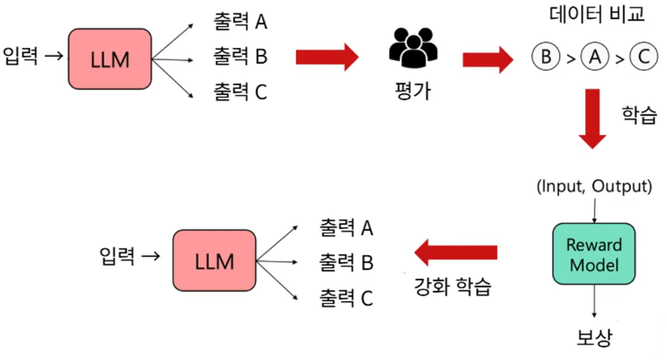

## easy
### 소량의 text 데이터 생성 방법
- AI로 데이터를 생성하는 가장 쉬운 방법
  - LLM (대규모 언어모델)에게 데이터를 생성 요청
- ChatGPT에게 대량의 데이터 생성을 요청 시 요금이 많이 듬
  - 10MB 용량의 데이터 (약 50,000개 문장)을 만드는데 250만 토큰: 무료티어 용량 초과
  - OpenAI API 사용시: GPT-4o mini 모델 기준으로, 출력 토큰 25만개 토큰이면 $1.5 -> 약 2,000원
- 대량의 데이터 생성: 허깅페이스의 모델을 사용해서, 코랩 or 추론서버에서 동작

### 대량의 Text 데이터 생성 방법
소형 모델 세팅
- 필요 시 transformers 를 최신버전으로 업그레이드

데이터 생성하기
- Temperature, Top_p 파라미터 조율
  - 이 옵션을 조율하면 답변의 다양성을 더 높일 수 있음
    - 너무 똑같은 대답만 반복할 때 이 값을 조율
    - 대신 너무 다양하면, 말도 안되는 문장을 만들어낼수도 있음

- top_p가 0.8 이면 확률 높은 순서대로 더해서 누적 확률이 80%에 도달할 때까지 단어들만 후보로 사용한다는 의미

- temperature는 `원점수 (logit) / temperature`를 먼저 수행하게 함으로써 확률 분포를 조정하게 합니다.  

$\begin{cases}
temp < 1.0 & : \text{보수적으로 확률이 높은 단어를 선택} \\[0.5em]
temp = 1.0 & : \text{모델의 원래 확률 분포대로 선택} \\[0.5em]
temp > 1.0 & : \text{확률이 낮은 단어에도 기회를 부여}
\end{cases}$

### LLM as a judge로 품질 낮은 데이터 필터링하기
- LLM as a judge는 AI 모델이 만들어낸 결과를, 더 높은 수준의 AI 모델이 평가하는 것을 뜻함
  - LLM as a judge는 주로 **벤치마크 용도로 주로 사용**

- AI 모델 선택하는 기준 -> 비용
- 이렇게 만들어진 데이터를 GPT를 사용하여 평가하는 방법이 있습니다.
  - GPT 모델이 직접 데이터를 생성 할때는 "출력토큰"이 주로 사용됩니다.
  - GPT 모델이 데이터를 입력 받고 판단 할때는 "입력토큰"이 주로 사용됩니다.

- 입력토큰보다 출력 토큰이 더 비쌈
  - GPT4o mini 기준, 출력토큰이 입력토큰보다 4배 비쌈
  - GPT5 기준, 출력토큰이 입력토큰보다 8배 비쌈
  - 실제로 "입력 후 의도 판단" 보다는, "신규 데이터 생성" 작업이 GPU 자원을 훨씬 많이 사용합니다.

- 비용을 효율적으로 사용하기 위해서라면
  - 데이터 생성: 경량 모델
  - 평가: 대형 모델

### 데이터 생성 방법의 분류
- AI를 이용하여 데이터를 생성하는 방법은 대표적으로 두가지가 있습니다.
  - 데이터 증강(Data Augmentation) : 열심히 수집해서 가지고 있는 데이터를... 살짝 변형을 가해서 데이터 개수를 2~3배로 늘리는 것
  - 합성데이터(Synthetic Data) : 데이터가 없어서... 예시를 몇개 주면서... AI에게 왕창 만들어달라고 하는 것

- **대규모 데이터를 다루는 실무에서는, 데이터 증강이 더 우선적으로 되어야합니다.**
- 데이터 증강은, 실제 데이터에 약간의 변형을 가한 것입니다.
  - 열심히 노가다로 데이터 수집하고, 변형을 가하는 것이죠. 데이터 수집에 노력이 필요해요.
  - 원본의 품질을 따라가기에, 모델 학습에 무리가 적습니다.
- 합성데이터는 품질을 보장하기 힘들어요.

#### 결론
- 소규모 프로젝트 진행시에는 Text 데이터 생성은 **합성데이터** 제작해주세요.
  - 편의성을 위함입니다.
  - 데이터 증강을 하게되면, 프로젝트 제작 시간을 다 소모하게 될지도 몰라요.

- 소규모 프로젝트 진행시 이미지 데이터는, **데이터 증강**으로 해주세요.
  - AI는 이미지 생성시 거대한 토큰이 들어갑니다.
  - 이미지 100장을 AI로 생성하면 비용과 시간소요가 커요.

### Image 데이터 증강하기
- 이미지 데이터 증강은, 기존 이미지를 인위적으로 개수를 늘리는 방법입니다!
- 이미지 데이터를 살짝 변형합니다.
  - 이미지 색상, 채도, 명도을 살짝 바꿉니다.
  - 이미지를 약간 회전 시킵니다.
  - 이미지 좌우를 반전시킵니다.
  - 등등
- 이러한 작업으로 데이터 양을 늘릴 수 있습니다.

#### 사전준비 - 이미지 다운로드 후 출력하는 코드 이해
- 먼저 데이터를 증강하기 전에, 이미지 다운받고 출력하는 코드를 이해해봅시다.
  1. 이미지를 requests 라는 Library로 다운로드 받습니다.
  2. BytesIO로 바이트 값으로 변경 후 이미지 타입으로 바꿉니다.
  3. 이후 Matplot으로 출력해봅니다.

#### Torch Vision 이란?
- 이미지 처리를 위해서 나온, PyTorch의 공식 Library 입니다.
- 이미지 AI를 연구하시는 분들이 많이 사용하는 Library 입니다.
  - Torch Vision을 이용하면 간결한 코드로 이미지 전처리를 할 수 있습니다.

- Torchvision 안에 있는 Transforms는 전처리 작업들이 모아둔 클래스입니다.
  - 아래 소스코드의 import 문을 참고하세요.
  - Compose 함수 안에 전처리 작업 순서대로 수행합니다.
- 아래 코드는 차후에 CNN 수업에서 다시 등장할 코드입니다.
  - "이미지 전처리 작업" > "모델에 입력" 순서가 될 것입니다.

## hard
### pre-training(사전 학습) vs post-training(사후 학습)
#### 거대 언어 모델 학습 패러다임
최근 거대 언어 모델 학습 방법
- pre-training(사전 학습): 방대한 인터넷 텍스트를 통해 언어와 지식을 배우는 단계
- post-training(사후 학습): 사람이 원하는 방식으로 대화하고, 안전하고, 유용하게 만드는 단계

pre-training(사전 학습)
- 방대한 인터넷 텍스트 데이터를 이용한 self-supervised learning을 통해 언어 패턴, 지식 등을 배운다
- 학습 목표: 다음 단어 예측
- 다음 단어를 예측하는 데에 강점을 보이지만 질문에 대한 대답을 하지는 않음

post-training(사후 학습)
- 유저의 의도를 파악하고 원하는 답변을 모델이 응답하도록 사후 학습을 진행

### instruction-tuning
사전 학습 후 거대 언어 모델의 한계
- 사전 학습 후 거대 언어 모델은 유저의 의도와 일치하지 않음
- 이를 해결하기 위해 파인 튜닝을 진행

파인튜닝: 이미 사전에 학습된 기존 모델에 특정 작업이나 도메인에 맞게 추가로 학습시키는 과정

instruction-tuning
- 언어모델이 사람이 내린 지시문(instruction)을 따르도록 학습하는 단계
- 정답 레이블이 요구되며, 다양한 태스크를 풀 수 있도록 적응하는 것에 중점을 둠
- 다양한 테스크에서 (지시문, 응답) 쌍을 모아서 언어모델을 파인튜닝
- 새로운 (모델이 학습하지 않은) 테스크에서 평가를 진행

더 많은 태스크를 가진 데이터 학습
- 대부분의 경우와 마찬가지로, 데이터와 모델의 크기가 핵심
- super-natruallnstructions 데이터셋은 1.6K+ 의 태스크와 3M+ 의 예시로 구성되어 있음

MMLU: 대규모 언어 모델(LLM)의 성능을 평가하기 위한 벤치마크
- 수학, 역사, 컴퓨터 과학, 법률 등 57가지 다양한 주제를 포함하는 다중 작업(multitask)을 통해 언어 이해 능력을 측정
- 주로 모델의 'zero-shot'(별도의 훈련 없이) 또는 'few-shot'(소수의 예시만으로) 능력을 평가하며, 다양한 분야에 걸쳐 지식을 습득하고 적용하는 능력을 측정하는 데 사용됨

### reinforcement learning from human feedback (RLHF)
instruction-tuning의 한계
1. 개방형/창의적 생성과 같은 태스크에는 정답이 존재하지 않음
2. 언어 모델링은 모든 토큰 레벨의 오류를 동일하게 취급하지만, 어떤 오류는 다른 오류보다 심하게 작용
3. 사람이 만든 답변(정답 레이블)이 최적이 아닐 수 있음
- instruction-tuning을 하더라도, 언어모델의 목표(LM objective)와 인간의 선호를 만족시키는 것 사이에는 여전히 불일치가 존재

인간의 선호를 반영한 최적화(optimizing for human preferences)
- 언어모델을 학습한다고 가정 했을 때
- 어떤 지시문(instruction) x와 언어모델의 응답 y가 있을 때, 해당 요약에 대한 인간이 준 보상(human reward)을 얻을 수 있다면 => 점수가 높을 수록 좋음
- 목표: 언어모델의 응답 중 기대보상(expected reward)를 최대화 하는 것

RLHF 파이프라인 큰그림
1단계: instruction-tuning
2, 3단계: 보상 최대화

인간의 선호도(hunam preference)를 모델링 하는 법
- 문제: 인간의 판단은 일관성이 떨어지고, 기준이 어긋날 수 있음
- 해결 방법: 직접 점수를 매기지 않고, 응답을 비교하는 방식을 활용
  - 해당 데이터로 리워드 모델(reward model)을 학습

최적화 방법: 강화학습
- 강화학습(reinforcement learning, RL) 분야는 오랫동안 관련된 문제들을 연구
- RLHF는 pre-tuning과 instruction-tuning보다 더 나은 성능 향상을 제공
- 주의점: 리워드 모델이 잘 작동하는지 먼저 잘 확인해야 함

### next model
리워드 모델의 한계점
- 인간의 선호도는 일관성이 부족함
  - 리워드 해킹(reward hacking)은 강화학습에서 자주 발생하는 문제
  - 챗봇들은 정답의 여부와 관계없이 생상적이고 도움이 되어 보이는 정답을 생성 => 환각(hallucination)
- 인간의 선호도를 학습한 리워드 모델은 더 일관성이 부족함

DPO
- RLHF에서 RL을 제거 => Direct Preference Optimization(DPO)

RLVR
- RLHF에서 수학 문제와 같이 답이 분명한 문제들은 정답 여부로 리워드를 주는 방법

### Basic Concepts of Retrieval-argumented LM
Retrieval-argumented LM
- 추론 시 외부 데이터 저장소를 불러와 활용하는 언어모델

- 구성요소: Datastore, Query, Index, Language Model

  - Datastore: 가공되지 않은 대규모 텍스트 코퍼스
    - 최소 수십억에서 수조 단위의 토큰으로 구성
    - 라벨링된 데이터셋이 아님
    - 지식베이스(knowledge base)와 같은 구조화된 데이터가 아님
  - Query: 검색 질의 / Retrieval input
    - 언어모델의 질의(input)와 같아야 하는 것은 아님
  - Index
    - 문서나 단락과 같은 검색 가능한 항목들을 체계적으로 정리하여 더 쉽게 찾을 수 있도록 하는 것
    - 각 정보 검색(information Retrieval) 메서드는 인덱싱 과정에서 구축된 인덱스를 활용해 쿼리와 관련 있는 정보를 식별
- 검색(Retrieval): Datastore + Query + Index
  - Datastore에 있는 수 많은 정보 중에서, 주어진 쿼리(Query)와 가장 관련성이 높은 정보를 찾아내는 과정
- Retrieval-argumented Generation(RAG)
  - 사용자의 질문에 답하기 위해, datastore에서 관련 정보를 검색(Retrieval)해와서 이를 언어모델이 생성(Generation) 단계에서 함께 활용하는 방법

### Information Retieval(정보검색)
- 목표: 검색 질의와 가장 관련성 높은 정보를 제공
- 예: 사용자가 녹차의 효능을 검색 -> IR이 관련 문서를 찾아 제공

- 정보검색(IR): 사용자의 질의(Query)에 맞는 정보를 대규모 데이터에서 찾아 제공하는 과정
- 주요 목표는 사용자의 검색 질의(Query)에 가장 관련성이 높은 정보를 제공하는 것

정보검색(IR)의 활용
- 웹 서치(Web Search) & 아이템 서치(Item Search)
  - 서치 엔진(Search engines): 구글, 네이버
  - 이커머스(E-Commerce): 아마존, 쿠팡
- 추천 시스템(Recommender System)
  - OTT 서비스: 넷플릭스
  - 이커머스(E-Commerce)
- 검색증강생성(Retrieval-argumented Generation;RAG)
  - RAG는 검색된 문서를 활용하여 더 정확하고 최신의 답변을 생성

Retrieval 종류
- Sparse Retriever(어휘적 유사도 기반)
  - 전통적인 정보검색(IR) 기법으로, 쿼리(Query)와 문서 간의 정확한 용어 일치(즉, 어휘적 유사도)에 기반
- Dense Retriever(의미적 유사도 기반)
  - 쿼리와 문서를 표현하기 위해 dense vector(embeddings;임베딩)을 활용해 의미적 유사도에 기반

Sparse Retriever - TF-IDF(Term Frequency-Inverse Document Frequency)
- 문서 내 특정 단어의 중요도를 나타내는 가중치 방식
  - TF: 단어가 문서에 얼마나 자주 등장하는지 => 문서 안에서 자주 등장하는 단어는 중요
  - IDF: 단어가 전체 코퍼스에서 얼마나 드물게 등장하는지 => 하지만 너무 많은 문서에서 등장하는 단어는 덜 중요
- 장점
  - 단순성(Simplicity): 구현과 이해가 비교적 쉬움
  - 효율성(Efficiency): Inverted index 구조 덕분에 빠른 검색과 효율적인 질의 처리가 가능
  - 투명성(Transparency): 검색 결과가 보통 해석 가능하며, 용어 매칭에 기반하기 때문에 설명이 명확
- 단점
  - 제한된 의미 이해(Limited semantic understanding): 예시=> 쿼리에는 bad guy라는 표현이 쓰였지만, 실제 문서에는 villain이라는 단어가 사용되어 매칭되지 않음

Dense Retriever - 임베딩 모델(Embedding Models)
- 임베딩 모델(BERT 등)은 단어/문장의 의미를 표현할 수 있음

Dense Retriever - Bi-encoder
- Bi-encoder retriever는 대조 학습(contrastive learning)을 통해 학습되며, 이는 쿼리가 긍정적인 문서와 가깝게 유지되도록 하고 부정적인 문서에서는 멀어지도록 유도함

Dense Retriever - Cross-encoder
- Cross-encoder 아키텍처는 두 개의 텍스트를 하나의 시퀀스로 결합
- Self-attention을 통해 모든 쿼리와 문서 토큰이 완전히 상호작용할 수 있어, Bi-encoder보다 더 높은 정확도를 얻을 수 있음
- 단점: 모든 쿼리-문서 쌍을 개별적으로 모델에 입력해야 하므로, 계산 비용이 크고 처리속도가 느림

Dense Retriever - Bi-encoder vs Cross-encoder
- Bi-encoder는 두 문장을 따로 인코딩
  - 매우 빠르고 대규모 데이터베이스 검색에 적합하지만 정확도는 낮음
- Cross-encoder
  - 매우 느리지만, 세밀한 상호작용을 포착하기 때문에 정확도는 높음

Dense Retriever - 장단점
- 장점
  - 의미적 이해(Semantic understanding): Dense Retriever는 동의어나 다양한 표현을 더 효과적으로 처리할 수 있으며, 글의 문맥과 의미를 포착함
  - 풍부한 쿼리 표현(Rich query representation): 복잡한 쿼리와 긴 검색 쿼리의 의미를 더 잘 포착할 수 있음
- 단점
  - 높은 연산 비용(High computationak cost): 모델 학습에는 상당한 계산 자원과 시간이 필요하며, 추론 과정에서도 많은 자원을 소모할 수 있음
  - 제한된 투명성(Limited transparency): Dense Retriever는 블랙박스처럼 작동할 수 있어, 특정 문서가 왜 검색 되었는지 해석하기 어려움
  - 데이터 및 모델 의존성(Dependency on data and model): Dense Retriever의 성능은 학습 데이터의 품질이나 모델 변셩에 크게 영향을 받음

### Retrieval-argumented LM
Retrieval-argumented LM
- 추론 시 외부 데이터 저장소를 불러와 활용하는 언어모델
- RAG(Retrieval-argumented Generation): 정보 검색부터 답변 생성까지의 프레임워크

Retrieval-argumented LM 사용 이유
1. 거대언어모델은 모든 지식을 다 자신의 파라미터에 저장하지 못 함
  - 거대언어모델은 사전학습 데이터에서 자주 나타나는 쉬운 정보를 기억하는 경향
  - RAG는 자주 등장하지 않는 정보에 대해서 큰 효과를 가져다 줌; 언어 모델이 잘 알고 있는 정보인 경우 부정적인 영향을 미칠 수도 있음
2. 거대언어모델이 보유한 지식은 금세 시대에 뒤쳐지며, 갱신이 어려움
  - 현재의 지식 편집(Knowledge editing) 메서드들은 확장성이 부족함
  - 저장소(Datastore)는 쉽게 업데이트가 가능하며, 확장성도 만족함
3. 거대언어모델의 답변은 해석과 검증이 어려움
4. 기업 내부 정보와 같은 보안 정보는 언어모델 학습에 활용되지 않음
  - 사내 챗봇/기업 내부 시스템에 언어모델을 사용하는 경우 내부 데이터를 학습 시 정보 유출의 위험성이 있음

Retrieval-argumented LM 파이프라인
- 검색증강 언어모델: 언어모델에 질문과 더불어 검색엔진 결과를 함께 이용

Challenges of Retrieval-argumented LM
1. Context => 언어모델의 context 길이를 늘려야 함
2. RAG의 결과는 검색 모델 성능에 의존 => 검색 노이즈에 취약
  - Context 안의 정보를 이용하려는 LLM의 경향성 => 검색에서의 노이즈가 Hallucination을 증가시킴
3. LLM의 사전지식과 컨텍스트 간의 충돌(Conflict) 발생
  - solution1: context 위에서 grounding 학습 강화
  - solution2: context가 없을 때, 답변 회피/거절 학습
4. 복잡한 추론 필요 & 문서가 명확한 사실에 대한 오류룰 포함할 떄

### Basic Concepts of LLM Agents
Agent: 센서를 통해 환경(environment)을 인지하고, 액추에이터(Actuator)를 통해 환경에 대해 액션(action)을 통해 영향을 미치는 것으로 간주될 수 있는 모든 것

LLM Agent: 거대언어모델(LLM)을 핵심 구조(backbone)로 삼아 환경을 이해하고 행동을 수행하는 에이전트
- LLM-first view: 기존 LLM을 활용한 시스템을 에이전트로 만듦
  - 서치(search) 에이전트, 심리상담 에이전트, 코드(code) 에이전트
- Agent-first view: LLM을 ai 에이전트에 통합하여, 언어를 활용한 추론과 의사소통을 가능하게 함
  - 로복, 임바디드(embodied) 에이전트

성공적인 에이전트가 갖추어야 할 요건들
- 도구 사용(Tool use)
- 추론과 계획(Reasoning and Planning)
- 환경 표현(Environment Representation)
- 환경 이해(Environment understanding)
- 상호작용/의사소통(Interaction/Communication)

### Tool Usage in LLMs
Tool(LLM 에이전트를 위한)
- 언어 모델 외부(external)에서 실행되는 프로그램에 연결 되는 함수(function) 인터페이스
  - LLM은 함수 호출과 입력 인자를 생성함으로써 이 도구를 활용할 수 있음

도구 사용 패러다임(Tool Use Paradigms)
- 도구 사용(Tool Use): 두 모드 간의 전환
  - 텍스트 생성 모드(text-generation mode)
  - 도구 실행 모드(tool-execution mode)
- 도구 사용을 유도하는 방법
  - 추론 시 프롬프트(inference-time prompting)
  - 학습(Training; Tool learning)

툴러닝(Tool learning) 방식
- 모방 학습
- 가장 간단하고 직관적인 방식

### Model Context Protocol(MCP)