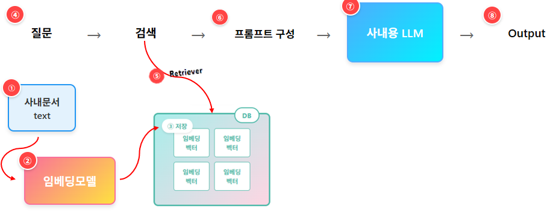
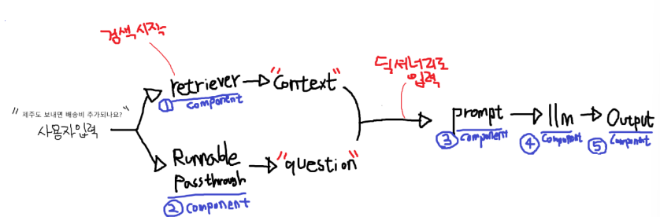

## easy
### AI Workflow
- 예시: 코딩없이 자동화 프로그램을 만드는 "노코드" 프로그램
  - 마우스로 배치하고, 연결하면 하나의 자동화프로그램이 완성됩니다.
- 입력 데이터가, 어디를 거치고, 또 어디를 거치고, AI도 거치고 하여, 출력을 내는 것 까지
- 이 데이터 처리 Flow를 만드는 것을 AI Workflow 라고 합니다.

### Langchain
- 노코드가 아니라, 코딩해서 만드는 AI Workflow 툴

- 아래와 같이 AI Workflow를 갖는 코드를 작성해보겠습니다.
  1. Prompt : 프롬프트를 입력
  2. LLM : LLM이 프롬프트를 전달 받아 처리
  3. String : LLM 출력결과를 정리

- 각 단계를 Langchain에서는 **Component** 라고 함

### ChatPromptTemplate 살펴보기
OpenAI API의 기본 입력 포맷
```JSON
[
  {
    "role": "system",
     "content": "너는 친절한 AI야."
  },
]
```
- 여기서 role에는 다음 내용을 넣습니다.
  - system : 모델의 역할을 지정합니다.
    - 예시 : 넌 매우 밝고 친근한 맥도날드 점원이지
  - user : 사람이 입력한 질문 입니다.
    - 예시 : 가장 맛있는 버거 추천해줘
  - assistant : LLM이 생성한 응답입니다.
    - 예시 : 빅맥!
- OpenAI는 위와 같은 포맷을 사용합니다.

#### ChatPromptTemplate의 **from_template**
- LLM 에게 보낼 프롬프트를 만드는 서식(Template)입니다.
  - 기본 값으로 role="user"로 변환됩니다.

- zero-shot
```python
from google.colab import userdata
from langchain_openai import ChatOpenAI
from langchain_core.prompts import ChatPromptTemplate
from langchain_core.output_parsers import StrOutputParser

key = userdata.get('OPEN_AI')

# Component 준비 (Workflow의 각 구성요소)
prompt = ChatPromptTemplate.from_template("내 달리기 속도는 {num1}m를 달리는데, {num2}초 걸려. 빠른 편이니?, 한 문장으로 이쁘게 말해봐")
llm = ChatOpenAI(model="gpt-5-nano", api_key=key)
output_parser = StrOutputParser()

# 체인 구성 (prompt --> llm --> output_parser)
chain = prompt | llm | output_parser

# 체인 수행!!
response = chain.invoke({"num1" : 100, "num2" : 12})

print(response)
```

- 위 코드는 다음과 같은 JSON 형태 문자열이 됨
```JSON
[
  {
    "role": "user",
    "content": "내 달리기 속도는 {num1}m를 달리는데, {num2}초 걸려. 빠른 편이니?, 한 문장으로 이쁘게 말해봐"
  }
]
```

- few-shot
```python
from google.colab import userdata
from langchain_openai import ChatOpenAI
from langchain_core.prompts import ChatPromptTemplate
from langchain_core.output_parsers import StrOutputParser

key = userdata.get('OPEN_AI')

# Component 준비 (Workflow의 각 구성요소)
prompt = ChatPromptTemplate.from_messages([
    ("system", "너는 무뚝뚝한 쉐프야. 항상 세줄로 말하지."),

    # Few-shot 1
    ("user", "선생님, 김치찌개 만드는 법 알려주세요."),
    ("assistant", "돼지고기, 김치많이, Last 두부"),

    # Few-shot 2
    ("user", "선생님, 계란말이 레시피 알려주세요."),
    ("assistant", "계란쫙, 간 조금, 천천히 Role!"),

    ("user", "선생님, {food} 만드는 방법좀 알려주세요.")

])

llm = ChatOpenAI(model="gpt-4o-mini", api_key=key)
output_parser = StrOutputParser()

# 체인 구성 (prompt --> llm --> output_parser)
chain = prompt | llm | output_parser

# 체인 수행!!
response = chain.invoke({"food": "보쌈"})

print(response)

```

### RunnableLambda
- 내가 만든 함수를, Chain 안에 사용할 수 있게해주는 컴포넌트
- RunnableLambda를 이용하면 여러 API들을 Custom하게 연동 가능

```python
from google.colab import userdata
from langchain_openai import ChatOpenAI
from langchain_core.prompts import ChatPromptTemplate
from langchain_core.output_parsers import StrOutputParser
from langchain_core.runnables import RunnableLambda # RunnableLambda

key = userdata.get('OPEN_AI')

# Component 준비
prompt = ChatPromptTemplate.from_template("항상 세 글자로 대답해 [질문] : {input}")
llm = ChatOpenAI(model="gpt-4o-mini", api_key=key)
output_parser = StrOutputParser()

def my_func(msg):
  if len(msg) == 3 :
    return msg
  return f'ERROR : "{msg}"는 세글자가 아닙니다.'

# 체인 구성 (prompt --> llm --> output_parser --> 함수)
chain = prompt | llm | output_parser | RunnableLambda(my_func)

# 체인 수행!!
response = chain.invoke({"input": "지금 너의 기분은?"})

print(response)
```

### RAG
- RAG: LLM에 사용자 질문과, 검색된 관련 정보를 함께 LLM에 넣어주는 기술
  - LLM이 더 똑똑하게 대답 가능

- 회사에서는 RAG를 필수적으로 사용합니다.
  - GPT는 회사만의 규율을 모르거든요.
  - 그 회사만 가지고 있는 기술문서도 있을 것이구요.
  - 그래서 대기업에서는 사내용 LLM 시스템에 RAG를 사용하곤 합니다.

#### RAG 구현을 위한 준비
- 먼저 사내문서들을 DB에 저장
- 사내문서를 DB에 저장할때 두 가지 선택지가 있습니다.
  1. Text들을 그대로 DB에 저장해두기
    - 차후 검색시, 완벽히 동일한 단어 중심으로 검색을 하게 됨
  2. Text들을 임베딩해서 Text의 의미벡터값을 저장해두기
    - 차후 검색시, 의미가 유사한 단어 중심으로 검색을 하게 됨
  - 사내문서 Text를 그냥 DB에 저장하지 않고, 임베딩 벡터로 저장하겠습니다.
- 임베딩 벡터로 저장시 다음과 같은 준비물이 필요
  1. 사내문서 Text
  2. Text를 임베딩하여 의미공간의 벡터값으로 변경할 "임베딩 모델"
  3. 마지막으로 임베딩 값을 저장할 "DB"
  4. Cos 유사도가 높은 단어가 있는 문서를 검색해주는 "Retriever" Library

#### RAG 동작 과정 이해하기
- 아래 이미지를 보면 다음과 같은 과정으로 진행됩니다.
  - 준비 단계
    1. 사내 문서 Text로 추출하여, "Chunk" 라는 단락 단위로 나눕니다.
    2. "Chunk" 를 임베딩모델의 입력값으로 넣어, 벡터로 만들고 만듭니다.
    3. 벡터를 DB에 저장합니다.
  - Workflow 동작
    4. 질문 프롬프트를 입력 받습니다.
    5. 임베딩 모델을 거쳐 벡터 값을 얻어낸 후, Retriever로 유사한 Chunk를 검색합니다.
    6. 기존 질문과, 검색결과를 합쳐 프롬프트를 완성합니다.
    7. 프롬프트를 LLM에 입력으로 넣습니다.
    8. 더 멋진 결과가 나옵니다.


#### RAG에 대한 Q&A
- Q. DB는 뭘 쓰나요?
- A. Vector 저장과 빠른 검색을 위한 Vector DB가 존재합니다. (Chroma, FAISS 등) <br/>
     그런데 그냥 MySQL을 써도 됩니다. MySQL 9.0 부터는 Vector도 지원되거든요.

- Q. 왜 문서를 Chunk 단위로 쪼개나요?
- A. LLM이 거대한 문서 입력을 못받아들여서요.

- Q. 문서 내용을 Chunk단위로 나눈다고 했는데, 몇 글자 정도로 나누나요?
- A. 보통 300 ~ 1000 토큰정도면 됩니다. 이정도면 LLM도 부담없고, 검색에 필요한 정보는 충분히 담길꺼예요. <br/>
   (한글 문장 수로 보면 한 20문장 정도)

- Q. Chunk 단위로 자르면, 정보가 중간에 짤리는 것 아니예요?
- A. 네 맞습니다. 그래서 겹치는 구간(Overlap)을 두면서 Chunk로 자릅니다.


#### RAG Workflow
동작 원리
1. 사용자 입력이 두 곳으로 전달됩니다.
      - retriever와 RunnablePassthrough 라는 컴포넌트로 입력이 들어갑니다.
      - retriever에서는 입력 받은 내용을 검색해서, 찾아낸 정보를 "context"에 담습니다.
      - RunnablePassthrough는 입력받는 내용을 그대로 출력에 전달만합니다. (ㅎㅎ)

2. prompt에 전달되면 프롬프트를 완성합니다. (prompt 컴포넌트)
      - 이 프롬프트에는 검색결과 내용과, 사용자 입력내용이 모두 포함되어있습니다.

3. LLM 동작 (llm 컴포넌트)

4. 출력 (StrOutParser 컴포넌트)



## hard
### 컴퓨터의 수 체계
#### 고정소수점
수 체계: 십진수, 이진수

$ 2^{10} $ = kilo = 약 1000
$ 2^{20} $ = mega = 약 1 million
$ 2^{30} $ = giga = 약 1 billion

- Most Significant Bit(MSB): 이진수에서 가장 왼쪽에 있는 비트, 가장 큰 자리값을 가짐
- Least Significant Bit(LSB): 이진수에서 가장 오른쪽에 있는 비트, 가장 작은 자리값을 가짐
- Niddle: 4bit(half byte)로 이루어진 데이터 단위

부호-크기 표현 방식(Signd-Magnitude Responsetation)
- 최상위 비트(MSB)를 부호 비트로 사용하여, 0이면 양수, 1이면 음수를 나타내고, 나머지 비트는 절대값(크기)을 표현하는 방식
- 기존 덧셈에서 문제 발생
  - 절댓값이 같은 양수 + 음수 = 0이 안됨
  - 0을 표현하는 방식이 2가지가 있음(±0)

2의 보수 표현 방식(two's complement representation)
- 음수를 표현할 때 해당 수의 절댓값을 이진수로 쓰고, 모든 비트를 반전(1의 보수)한뒤 1을 더하는 방식
- 2의 보수에서 부호반전
  - 모든 bit를 반전 -> +1
  - 부호-크기 표현 방식에 비교해서 덧셈 연산이 필요함 => 절댓값 확인에 비용이 더 듬

비트 폭 확장(Increasing Bit Width)
- 부호 확장(sign extension): 최상위 비트를 복사해 상위 비트를 채움(값을 일정하게 유지)
- 제로 확장(zero extension): 상위 비트를 모두 0으로 채움(패턴을 일정하게 유지)

int와 long의 역사
- 8-bt, 16-bit 컴퓨터 시절 완성됨
  - int: 2byte 정수형
  - long: 4byte 정수형
- 64-bit 컴퓨터의 등장
  - long long: 8byte 정수형
  - int: 2byte, 4byte 병용하다가 4byte로 고정
  - long: 플랫폼에따라 어디(window)는 4byte 어디는 8byte로 사용됨

N-bit 패턴이 꼭 정수일 필요는 없음
- 정수부와 소수부를 N-bit 패턴에서 함께 표현 할 수 있음
  - K-bit: 정수부, M-bit: 소수부
  - N = K + M
  - 정수부와 소수부 사이에 이진 소수점

- 이진 소수점: 사용자(프로그래머)가 제한 없이 해당 위치를 정할 수 있음 => HW는 모두 N-bit 정수로 판단
- 덧셈과 뺄셈은 이전과 동일하게 동작

#### 부동소수점
고정소수점 표현을 활용할 경우 너무 많은 비트를 필요로 함
- 큰/작은 수를 더 적은 문자로 표현 => 대신 유효숫자의 개념을 도입 

부동소수점
- 지수를 활용하여 수를 표기
- 소수점이 고정되지 않고 이동 가능


- 가수는 고정 소수점 체계를 사용 해야함
- 언제나 $ ■.■■■■ x 10^■ $ 형태로만 표현하기로 약속 => 정규화(nomalization)

지수적 표현을 이진 수 체계에 접목하는 법


- 가수는 두 가지 표현 중에 선택
  - [0, 1) 범위의 순수한 소수 표현: 0.■■■
  - [1, 2) 범위의 정규화된 표현: ■.■■■
- 밑(base, β): 일반적으로 2의 거듭제곱 형태를 선택
  - 밑을 미리 약속(고정)하여 가수/지수 변화를 간단하게 만들 수 있음
  - 가수의 최대($ M_{max} $)보다 큰 값이 생기면 가수를 표현 가능한 범위로 줄이고 지수를 증가시켜야 함
- 부동소수점은 유일한(unique) 표현이 아님에 주의
  - 가수의 비트 수 한계로 같은 표현을 무한히 만들 수는 없음
- 일반적으로 0으로 시작하는 패턴을 피하고자 함(유효숫자를 최대한 확보) => 정규화
- $ β = 2^k $ 경우에는 가수는 k 비트 단위로 이동할 수 있음 => 첫 k 비트가 모두 0이 아니면 정규화된 것으로 판단
- 정규화 표현의 한계: 정규화된 표현은 0을 포함하지 않음

바이어스/편향지수(biased exponent)
- 가장 일반적으로 사용되는/기록되는 지수 표현 => $ E = E^{true} + bias $
  - bias: 미리 정해진 상수
  - $ E^{ture} $: 실제 지수(2의 보수 표현)
- e-bit $ E^{ture} $가 표현할 수 있는 범위: $ -2^{e-1} ≤ E^{true} ≤ 2^{e-1} -1 $
- 바이어스는 일반적으로 지수가 가질 수 있는 가장 작은 음수의 절대값으로 설정($ bias = 2^{e-1} $)
- exess $ 2^{e-1} $ 기법을 사용한다면 실제 지수의 2의 보수 표현에서 부호 비트만 반전(inversion) 시키면 됨
- 바이어스 지수의 장점
  - 지수를 0/양수 영역으로 이동시켜 기록된 지수를 부호 없는 수 표현으로 해석하게 만듦
- 정규화된 가수와 바이어스 지수
  - S, E, M 표현 방식의 대소 비교가 부호 없는 정수 표현의 경우와 동일

이진 부동소수점의 표현 범위
- 양수($ F^+ $)와 음수($ F^- $)의 영역을 따로 생각함
- 연산의 결과에서 지수가 $ E_{max} $ 초과되면 상한초과 발생(exponent overflow)
- 연산의 결과에서 지수가 $ E_{min} $ 미달되면 하한초과 발생(exponent underflow)
- 정규화된 가수를 사용한다면 상한초과(overflow)는 지수의 변화에서만 발생
- 하한 미달(underflow) 발생

IEEE Single-Precision 포맷
- 주요 특징
  - Base-2
  - Hidden bit 사용: 1.■■■■ 형태로 가수를 정규화 하고 있으며, 맨 앞의 1을 f에 저장하지 않음
  - 8-bit 지수에 bias를 127로 사용(256가지 지수 표현 중 특수 패턴 정의)
#### 연산과 복잡도
이진수 체계 정수의 뺄셈(2의 보수 방식)
- 빼는 값을 2의 보수로 변경하여 덧셈

실제 고정소수점 덧셈기와 뺄셈기의 HW 복잡도는 사실상 동일

이진 고정소수점 수 체계 정수의 덧셈/뺄셈
- 정수의 덧셈/뺄셈과 기본적으로 동일하나 이진 소수점 위치 차이로 인한 scaling factor 주의

이진수 체계의 곱셈/나눗셈
- 기존 십진수 체계의 곱셈/나눗셈과 동일한 과정

고정소수점 연산의 복잡도
- 일반적으로 연산 속도 관점에서 덧셈~뺄셈 << 곱셈 << 나눗셈

이진 부동소수점 수 체계의 덧셈/뺄셈
- 가수의 덧셈/뻴셈 전에 지수를 동일하게 만들어야 함
- 기본 덧셈/뺄셈 이후 추가 체크
  - 가수의 결과가 정규화 영역을 넘어설 수 있음
  - 덧셈: 증가한 지수로 인한 상한초과 체크
  - 뺄셈: 감소한 지수로 인한 하한미달 체크

이진 부동소수점 수 체계의 곱셈
- 부호: 부호가 같으면 + 다르면 -
- 지수: 두 지수를 더함
- 가수: 두 가수를 고정 소수점 곱셈처럼 연산(지수 연산과 병렬처리 가능)

이진 부동소수점 수 체계의 나눗셈
- 부호: 부호가 같으면 + 다르면 -
- 지수: 두 지수를 뺌
- 가수: 두 가수를 고정 소수점 나눗셈처럼 연산(지수 연산과 병렬처리 가능)
- 제수(divisor)가 0인 경우
  - 우선적으로 상한초과 처리
  - 몫의 경우 infinity
- 피제수(dividend)와 제수(divisor)가 모두 0인 경우
  - IEEE 754의 경우 not a number(NaN) 처리
- 나머지(remainder) 계산
  - 부동소수점 나머지 계산이 정의되어 있으나 일반적으로 몫 계산보다 훨씬 복잡함
  - 대부분의 경우 하드웨어 수준에서 제공되지 않음

부동소수점 연산의 복잡도
- 일반적으로 연산 속도 관점에서 곱셈 < 덧셈~뺄셈 << 나눗셈

### 모델 경량화와 효율적 파인튜님
#### 모델 경량화의 필요성
AI/ML의 발전: (한계도 있지만) 이미 많은 영역에서 평균적으로 사람보다 우수함

AI/ML 세상의 어두운 면
- 모델 크기 문제
  - 계속해서 커질 것으로 예상됨
- 컴퓨팅 리소스 문제
- 학습비용

모델 경량화: 선택이 아닌 필수가 되고 있음(특히 추론, 서비스 영역)
- 일반적으로 경량화 정도가 좋아지면 모델 성능이 떨어짐 + 어떤 성능(모델크기, 속도, 전력)을 개선할 것인지

#### Quantization/Pruning/Distillation
양자화(Quantization): 연산/메모리 부하를 줄이는 가장 직관적인 방법
- Clipping range에 따른 scaling factor 정하는 것이 가장 첫 단계
- 모델마다 적용 가능한 Quantization 옵션이 다른 경우가 많음
- 효율 개선을 위해 하드웨어/가속기 지원이 필요한 경우도 있음

QAT vs PTQ
- Quantization-aware training(QAT)
  - 학습 단계에서 (forward pass) Quanrization을 함께 수행(학습 데이터가 필요)
  - 동일 accuracy 기준 압축률을 높일 수 있음, 그러나 학습 복잡도가 엄청나게 상슴(retrain/fine-tunning 접근)
  - 상대적으로 CNN등 오리지널 학습 복잡도/데이터가 크지 않은 경우 쉽게 적용 가능
- Post-training Quantization(PTQ)
  - LLM처럼 모델도 학습데이터도 너무 큰 경우엔 QAT 사용불가
  - 사전학습된 (pre-trained) 모델을 바탕으로 Quantization 바로 수행
  - 적절한 calibration 데이터를 사용하여 경량화 효율을 높일 수 있음

양자화를 사용시 고려사항
- Weight-activation vs Weight-only
  - 모델 사이즈에 얼마나 집중할 것인가
  - De-Quantization 과정을 얼마나 허락할 것인가
- Symmetric vs Asymmetric
  - Activation 및 weight의 분포를 어디까지 반영할 것인가
- Integer vs Floating-point
  - Integer Quantization 방식
  - Floating-point Quantization 방식
- Mixed-precision Quantization
  - Layer(혹은 다른 단위) 별로 최적화된 Quantization 적용 (하드웨어 지원이 필요할 수 있음)

가지치기(Pruning)
- 불필요한 (기여도가 적은) weight를 제거
  - 저장해야 하는 weight가 적어지면서 모델 크기가 줄어들게 됨
  - 살아남은 weight의 위치를 기록하기 위한 추가 정보가 필요함(indexing data, meta data 등)
  - Quantization이 더이상 되지 않는 강황에서도 pruning이 가능한 경우가 많음
  - GPU상에서 속도 이득을 보기에 어려운 경우가 많음 (전용 가속기 설계 필요)

가지치기 사용시 고려사항
- Pruning 대상의 순서를 어떻게 정할 것인가
- Unstructured vs Structured
  - 추론(inference) 효율과 accuracy 방어 사이의 선택
  - Channel/layer 수준의 극단적인 structured pruning도 활용 가능
- Indexing data format
  - 가장 일반적으로 쓰는 CSR(compressed sparse row) => 하지만 pruning ratio가 극단적으로 높아야 GPU 가속
  - 그 이외에도 on-off encoding, XOR-gate compression 등 새로운 시도들이 제시되고 있음
- Fine-tuning/retraining 가능 여부
  - Quantization의 경우와 비슷한 양상
  - 모델 구조에 따라 상이하지만, CNN 기반 이미지 처리는 80% 이상도 pruning 가능(1~2% accuracy drop)
  - 언어 처리를 위한 LLM 계열은 50% 내외 수준
- GPU호환여부
  - Quantization과 비슷하게 GPU가 감당할 수 없는 pruning 패턴이 형성되는 경우가 있음
  - AI/ML 모델 특성상 기본적으로 0이 많이 포함되어 있음
  - 전용 가속기 및 NPU 설계 단계에서 sparsity-aware 구조를 많이 고민하고 있음

지식 증류(Knowledge Distillation)
- 작은 모델을 만드는 효과적인 방법
  - 똑똑하지만 매우 큰 모델에서 출발(Teacher)
- 훈련 방법
  - 두 가지 loss를 정의: Total loss = Student loss + Distillation loss
    - Student loss: Ground truth의 student 추론의 차이
    - Distillation loss: 동일 데이터에서 teacher와 student의 결과 차이

보다 효율적인 지식 전달/증류
- 조교 활용(Assistant model)
  - 학생의 잠재력이 고정되고 선생님이 너무 뛰어나면 효율 떨어짐
  - 선생님이 고정되고 학생의 잠재력이 너무 뛰어나면 효율 떨어짐

LLM Distillation
- 상대적으로 작은 LLM 학습에서 기존 (엄청나게 큰) LLM 활용
- 그러나 학습에 사용해야 하는 데이터가 너무 크면 여전히 문제

#### LoRA/QLoRA
모델 경량화 관점에서 파인튜닝
- 원본 모델의 크기를 줄이는 과정

모델 서비스 관점에서(특히 LLM의 경우)
- 일반적인 능력은 강한 원본 모델
- 보다 특정 영역/도메인에 특화 시키고자 하면 => 원본 모델을 조정/튜닝 하여 서비스

다양한 튜닝 방법
- In-context 학습
  - 원본 모델을 두고 원하는 방향으로의 동작을 튜닝하기 위한 프롬프트 고민
- Full fine tuning
  - 특정 도메인의 데이터를 사용하여 원본 모델의 모든 weight를 fine tuning
  - 장점:
    1. 처음부터 새로 학습하는 것에 비해 적은 데이터만 활용하여 도메인 특화 가능
    2. 도메인 특화 관점에서 accuracy 이득을 기대할 수 있음
  - 단점:
    1. 원본 모델이 일반적으로 크기에 모든 weight를 갱신하는 학습(tuning) 비용이 부담
    2. 메모리 사용량 관점에서 사실상 처음부터 학습하는 수준이 요구될 수 있음
    3. 원본 모델의 weight 자체가 변화하는 과정에서 기존 학습 정보의 망각이 일어날 수 있음

파라미터 효율적 파인 튜닝(Parameter Efficient Fine Tuning, PEFT)
- LLM을 도메인 특화 시키는 과정의 복잡도 개선
  - 원본 모델의 전체 weight를 전부 갱신하지 않고서도 튜닝 작업을 지원
- Adapter layer
  - 입력 원본 모델 내부에 새로운 layer를 추가
  - 목표로 하는 특화 데이터를 활용하여 adapter layer만 학습
  - Full tuning보다는 적지만 많은 추가 weight 필요
  - 사실상 원본 모델의 구조가 바뀌고, adapter layer의 메모리/연산 오버헤드가 크다는 단점
- Prompt tuning
  - 입력 임베딩 앞/중간에 학습 가능한 가짜 토큰 추가
  - 원본 모델의 구조를 전혀 건들이지 않고, 아주 적은 추가 weight로 입력을 조정하여 특정 동작을 유도
  - 매우 가볍고 배포가 쉬운 장점이 있으나, 표현력의 한계로 성능 제한
- Low-Rank Adaptation(LoRA)
  - 특정 weight matrix에 low-rank update를 추가
  - 원본 weight를 고정하고 추가되는 low-rank weight만 학습
  - 높은 표현력에 adapter layer보다 훨씬 적은 추가 weight


Quantized Low-Rank Adaptation(QLoRA)
- 경량화(Quantization) + LoRA
  - 원본 모델을 강하게 Quanization => 범용 성능의 하락을 피할 수 없음
  - LoRA를 적용하는 low-rank weight는 BF16 등 높은 해상도를 유지하면서 학습
  - 전체 모델의 복잡도를 대폭 줄이면서 목표로 하는 task에 대해서는 적어도 높은 성능을 달성할 수 있음