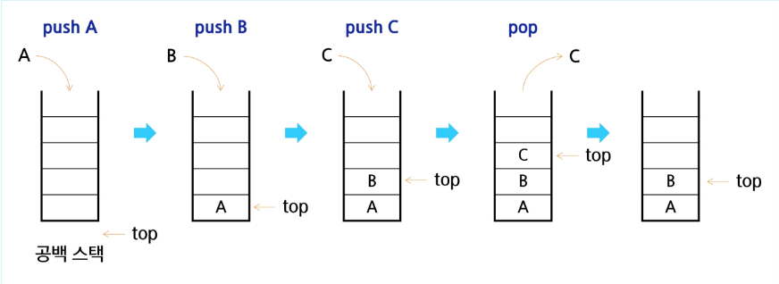
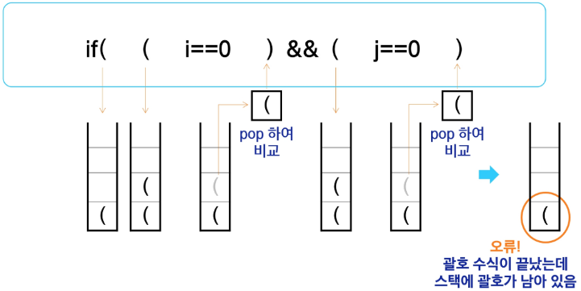
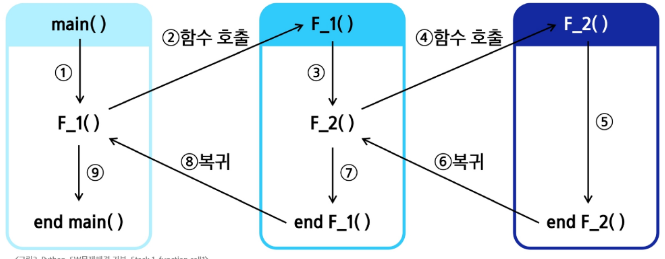
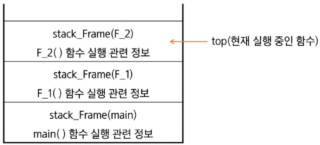
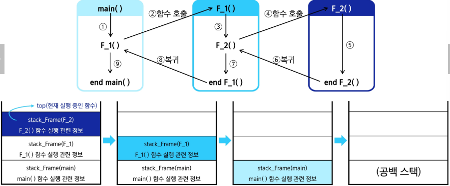

### Stack 자료구조 이해
#### Stack의 개념과 특성
스택(Stack) : 물건을 쌓아 올리듯 자료를 쌓아 올린 형태의 자료구조
- 대표적인 선형 자료구조 중 하나, 스택에 자료를 삽입하거나 꺼낼수 있음
- 선형구조 : 자료 간의 관계가 1:1의 관계를 갖는다(리스트, 배열)
- 비선형구조 : 자료 간의 관계가 1:N의 관계를 갖는다(트리, 그래프)

후입선출(LIFO : Last-In-First_Out) : 가장 마지막에 넣은 자료가 가장 먼저 나오는 것
- 스택에 1,2,3을 차례대로 넣으면 꺼낼 때는 3,2,1 순서로 나오게 됨

#### Stack의 기본 연산
스택을 프로그램에 구현하기 위해서 필요한 자료구조와 연산
- 배열을 사용해 구현할 수 있음
  - 파이썬에서는 리스트를 사용
- 저장소 자체를 스택이라 부르기도 함
  - 용도에 따라 메모리의 일부를 스택으로 부름
- 스택에서 마지막에 삽입된 원소의 위치
  - 스택 포인터, top으로 부르며 데이터를 넣거나 뺄 때 기준이 되는 위치

스택의 연산
- 삽입(Push)
  - 저장소에 자료를 저장하는 연산으로, 보통 push라고 부름
- 삭제(Pop)
  - 저장소에서 삽입한 자료의 역순으로 꺼내는 연산으로, 보통 pop이라고 부름
- 스택이 공백인지 아닌지를 확인하는 연산(isEmpty)
  - 스택이 비어 있으면 True, dkslaus False를 반환
- 스택의 top에 있는 item(원소)을 반환하는 연산(peek)
  - 삭제는 하지 않음

스택의 삽입/삭제 과정
  - 빈 스택에 원소 A, B, C를 차례로 삽입(push) 후 한번 삭제(pop)하는 연산 과정
  

#### Stack 구현 실습
Push 연산
- append 메소드를 통해 리스트의 마지막에 데이터를 삽입
```python
def my_push(item):
    s.append(item)
```

- 인덱스 연산을 활용한 구현
```python
def my_push(item, size):
    globla top
    top += 1
    if top == size:
        print("overflow!")
    else:
        stack[top] = item
```

단순한 Push 연산
- 크기가 정해진 리스트와 인덱스 연산을 활용
```python
size = 10
stack = [0] * size
top = -1

push(10, size)
top += 1
stack[top] = 20
```

Pop 연산
- 남은 데이터 중 가장 늦게 저장 된 데이터를 삭제하는 연산
```python
def my_pop():
    if len(s) == 0:
        # underflow
        return
    else:
        # 리스트 s의 마지막 원소 삭제
        return s.pop()
```

인덱스 연산을 이용한 Pop 연산
- 크기가 정해진 리스트와 인덱스 활용
```python
def my_pop():
    global top
    if top == -1:
        print("undefflow")
        return 0
    else:
        top -= 1
        return stack[top+1]

print(my_pop())

if top > -1:
    top -= 1
    print(stack[top+1])
```

스택 구현 고려 사항
- 1차원 배열을 사용하여 구현할 경우
  - 장점 : 구현이 용이
  - 단점 : 스택의 크기를 변경하기가 어려움
- 해결 방법 : 저장소를 동적으로 할당하여 스택을 구현하는 방법(동적 연결리스트를 이용하여 구현하는 방법)
  - 장점 : 메모리를 효율적으로 사용
  - 단점 : 구현이 복잡함
- 동적 메모리 할당 : 필요한 만큼 메모리를 할당하고 해제하여 유연하게 크기를 조절할 수 있음
- 연결리스트 : 데이터와 다음 노드의 주소를 함께 저장하여 요소들이 순차적으로 연결된 자료구조
- 메모리 : 컴퓨터에서 데이터를 저장하고 처리하기 위해 사용하는 일시적인 공간

연습문제1
- 스택을 구현한 후, 이를 이용해 3개의 데이터를 저장하고 다시 3번 꺼내어 출력해 봅시다.

### Stack 응용
#### 괄호 검사
괄호의 종류
- 대괄호('[', ']'), 중괄호('{', '}'), 소괄호('(', ')')

조건
1. 왼쪽 괄호의 개수와 오른쪽 괄호의 개수가 같아야 한다
2. 같은 괄호에서 왼쪽 괄호는 오른쪽 괄호보다 먼저 나와야 한다
3. 괄호 사이에는 포함 관계만 존재한다



괄호를 검사하는 알고리즘 개요
1. 문자열에 있는 괄호를 차례대로 검사하면서 왼쪽 괄호를 만나면 스택에 삽입하고, 오른쪽 괄호를 만나면 스택에서 top 괄호를 삭제한 후 오른쪽 괄호와 짝이 맞는지를 검사한다.
2. 이 때, 스택이 비어 있으면 조건1 또는 조건2에 위배되고 괄호의 짝이 맞지 않으면 조건3에 위배된다.
3. 마지막 괄호까지 조사한 후에도 스택에 괄호가 남아 있으면 조건 1에 위배된다.

연습문제2
괄호의 짝을 검사하는 프로그램을 작성하고, 이를 이용해 주어진 괄호 문자열의 올바를 사용 여부를 검사해 봅시다.


#### Function Call
Function call : 프로그램에서의 함수 호출과 복귀에 따른 수행 순서를 관리
- 가장 마지막에 호출된 함수가 가장 먼저 실행을 완료하고 복귀하는 후입선출 구조이므로, 후입선출 구조의 스택을 이용하여 수행순서 관리


- 시스템 스택
  - 함수 수행에 필요한 지역변수, 매개변수 및 수행 후 복귀할 주소 등의 정보를 저장
  - 함수 호출이 발생하면 스택 프레임(stack frame)에 저장하여 시스템 스텍에 삽입


프로그램에서의 함수 호출과 복귀에 따른 수행 순서를 관리
- 함수의 실행이 끝나면 시스템 스택의 top 원소(스택 프레임)를 삭제(pop)하면서 프레임에 저장되어 있던 복귀주소를 확인하고 복귀시킵니다.
- 함수 호출과 복귀에 따라 이 과정을 반복하여 전체 프로그램 수행이 종료되면 시스템 스택은 공백 스택이 됩니다.

시스템 스택을 이용한 함수 호출과 복귀
