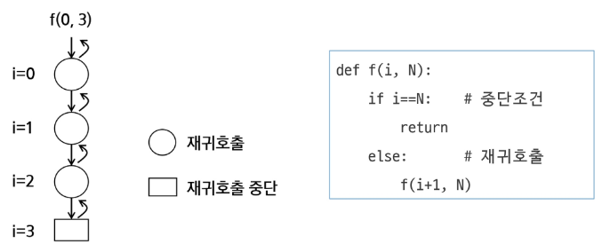
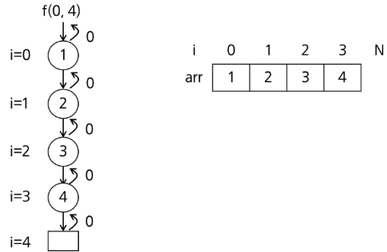
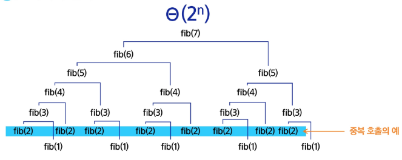
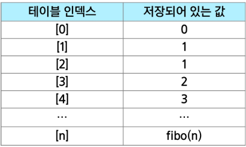
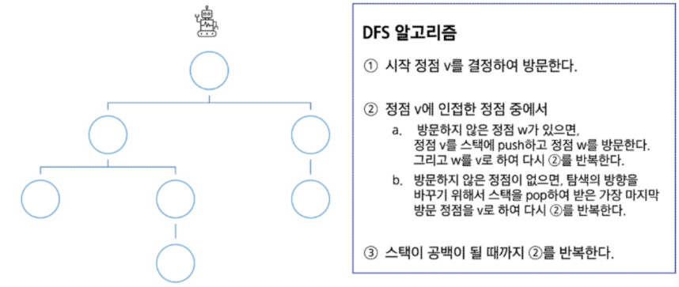
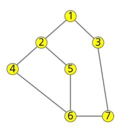

### Stack 기반 문제 해결 기법
#### 재귀호출
재귀호출 : 함수가 자신과 같은 작업을 반복해야 할 때, 자신을 다시 호출하는 구조
- 반복적으로 자기 자신을 호출해야 하거나 전체를 부분 문제로 나눌 수 있는 경우에는 일반적인 호출방식보다 재귀호출 방식을 사용하여 함수를 만들면 프로그램의 크기를 줄이고 간단하게 작성 가능

n! : n에 대한 factorial
```python
def factorial(n):
    if n == 1:
        return 1
    else:
        return n * factorial(n-1)
```

피보나치 수열 : 0과 1로 시작하고 이전의 두 수 합을 다음 항으로 하는 수열

피보나치 수열의 수학적 정의
- 피보나치 수열의 i번 째 값을 계산하는 함수 F를 정의
  - F(0), F(1) = 0, 1
  - F(i) = F(i-1) + F(i-2), for i >= 2

피보나치 수를 구하는 재귀함수
- 피보나치 수열의 수학적 정의에 따라, 피보나치 수열의 i번째 항을 반환하는 함수를 재귀함수로 구현 가능
```python
def fibo(n):
    if n < 2:
        return n
    else:
        return fibo(n-1) + fibo(n-2)
```

재귀함수의 기본형
- 현재 호출 단계와 목표 단계를 인자로 사용
  - 현재 단계 i, 목표 N을 인자로 갖는 재귀함수 f(i, N)이 기본형


모든 배열 원소에 접근하는 재귀함수
- 기본형 활용
  - 호출 단계 i에서 arr[i]원소에 접근하고, i가 배열의 크기와 같아지면 재귀호출을 중단
  
```python
def f(i, N):
    if i == N:
        return
    else:
        print(arr[i])
        f(i+1, N)
```

배열 원소 검색
- 배열에 v가 있으면 1, 없으면 0을 리턴하는 함수
  - v = 5인 경우, arr에는 5가 없으므로 마지막 단계까지 호출하고 0을 리턴
  
  - v = 3인 경우, 3을 찾은 경우에도 재귀호출을 중단
  
```python
def f(i, N, v):
    if i == N:
        return 0
    elif arr[i] == v:
        return 1
    else:
        return f(i+1, N, v)
```

#### Memoization
피보나치 재귀호출의 문제점
- 피보나치 수를 구하는 함수를 재귀함수로 구현한 알고리즘은 "엄청난 중복 호출이 존재한다"는 문제 발생


재귀 알고리즘 최적화 : 메모이제이션 기법

메모이제이션 : 컴퓨터 프로그램을 실행할 때 이전에 계산한 값을 메모리에 저장해서 매번 다시 계산하지 않도록 하여 전체적인 실행속도를 빠르게 하는 기술
- 동적 계획법의 핵심이 되는 기술로, 앞의 피보나치 수를 구하는 알고리즘에서 fibo(n)의 값을 계산하자마자 저장하면(memoize), 실행시간을 Θ(n)으로 줄일 수 있음

Memoization을 적용한 피보나치
- 계산된 적이 있는 피보나치 수는 저장된 값을 리턴
```python
def fibo1(n):
    if n >= 2 and memo[n] == 0:
        memo[n] = fibo(n-1) + fibo(n-2)
    return memo[n]
memo = [0] * (n+1)
memo[0] = 0
memo[1] = 1
```

#### DP
최적화를 위한 알고리즘 : 동적계획법(DP)

동적계획법(DP, Dynamic Programing) : 입력 크기가 작은 부분 문제들을 먼저 해결한 뒤, 그 결과를 바탕으로 더 큰 문제를 순차적으로 해결해 나가며 최종적으로 전체 문제의 해답을 도출하는 알고리즘
- 동적 계획 알고리즘은 그리디 알고리즘과 같이 최적화 문제를 해결하는 알고리즘이다.

피보나치 수열
- DP 적용 문제
  - 문제의 최적 해가 그 하위 문제의 최적 해로부터 쉽게 구성될 수 있는 최적 부분구조여야 함
  - 동일한 하위 문제가 여러 번 반복되어 나타나는 중복 부분 문제여야 함

- 최적 부분 구조 + 중복 부분 문제
  - F(n) = F(n-1) + F(n-2) = (F(n-2) + F(n-3)) + F(n-2)
  - F(4) = F(3) + F(2) = (F(2)+F(1))+(F(1)+F(0))=(F(1)+F(0)+F(1))+(F(1)+F(0))

피보나치 수열 함수의 중복 호출 제거
- 부분 문제로 나누는 일을 끝냈으면 가장 작은 부분 문제부터 해 구하기
- 그 결과는 테이블에 저장하고, 테이블에 저장된 부분 문제의 해를 이용하여 상위 문제의 해를 구하기


피보나치 수열을 DP로 구현한 코드
```python
def fibo2(n):
    f = [0] * (n + 1)
    f[0] = 0
    f[1] = 1
    for i in range(2, n + 1):
        f[i] = f[i-1] + f[i-2]

    return f[n]
```

DP의 구현 방식
- Recursive 방식 : fibo1()
- Iterative 방식 : fibo2()
- 재귀 구조에 Memoization을 사용하는 것보다, 반복적인 구조로 DP를 구현하는 방식이 성능 면에서 더 효율적, 재귀적 구조는 내부에 시스템 호출 스택을 사용하는 오버헤드(추가적인 자원 소모나 처리 시간을 발생시키는 부가적인 비용)가 발생하기 때문

#### DFS
비선형 자료구조 탐색
- 비선형구조인 그래프 구조는 그래프로 표현된 모든 자료를 빠짐없이 검색하는 것이 중요, 이러한 탐색에는 다음의 두 가지 방법이 사용됨
  1. 깊이 우선 탐색(DFS)
  2. 너비 우선 탐색(BFS)

깊이 우선 탐색(DFS, Depth First Search) : 한 방향으로 가능한 한 깊게 탐색한 후, 더 이상 갈 곳이 없으면 되돌아와 다른 방향을 탐색

DFS의 동작 원리
1. 시작 정점의 한 방향으로 갈 수 있는 경로가 있는 곳까지 깊이 탐색해 나간다.
2. 더 이상 갈 곳이 없게 되면, 가장 마지막에 만났던 갈림길 간선이 있는 정점으로 되돌아와서 다른 방향의 정점으로 탐색을 계속 반복하여 결국 모든 정점을 방문하는 탐색방법
- 가장 마지막에 만났던 갈림길의 정점으로 되돌아가서 다시 깊이 우선 탐색을 반복해야 하므로 후입선출(LIFO) 구조의 스택 사용

로봇이 선을 따라 모든 칸을 탐색하는 방법


연습문제3
- 다음은 연결되어 있는 두 개의 정점 사이의 간선을 순서대로 나열 해 놓은 것이다. 모든 정점을 깊이 우선 탐색을 사용하여 화면에 깊이 우선 탐색 경로를 출력하시오. 시작 정점을 1로 시작하시오.
