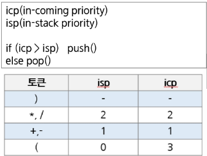

### Stack 계산기
#### 후위 표기법 변환
문자열로 된 계산식
- stack을 이용하여 값을 계산할 수 있음
- 문자열 수식 계산의 일반적인 방법
  1. 중위 표기법의 수식을 후위 표기법으로 변경(stack 이용)
    - 중위 표기법 : 연산자를 피연산자 중간에 표기, A+B
  2. 후위 표기법의 수식을 stack을 이용하여 계산
    - 후위 표기법 : 연산자를 피연산자 뒤에 표기, AB+

STEP1. 중위 표기법의 후위 표기법 변환 방법1
  1. 수식의 각 연산자에 대해서 우선순위에 따라 괄호를 사용하여 다시 표현
  2. 각 연산자를 그에 대응하는 오른쪽 괄호의 뒤로 이동
  3. 괄호를 제거

실제 사용 사례
  0. A*B-C/D
  1. ((A*B)-(C/D))
  2. ((AB)*(CD)/)-
  3. AB*CD/-

STEP1. 중위 표기법의 후위 표기법 변환 방법2(알고리즘 - Staack 이용)
1. 입력 받은 중위 표기법에서 토큰을 읽는다.
2. 토큰이 피연산자면 토큰을 출력
3. 토큰이 연산자(괄호포함)일 때,
  - 이 토큰이 스택의 top에 저장되어 있는 연산자보다 우선순위가 높으면 push
  - 그렇지 않다면 스택 top의 연산자의 우선순위가 작을 때까지 스택에서 pop한 후 토큰의 연산자를 push한다. 만약 top에 연산자가 없으면 push한다.
4. 토큰이 오른쪽 괄호 ')'이면 스택 top에 왼쪽 괄호 '('가 올 때까지 스택에 pop연산을 수행하고 pop한 연산자를 출력. 왼쪽 괄호를 만나면 pop만 하고 출력하지 않는다.
5. 중위 표기법에 더 읽을 것이 없다면 중지, 더 읽을것이 있다면 1부터 다시 반복
6. 스택에 남아 있는 연산자를 모두 pop하여 출력한다
  - 스택 밖의 왼쪽 괄호는 우선 순위가 가장 높으며, 스택 안의 왼쪽 괄호는 우선 순위가 가장 낮다.



#### 후위 표기법 연산
Step2. 후위 표기법 식을 Stack을 이용하여 계산
1. 피연산자를 만나면 스택에 push
2. 연산자를 만나면 필요한 만큼의 피연산자를 스택에서 pop하여 연산하고, 연산결과를 다시 스택에 push
3. 수식이 끝나면, 마지막으로 스택을 pop하여 출력

### Stack 응용
#### Backtracking
백트랙킹(Backtracking) : 후보해를 구성해 나가다가, 더 이상 해가 될 수 없다고 판단되면 되돌아가서(backtrack) 다른 경로를 시도하는 방법
- 문제 해결을 위한 탐색 알고리즘의 하나
- 가능성이 없는 경로는 더 이상 탐색하지 않고 되돌아가며 해결책을 찾는 방식
- 최적화(optimization) 문제와 결정(decision) 문제에 적용
- 적용 예
  - N-Queens 문제
  - 미로 찾기
  - 순열/조합 생성
  - 부분집합 탐색
  - 스도쿠 풀이 등
- 결정 문제(decision) : 문제의 조건을 만족하는 해가 존재하는지 여부를 yes, no가 답하는 문제

Backtracking와 DFS와의 차이
- Prunning(가지치기) 유무
  - Backtracking은 어떤 node에서 출발하는 경호가 해결책으로 이어질 것 같지 않으면 더 이상 그 경로를 따라가지 않고 시도를 줄입니다.
- 조기 경로 차단
  - DFS는 모든 경로를 추적하지만, Backtracking은 불필요한 경로를 조기에 차단합니다.
- 경우의 수가 많은 경우
  - 예를 들어 N!인 경우의 수를 가진 문제에 대해 DFS를 가하면 처리가 불가능
  - Backtracking을 적용하면 일반적으로 경우의 수가 줄어들지만, 최악의 경우 지수함수 시간을 요하므로 처리가 불가능

Backtracking 기법
- 어떤 노드의 유망성을 점검한 후에 유망(promising)하지 않다고 결정되면 그 노드의 부모로 되돌아가(backtracking) 다음 자식 노드로 이동
- 어떤 노드를 방문하였을 때, 그 노드를 포함한 경로가 해답이 될 수 없으면 그 노드는 유망하지 않다고 하며, 반대로 해답의 가능성이 있으면 유망하다고 함
- 가지치기(pruning) : 유망하지 않은 노드가 포함되는 경로는 더 이상 고려하지 않음

Backtracking 진행 절차
1. 상태 공간 트리의 DFS 실시
2. 각 node가 유망한가 점검
3. 만일 그 node가 유망하지 않으면, 해당 node의 부모 node로 돌아감
4. 돌아간 node에서 검색을 계속함

일반 Backtracking 알고리즘
```python
def checknode(v):
    if promising(v):
        if there is a solution at v:
            write the solution
        else:
            for u in each child of v:
                checknode(u)
```
