### Stack 응용
#### 부분 집합
부분집합(powerset) : 어떤 집합의 공집합과 자기자신을 포함한 모든 부분
- 구하고자 하는 어떤 집합의 원소 개수가 n일 경우 부분집합의 수는 2**n개이다.

Backtracking 기법으로 powerset 만들기
- 앞에서 설명한 일반적인 Backtracking 접근 방법을 이용
- N개의 원소가 들어있는 집합의 2**n개의 부분집합을 \
  - True 또는 False값을 가지는 항목들로 구성된 n개의 배열을 만드는 방법을 이용
- 여기서 배열의 i번째 원소가 부분집합의 값인지 아닌지를 나타내는 값


각 원소가 부분집합에 포함되었는지를 loop를 이용하여 확인하고 부분집합을 생성하는 방법
```python
bit = [0, 0, 0, 0]
for i in range(2):
    bit[0] = i  # 0번째 원소
    for j in range(2):
        bit[1] = j  # 1번째 원소
        for k in range(2):
            bit[2] = k  # 2번째 원소
            for l in range(2):
                bit[3] = l  # 3번째 원소
                print(bit)  # 생성된 부분집합 출력
```

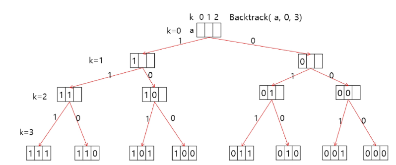
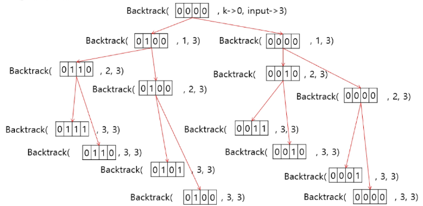

Powerset을 구하는 Backtracking 알고리즘 1
```python
# a: 주어진 배열, k: 결정할 원소, n: 원소 개수
def backtrack(a, k, n):
    c = [0] * maxcandidates

    if k == n:
        process_solution(a, k)
    else:
      ncandidates = construct_candidates(a, k, n, c)
      for i in range(ncandidates):
          a[k] = c[i]
          backtrack(a, k + 1, n)

def construct_candidates(a, k, n, c):
    c[0] = True
    c[1] = False
    return 2

def process_solution(a, k):
    for i in range(k):
        if a[i]:
            print(num[i], end = ' ')
    print()

maxcandidates = 2
NMAX = 4
a = [0] * NMAX
num = [1, 2, 3, 4]
backtrack(a, 0, 3)
```

#### 순열1
단순하게 순열을 생성하는 방법
```python
for i1 in range(1, 4):
    for i2 in range(1, 4):
        if i2 != i1:
            for i3 in range(1, 4):
                if i3 != i1 and i3 != i2:
                    print(i1, i2, i3)
```

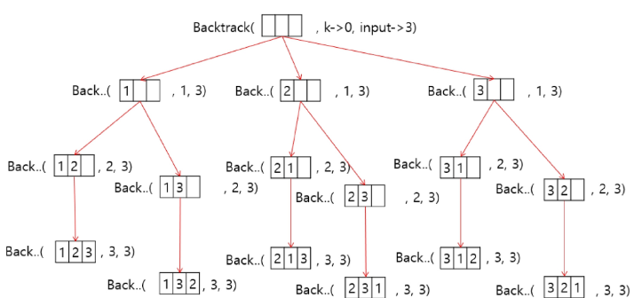

Backtracking을 이용하여 {1,2,3,...,NMAX}에 대한 순열 구하기1
- 접근 방법은 부분집합을 구하는 방법과 유사
```python
def backtrack(a, k, n):
    c = [0] * maxcandidates

    if k == n:
        for i in range(0, k):
            print(a[i], end=" ")
        print()
    else:
      ncandidates = construct_candidates(a, k, n, c)
      for i in range(ncandidates):
          a[k] = c[i]
          backtrack(a, k + 1, n)

def construct_candidates(a, k, n, c):
    in_perm = [False] * (NMAX + 1)

    for i in range(k):
        in_perm[a[i]] = True

    ncandidates = 0
    for i in range(1, NMAX + 1):
        if in_perm[i] == False:
            c[ncandidates] = i
            ncandidates += 1
    return ncandidates

maxcandidates = 3
NMAX = 3
a = [0] * NMAX
backtrack(a, 0, 3)
```

#### 가지치기
부분집합의 합
- 집합{1,2,3}의 원소에 대해 각 부분집합에서의 포함 여부를 트리로 표현
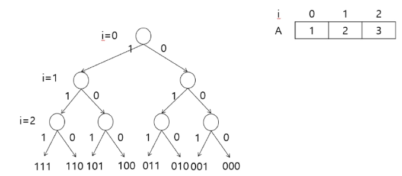
- I원소의 포함 여부를 결정하면 i까지의 부분집합의 합 Si를 결정할 수 있음
- Si-1이 찾고자 하는 부분집합의 합보다 크면 남은 원소를 고려할 필요가 없음
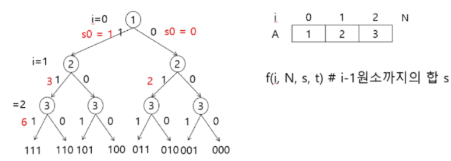
- A[i] 원소를 부분집합의 원소로 고려하는 재귀 함수(A는 서로 다른 자연수의 집합)
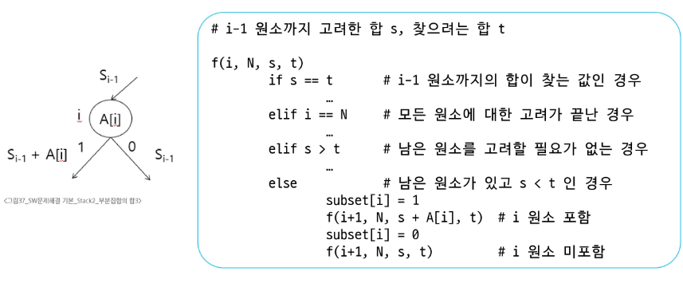
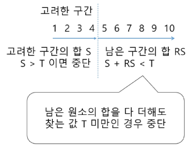

#### 순열2
A[1, 2, 3]의 모든 원소를 사용한 순열
- 3개의 칸에 넣을 수 있는 나열
- 123, 132, 213, 231, 312, 321
- 총 6가지의 경우
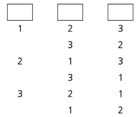

자리 교환으로 순열 생성1
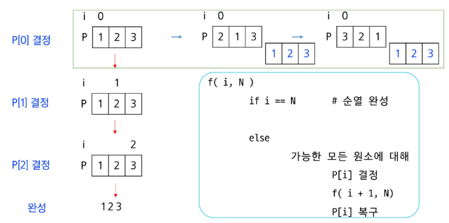
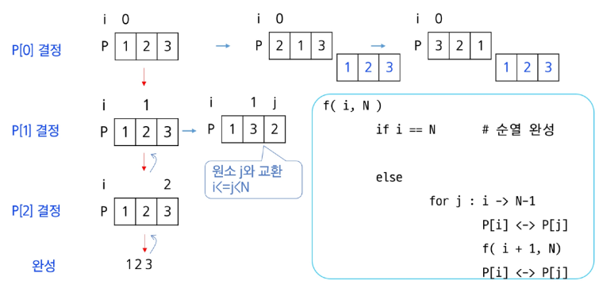

#### 분할정복
분할정복 알고리즘의 유래
- 1805년 12월 2일 아우스터리츠 전투에서 나폴레옹이 사용한 전략
- 전력이 우세한 연합군을 공격하기 위해 나폴레옹은 연합군의 중앙부로 쳐들어가 연합군을 둘로 나눔
- 둘로 나뉜 연합군을 한 부분씩 격파함

설계 전략
- 분할(divide): 해결할 문제를 여러 개의 작은 부분으로 나눈다.
- 정복(conquer): 나눈 작은 문제를 각각 해결한다.
- 통합(combine): (필요하다면) 해결된 답을 모은다.

거듭 제곱(exponentiation)
- O(n)
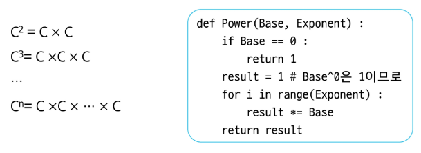

분할 정복 기반의 알고리즘: O(log2 n)
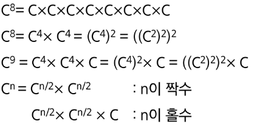
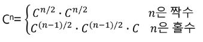
```python
def power(base, exponent):
    if exponent == 0:
        return 1
    
    if exponent % 2 == 0:
        new_base = power(base, exponent // 2)
        return new_base * new_base
    else:
        new_base = power(base, (exponent - 1) // 2)
        return (new_base * new_base) * base
```