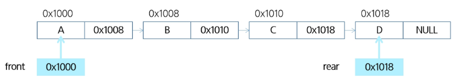

### 큐(Queue)
#### 큐
큐 : 먼저 들어온 데이터가 먼저 나가는 선형 자료구조
- 스택과 마찬가지로 삽입과 삭제의 위치가 제한적인 구조로 큐의 뒤에서는 삽입만 하고, 앞에서는 삭제만 이루어지는 구조

큐의 구조(선입선출) : 가장 먼저 넣은 자료가 가장 먼저 나오는 것


큐의 기본 연산
- 삽입 : enqueue
- 삭제 : dequeue

연산|기능
---|---
enqueue(item)|큐의 뒤쪽(rear 다음)에 원소를 삽입하는 연산
dequeue()|큐의 앞쪽(front)에서 원소를 삭제하고 반환하는 연산
create_queue()|공백상태의 큐를 생성하는 연산
is_empty()|큐가 공백상태인지를 확인하는 연산
is_full()|큐가 포화상태인지를 확인하는 연산
qpeek()|큐의 앞쪽(front)에서 원소를 삭제 없이 반환하는 연산

큐의 연산 과정


#### 선형 큐
선형 큐(Linear Queue) : 데이터를 일렬로 저장하며, 앞에서 꺼내고 뒤에 넣는 기본 큐 구조
- 구현
  - 배열이나 연결형 리스트로 구현할 수 있습니다.
  - 큐의 크기는 배열의 크기와 같습니다.
  - front: 가장 최근에 삭제된 원소의 인덱스입니다.
  - rear: 마지막으로 저장된 원소의 인덱스입니다.
- 상태 표현
  - 초기 상태: front = rear = -1
  - 공백 상태: front == rear
  - 포화 상태: rear == n-1(n:배열의 크기, n-1:배열의 마지막 인덱스)

선형 큐의 구현
1. 초기 공백 큐 생성: create_queue()
  - 크기 n인 1차원 배열 생성
  - front와 rear를 -1로 초기화
```python
# create_queue()에 해당
q = [0] * n
front = -1
rear = -1
```

2. 삽입: enqueue(item)
  - 마지막 원소 뒤에 새로운 원소를 삽입하기 위해
  1) rear 값을 하나 증가시켜 새로운 원소를 삽입할 자리를 지정
  2) 그 인덱스에 해당하는 배열원소 Q[rear]에 item을 저장
```python
enqueue(item):
    global rear
    if is_full():
        print("Queue_Full")
    else:
        rear += 1
        q[rear] = item
```

3. 삭제: dequeue()
  - 가장 앞에 있는 원소를 삭제하기 위해
    1) front 값을 하나 증가시켜 큐에 남아있는 첫번째 원소 이동
    2) 새로운 첫 번째 원소를 리턴 함으로써 삭제와 동일한 기능함
```python
dequeue():
    if is_empty():
        queue_empty():
    else:
        front += 1
        return Q[front]
```

4. 공백상태 및 포화상태 검사: is_empty(). is_full()
  - 공백상태: front == rear
  - 포화상태: rear == n-1(n:배열의 크기, n-1:배열의 마지막 인덱스)
```python
is_empty():
    return front == rear
is_full():
    return rear == len(q) - 1
```

5. 검색:qpeek()
  - 가장 앞에 있는 원소를 검색하여 반환하는 연산
  - 현재 front의 한자리 뒤(front+1)에 있는 원소, 즉 큐의 첫 번째에 있는 원소를 반환
```python
def qpeek():
    if is_empty()
        print("Queue_Empty")
    else:
        return q[front+1]
```

선형 큐 연습문제
- 큐를 구현하여 다음 동작을 확인하기
  - 세 개의 데이터 1, 2, 3을 차례로 큐에 삽입하고
  - 큐에서 세 개의 데이터를 차례로 꺼내서 출력
  - 1, 2, 3이 출력 되야 함

#### 원형 큐
선형 큐 이용시의 문제점
- 잘못된 포화상태의 인식

  - 선형 큐를 이용하여 원소의 삽입과 삭제를 계속할 경우, 배열의 앞부분에 활용할 수 있는 공간이 있음에도 불구하고, rear=n-1인 상태 즉, 포화상태로 인식하여 더 이상의 삽입을 수행하지 않게 됩니다.

해결 방법 1
- 매 연산이 이루어질 때마다 저장된 원소들을 배열의 앞부분으로 모두 이동
  - 그러나, 이 방법은 원소 이동에 많은 시간이 소요되어 큐의 효율성이 급격히 떨어짐


해결 방법 2
- 1차원 배열을 사용
  - 논리적으로는 배열의 처음과 끝이 연결되어 원형 형태를 이룬다고 가정하고 사용


원형 큐 : 선형 큐의 공간 낭비를 막기 위해 처음과 끝이 연결된 구조

원형 큐의 구조
- 초기 공백 상태
  - front = rear = 0
- index의 순환
  - front와 rear의 위치가 배열의 마지막 인덱스인 n-1를 가리킵니다.
  - 그 다음에는 논리적 순환을 이루어 배열의 처음 인덱스인 0으로 이동해야 합니다.
  - 이를 위해 나머지 연산자 mod를 사용합니다.
- front 변수
  - 공백 상태와 포화 상태 구분을 쉽게 하기 위해 front가 있는 자리는 사용하지 않고 항상 빈자리로 둡니다.

선형 큐와 원형 큐 비교
- 삽입 위치 및 삭제 위치

x|삽입 위치|삭제 위치
---|---|---
선형 큐|rear = rear + 1|front = front + 1
원형 큐|rear = (rear + 1)mod n|front = (front + 1)mod n

원형 큐의 연산 과정


원형 큐의 구현
1. 초기 공백 큐 생성
  - 크기 n인 1차원 배열 생성
  - front와 rear를 0으로 초기화
```python
cq = [0] * n
front = rear = 0
```

2. 삽입: enqueue(item)
  - 마지막 원소 뒤에 새로운 원소를 삽입하기 위해
    1) rear 값을 조정하여 새로운 원소를 삽입할 자리를 지정
      - rear <- (rear + 1) mod n
    2) 그 인덱스에 해당하는 배열원소 cQ[rear]에 item을 저장
```python
def enqueue(item):
    global rear
    if is_full():
        print("Queue_Full")
    else:
        rear = (rear + 1) % len(cq)
        cq[rear] = item
```

3. 삭제: dequeue()
  - 가장 앞에 있는 원소를 삭제하기 위해
    1) front 값을 조정하여 삭제할 자리를 지정
    2) 새로운 front 원소를 리턴 함으로써 삭제와 동일한 기능을 함
```python
def dequeue():
    global front
    if is_empty():
        print("Queue_Empty")
    else:
        front = (front + 1) % len(cq)
        return cq[front]
```

4. 공백상태 및 포화상태 검사: is_empty(), is_full()
  - 공백상태: front==rear
  - 포화상태: 삽입할 rear의 다음 위치 == 현재 front
    - (rear + 1) mod n == front
```python
def is_empty():
    return front==rear

def is_full():
    return (rear+1) % len(cq) == front 
```

#### 연결 큐
연결 큐 : 연결 리스트를 이용해 구현한 큐

연결 큐의 구조
- 단순 연결 리스트(Linked List)를 이용한 큐
  - 큐의 원소: 단순 연결 리스트의 노드
  - 큐의 원소 순서: 노드의 연결 순서, 링크로 연결되어 있음
  - front: 첫 번째 노드를 가리키는 링크
  - rear: 마지막 노드를 가리키는 링크

- 상태 표현
  - 초기 상태: front = rear = null
  - 공백 상태: front = rear = null




연결 큐의 연산 과정


deque(덱)
- 컨테이너 자료형 중 하나로 양쪽 끝에서 빠르게 추가와 삭제를 할 수 있는 리스트류 컨테이너
  - 연결 리스트를 직접 만들지 않아도 됩니다.

deque의 연산
- append(x): 오른쪽에 x 추가
- popleft(): 왼쪽에서 요소를 제거하고 반환, 요소가 없으면 IndexError
```python
from collections import deque

q = deque()
q.append(1)     # enqueue(1)
t = q.popleft() # dequeue()
```

연결 큐의 구현
```python
clas Node:
    def __init__(self, item, n=None):
        self.item = item
        self.next = n

# 연결 큐의 삽입 연산
def enqueue(item):
    global front, rear
    # 새로운 노드 생성
    newNode = Node(item)
    # 큐가 비어있다면
    if front == None:
        front = newNode
    else:
        rear.next = newNode
    rear = newNode

def is_empty():
    return front == None

# 연결 큐의 삭제 연산
def dequeue():
    global front, rear
    if is_empty():
        print("Queue_Empty")
        return None
    
    item = front.item
    front = front.next
    if front == None:
        rear = None
    return item

def qpeek():
    return front.item

def print_q():
    f = front
    s = ""
    while f:
        s += f.item + " "
        f = f.next
    return s

front = None
rear = None
```

#### 우선순위 큐
우선순위 큐: 우선순위를 가진 항목들을 저장하는 큐
- FIFO 순서가 아니라 우선순위가 높은 순서대로 먼저 나가게 됩니다. 우선순위 큐의 적용 분야로 시뮬레이션 시스템, 네트워크 트래픽 제어, 운영체제의 테스크 스케쥴링이 있습니다.

우선순위 큐의 연산
- 삽입: enqueue
- 삭제: dequeue


우선순위 큐의 구현
- 배열을 이용한 우선순위 큐
- 리스트를 이용한 우선순위 큐

배열을 이용한 우선순위 큐
- 배열을 이용하여 자료 저장
- 원소를 삽입하는 과정에서 우선순위를 비교하여 적절한 위치에 삽입하는 구조
- 가장 앞에 최고 우선순위의 원소가 위치

문제점
- 배열을 사용하므로, 삽입이나 삭제 연산이 일어날 때 원소의 재배치가 발생
- 이에 소요되는 시간이나 메모리 낭비가 큼

### 큐의 활용
#### 버퍼
버퍼(Buffer) : 데이터를 한 곳에서 다른 한 곳으로 전송하는 동안 일시적으로 그 데이터를 보관하는 메모리의 영역
- 버퍼를 채우는 것을 버퍼링이라고 합니다.

버퍼의 자료 구조
- 버퍼는 일반적으로 입출력 및 네트워크와 관련된 기능에서 이용됨
- 순서대로 입력/출력/전달되어야 하므로 FIFO 방식의 자료구조인 큐가 활용됨

버퍼의 예시 : 키보드 버퍼


큐를 이용한 마이쮸 나눠주기 시뮬레이션
문제 설명
- 1번이 줄을서고 1개받은후 다시 줄을 섬. 그후 2번이 줄을 선다. 1번이 받고 줄을 서고 3번이 와서 줄을 선다. 2번이 받고 줄을 서고 4번이 와서 줄을 선다. 이렇게 반복될 때, 마이쮸가 20개 있다면 몇번이 마지막 마이쮸를 받는가?

- 마이쮸 시뮬레이션 구현하기
- 엔터를 칠 때마다 다음 정보를 화면에 출력
  -큐에 있는 사람의 수
  - 현재 일인당 나눠주는 사탕의 수
  - 현재까지 나눠중 사탕의 수
