### 큐의 활용
#### BFS
너비 우선 탐색(Breadth First Search, BFS) : 탐색 시작점의 인접한 정점들을 모두 차례로 방문한 후에, 방문했던 정점을 시작점으로 하여 다시 인접한 정점들을 차례로 방문하는 방식
- 인접한 정점들에 대해 탐색을 한 후, 차례로 다시 너비우선탐색을 진행해야 하므로, 선입선출 형태의 자료구조인 큐를 활용

BFS의 탐색 순서
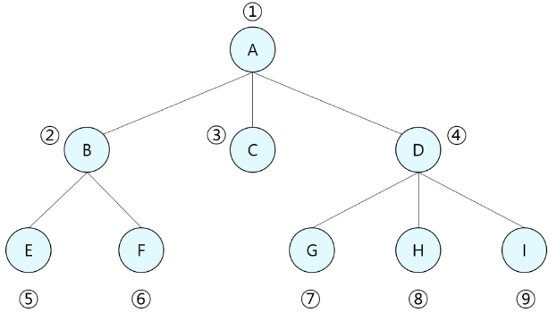

BFS 알고리즘
- 입력 파라미터 : 그래프 G와 탐색 시작점 v
```python
def bfs(G, v):
    # n : 정점의 개수
    visited = [0]*(n+1)
    # 큐 생성
    queue = []
    # 시작점 v를 큐에 삽입
    queue.append(v)

    # 큐가 비어있지 않은 경우 반복
    while queue:
        # 큐의 첫번째 원소 반환
        t = queue.pop(0)
        # 방문되지 않은 곳이라면
        if not visited[t]:
            # 방문한 것으로 표시
            visited[t] = True
            # 정점 t에서 할 일
            visit(t)
            # t와 연결된 모든 정점에 대해
            for i in G[t]:
                # 방문되지 않은 곳이라면
                if not visited[i]:
                    # 큐에 넣기
                    queue.append(i)
```

BFS 예제 1
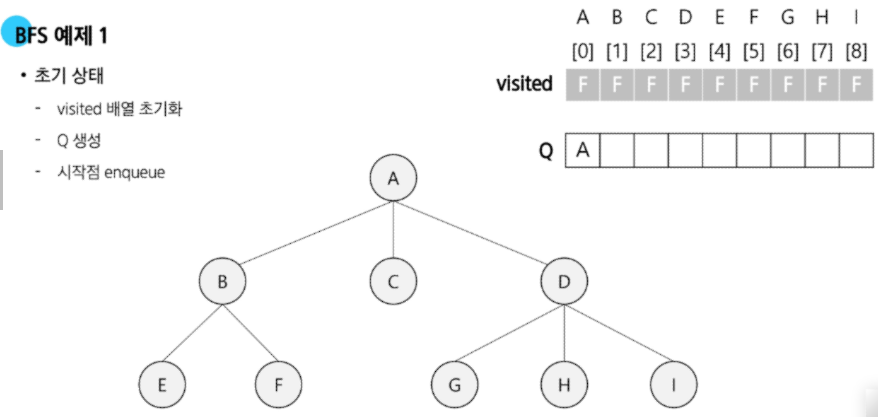
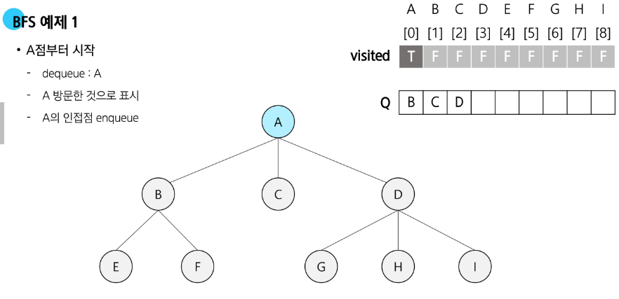
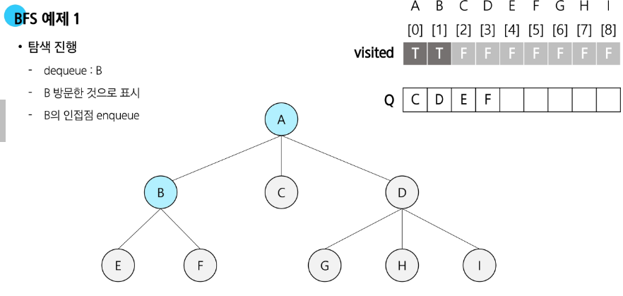
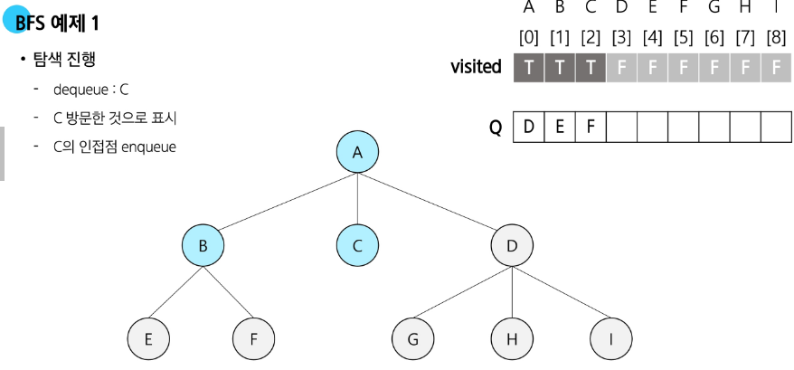
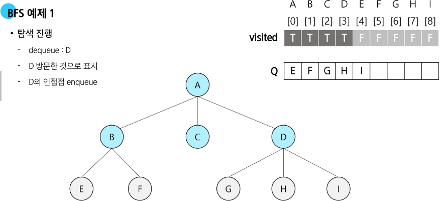
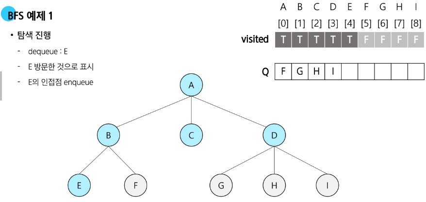
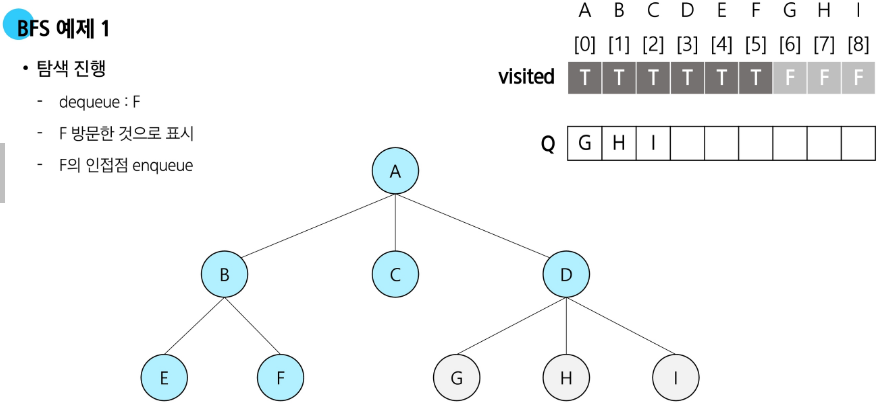
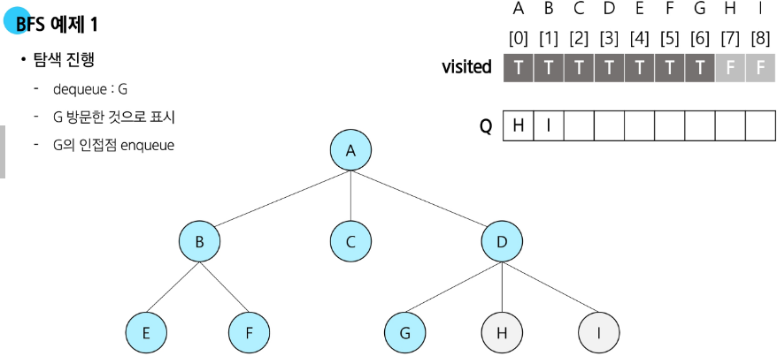
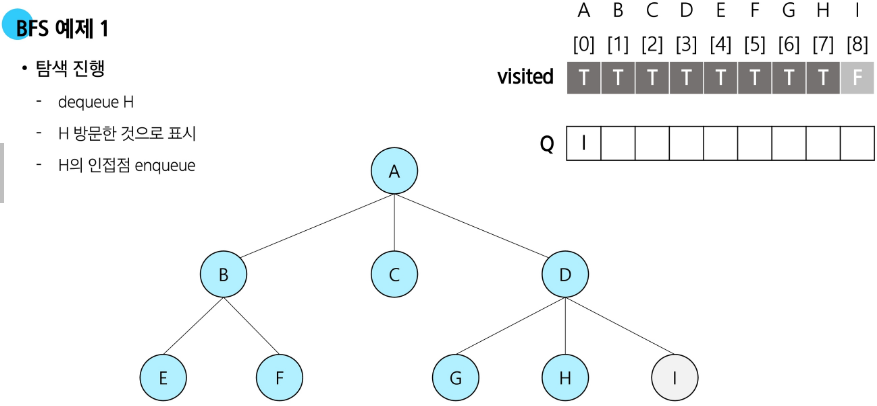
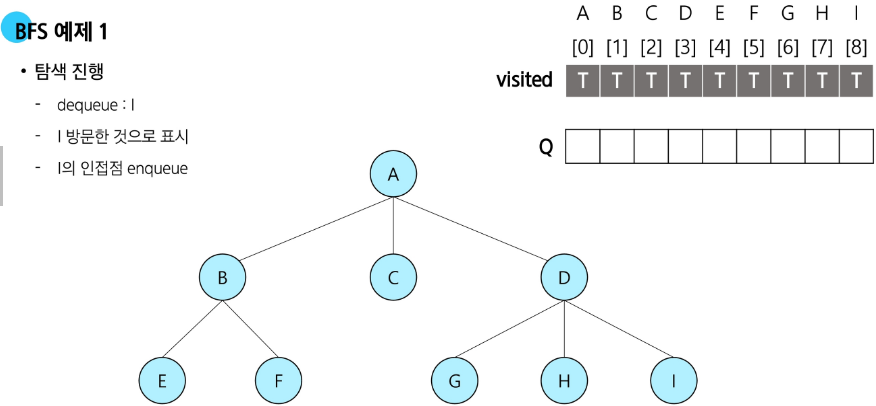
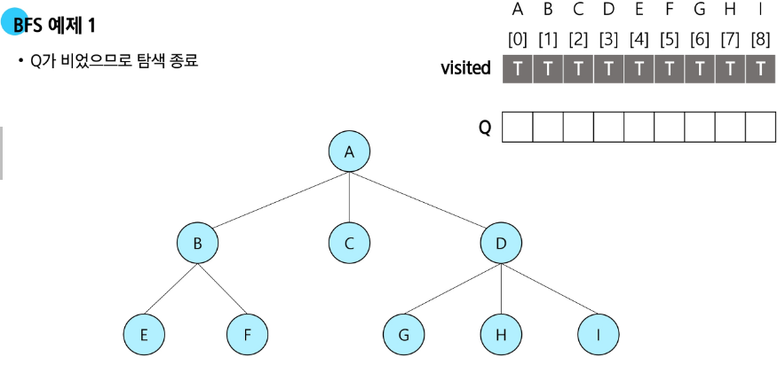

BFS 예제 2
- 입력 파라미터 : 그래프 G와 탐색 시작점 v
```python
def BFS(G, v, n):
    # n : 정점의 개수
    visited = [0]*(n+1)
    # 큐 생성
    queue = []
    # 시작점 v를 큐에 삽입
    queue.append(v)
    visited[v] = 1
    # 큐가 비어있지 않은 경우 반복
    while queue:
        # 큐의 첫번째 원소 반환
        t = queue.pop(0)
        visit(t)
        # t와 연결된 모든 정점에 대해
        for i in G[t]:
            # 인큐되지 않은 곳이라면
            if not visited[i]:
                # 큐에 넣기
                queue.append(i)
                # n으로 부터 1만큼 이동
                visited[i] = visited[t] + 1
```

BFS 예제 3
다음은 연결되어 있는 두 개의 정점 사이의 간선을 순서대로 나열 해 놓은 것이다. 모든 정점을 너비우선탐색 하여 경로를 출력하시오. 시작 정점을 1로 시작하시오.
입력 : 1, 2, 1, 3, 2, 4, 2, 5, 4, 6, 5, 6, 6, 7, 3, 7

출력 결과의 예는 다음과 같다.
1 - 2 - 3 - 4 - 5 - 7 - 6
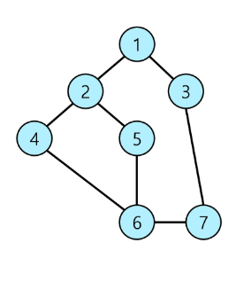