### 트리
#### 트리
트리의 개념
- 비선형 구조
- 원소들 간에 1:n 관계를 가지는 자료구조
- 원소들 간에 계층관계를 가지는 계층형 자료구조
- 상위 원소에서 하위 원소로 내려가면서 확장되는 트리(나무) 모양의 구조

트리의 정의
- 한 개 이상의 노드로 이루어진 유한 집합이며 다음 조건을 만족한다.
  - 노드 중 최상위 노드를 루트(root)라고 한다.
  - 나머지 노드들은 n(>=0)개의 분리 집합 T1,...,TN으로 분리될 수 있다.
- 이들 T1,...,TN은 각각 하나의 트리가 되며(재귀적 정의) 루트의 부 트리(subtree)라 한다.
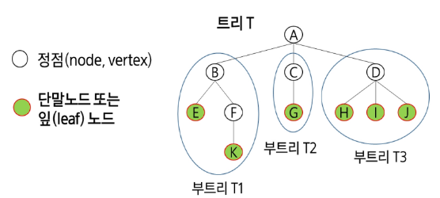

용어 정리
- 노드(node) : 트리의 원소
  - 트리 T의 노드 : A, B, C, D, E, F, G, H, I, J, K
- 간선(edge) : 노드를 연결하는 선, 부모 노드와 자식 노드를 연결
- 루트 노드(root node) : 트리의 시작 노드
  - 트리 T의 루트노드 : A
- 형제 노드(sibling node) : 같은 부모 노드의 자식 노드들
  - B, C, D는 형제 노드
- 조상 노드 : 간선을 따라 루트 노드까지 이르는 경로에 있는 모든 노드들
  - K의 조상 노드 : F, B, A
- 자손 노드 : 서브 트리에 있는 하위 레벨의 노드들
  - B의 자손 노드 : E, F, K
- 노드의 차수 : 노드에 연결된 자식 노드의 수
  - B의 차수 = 2, C의 차수 = 1
- 트리의 차수 : 트리에 있는 노드의 차수 중에서 가장 큰 값
  - 트리 T의 차수 = 3
- 단말 노드(리프 노드) : 차수가 0인 노드, 자식 노드가 없는 노드
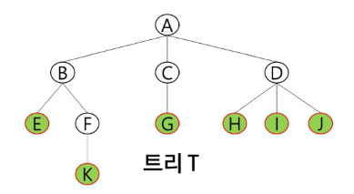

- 노드의 높이 : 루트에서 노드에 이르는 간선의 수, 노드의 레벨
  - B의 높이 = 1, F의 높이 = 2
- 트리의 높이 : 트리에 있는 노드의 높이 중에서 가장 큰 값, 최대 레벨
  - 트리 T의 높이 = 3
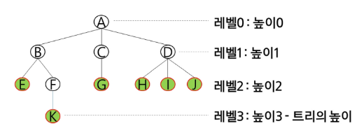

#### 이진 트리
이진 트리
- 모든 노드들이 2개의 서브트리를 갖는 특별한 형태의 트리
- 각 노드가 자식 노드를 최대한 2개까지만 가질 수 있는 트리
  - 왼쪽 자식 노드(left child node)
  - 오른쪽 자식 노드(right child node)
- 이진 트리의 예
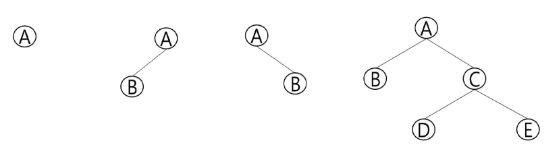

이진 트리의 특성
- 레벨 i에서의 노드의 최대 개수는 2**i 개
- 높이가 h인 이진 트리가 가질 수 있는 노드의 최소 개수는 (h+1)개가 되며, 최대 개수는 (2**(h+1)-1)개

포화 이진 트리(Full Biamsry Tree)
- 모든 레벨의 노드가 포화상태로 차 있는 이진 트리
- 높이가 h일 때, 최대의 노드의 개수인 (2**(h+1)-1)의 노드를 가진 이진 트리
  - 높이 3일 때, 2**(3+1)-1 = 15개의 노드를 갖습니다.
- 루트를 1번으로 하여 2**(h+1)-1까지 정해진 위치에 대한 노드 번호를 가짐
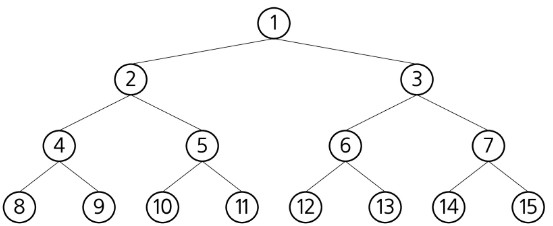

완전 이진 트리(Complete Bianry Tree)
- 높이가 h이ㅣ고 노드 수가 n개일 때 (단, 2\*\*h <= n <= 2\*\*(h+1)-1), 포화 이진 트리의 노드 번호 1번부터 n번까지 빈자리가 없는 이진 트리
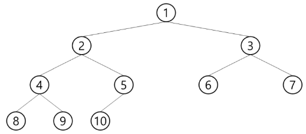

편향 이진 트리(Skewed Binary Tree)
- 높이가 h에 대한 최소 개수의 노드를 가지면서 한쪽 방향의 자식 노드만을 가진 이진 트리
  - 왼쪽 편향 이진 트리
  - 오른쪽 편향 이진 트리
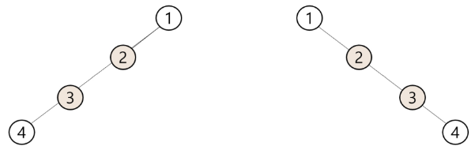

#### 순회
순회(traversal) : 트리의 각 노드를 중복되지 않게 전부 방문(visit)하는 것, 트리의 노드를 체계적으로 방문하는 것
- 트리는 비 선형 구조이기 때문에 선형구조와 같이 선후 연결 관계를 알 수 없습니다.

3가지의 기본적인 순회 방법
- 전위순회(preorder traversal) : VLR
  - 부모 노드 방문 후, 자식 노드를 좌, 우 순서로 방문합니다.
- 중위순회(inorder traversal) : LVR
  - 왼쪽 자식 노드, 부모 노드, 오른쪽 자식 노드 순으로 방문합니다.
- 후위순회(postorder traversal) : LRV
  - 자식 노드를 좌, 우 순서로 방문한 후, 부모 노드로 방문합니다.

전위 순회(preorder traversal)
- 수행 방법
  1. 현재 노드 n을 방문하여 처리한다. → V
  2. 현재 노드 n의 왼쪽 서브트리로 이동한다. → L
  3. 현재 노드 n의 오른쪽 서브트리로 이동한다. → R

- 전위 순회 알고리즘
```python
# 전위 순회
def preorder_traverse(T):
    if T:
        visit(T)
        preordef_traverse(T.left)
        preordef_traverse(T.right)
```

전위 순회의 예
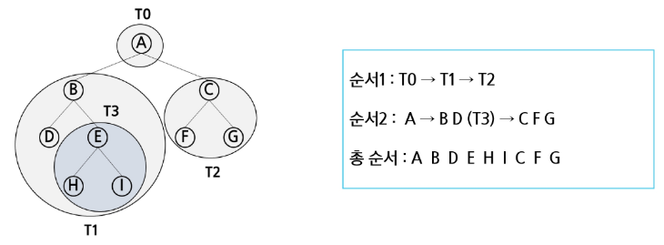

중위 순회(inorder traversal)
- 수행 방법
  1. 현재 노드 n의 왼쪽 서브트리로 이동한다. → L
  2. 현재 노드 n을 방문하여 처리한다. → V
  3. 현재 노드 n의 오른쪽 서브트리로 이동한다. → R

- 중위 순회 알고리즘
```python
# 중위 순회
def inorder_traverse(T):
    if T:
        preordef_traverse(T.left)
        visit(T)
        preordef_traverse(T.right)
```

중위 순회의 예
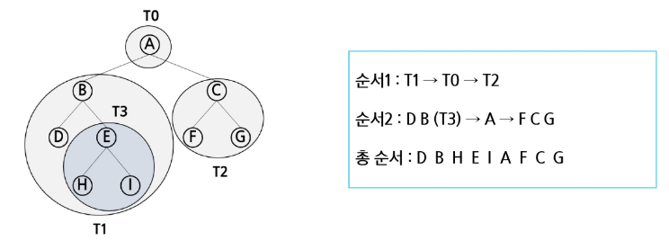

후위 순회(postorder traversal)
- 수행 방법
  1. 현재 노드 n의 왼쪽 서브트리로 이동한다. → L
  2. 현재 노드 n의 오른쪽 서브트리로 이동한다. → R
  3. 현재 노드 n을 방문하여 처리한다. → V

- 후위 순회 알고리즘
```python
# 후위 순회
def postorder_traverse(T):
    if T:
        preordef_traverse(T.left)
        preordef_traverse(T.right)
        visit(T)
```

후위 순회의 예
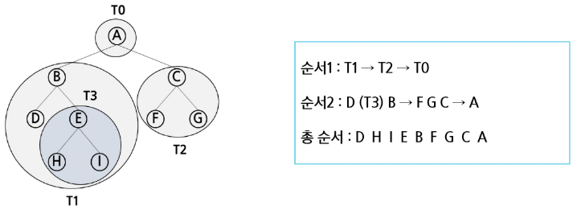

이진 트리의 순회 연습
- 전위 순회 : A - B - D - H - I - E - J - C - F - K - G - L - M
- 중위 순회 : H - D - I - B - J - E - A - F - K - C - L - G - M
- 후위 순회 : H - I - D - J - E - B - K - F - L - M - G - C - A
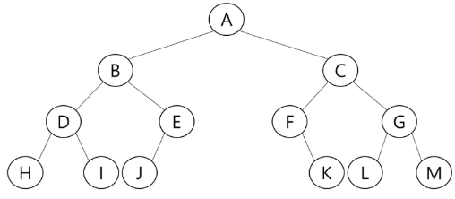

#### 이진 트리의 표현 1
배열을 이용한 이진 트리의 표현
- 이진 트리에 각 노드 번호를 다음과 같이 부여
-루트의 번호를 1로 함 부터
- 레벨 n에 있는 노드에 대하여 왼쪽부터 오른쪽으로 2\*\*n부터 2\*\*(n+1)까지 번호를 차례로 부여
- 포화 이진 트리, 완전 이진 트리에 적합
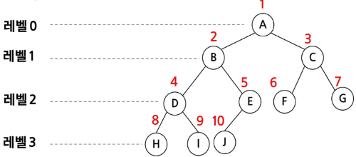

- 노드 번호를 배열의 인덱스로 사용
- 높이가 h인 이진 트리를 위한 배열의 크기 : 2**(h+1)-1
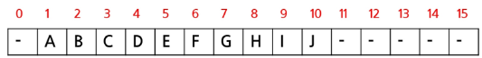
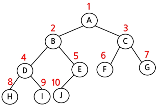
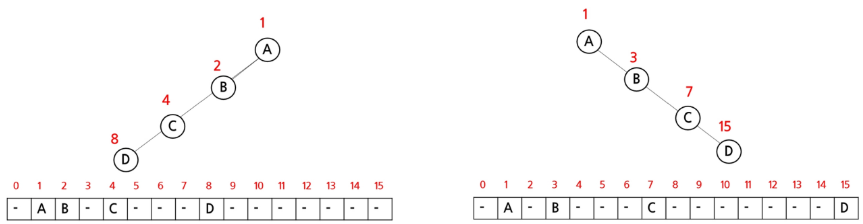

노드 번호의 성질
- 노드 번호가 i인 노드의 부모 노드 번호 : i/2
- 노드 번호가 i인 노드의 왼쪽 자식 노드 번호 : 2*i
- 노드 번호가 i인 노드의 오른쪽 자식 노드 번호 : 2*i + 1
- 레벨 n의 노드 번호 시작 번호 : 2**n

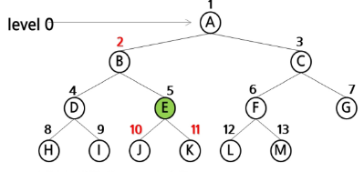
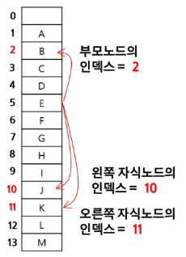

#### 이진 트리의 표현 2
부모 번호를 인덱스로 자식 번호를 저장
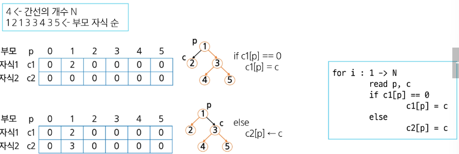

자식 번호를 인덱스로 부모 번호를 저장
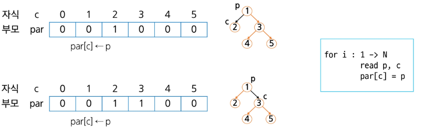

루트 찾기, 조상 찾기
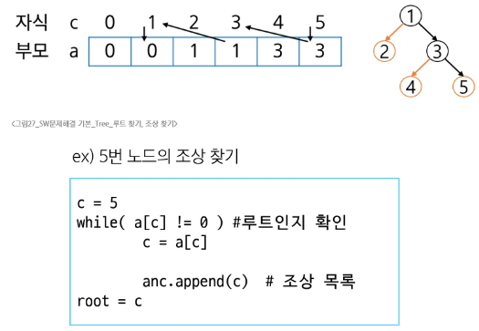

배열을 이용한 이진 트리의 표현의 단점
- 편향 이진 트리의 경우에 사용하지 않는 배열 원소에 대한 메모리 공간 낭비 발생
- 트리의 중간에 새로운 노드를 삽입하거나 기존의 노드를 삭제할 경우 배열의 크기 변경이 어려워 비효율적

연결리스트를 이용한 트리의 표현
- 배열을 이용한 이진 트리의 표현의 단점을 보완

연결 자료구조를 이용한 이진 트리의 표현
- 이진 트리의 모든 노드는 최대 2개의 자식 노드를 가지므로 일정한 구조의 단순 연결 리스트 노드를 사용
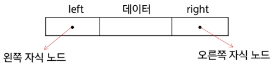

완전 이진 트리의 연결 리스트 표현
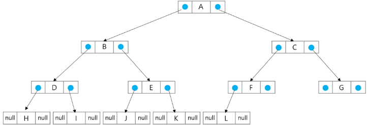

수식 트리
- 수식을 표현하는 이진 트리
- 수식 이진 트리 (Expression Binary Tree)라고 부르기도 함
- 연산자는 루트 노드이거나 가지 노드
- 피연산자는 모두 잎 노드
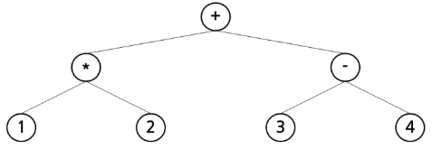

수식 트리의 순회
- 중위 순회
  - A/B*C*D+E(중위 표기법)
- 후위 순회
  - AB/C*D*E+(후위 표기법)
- 전위 순회
  - +**/ABCDE(전위 표기법)
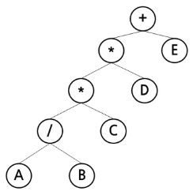

#### 연습 문제
전위 순회
- 전위 순회하여 정점의 번호를 출력
  - 첫 줄에는 트리의 정점의 총 수 V, 그 다음 줄에는 V-1개 간선 정보가 나열됨
  - 간선은 그것을 이루는 두 정점으로 표기
  - 간선은 항상 "부모 자식" 순서로 표기되며, 아래 예에서 두 번째 줄 처음 1과 2는 정점 1과 2를 잇는 간선으로 1이 부모 2가 자식을 의미
```
입력 값:
13
1 2 1 3 2 4 3 5 3 6 4 7 5 8 5 9 6 10 6 11 7 12 11 13
```
