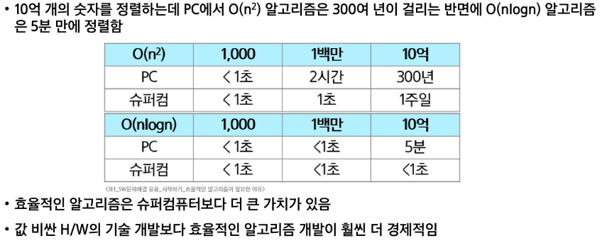

### 시작하기
#### SW 문제해결
SW 문제해결 역량
- 프로그램을 하기 위한 많은 제약 조건과 요구 사항을 이해하고 최선의 방법을 찾아내는 능력
- 프로그래머가 사용하는 언어나 라이브러리, 자료구조, 알고리즘에 대한 지식을 적재적소에 퍼즐을 배치하듯 이들을 연결하여 큰 그림을 만드는 능력
- 문제해결 역량은 추상적인 기술
  - 문제해결 역량을 향상시키기 위해서 훈련이 필요

문제해결 과정
1. 문제를 읽고 이해
2. 문제를 익숙한 용어로 재정의
3. 해결 계획 수립
  - 자료구조와 알고리즘 선택
4. 계획 검증
  - 시간복잡도 문제와 비교
5. 프로그램 구현
6. 풀이 확인 후 개선 방법 찾기

#### 복잡도 분석
알고리즘이란
- 유한한 단계를 통해 문제를 해결하기 위한 절차나 방법
  - 주로 컴퓨터 용어로 쓰이며, 컴퓨터가 어떤 일을 수행하기 위한 단계적 방법
- 어떠한 문제를 해결하기 위한 절차

알고리즘의 효율
- 공간적 효율성과 시간적 효율성
  - 공간적 효율성은 알고리즘이 필요로 하는 메모리 공간
  - 시간적 효율성은 알고리즘이 작업을 완료하는 데 걸리는 시간
  - 효율성을 뒤집어 표현하면 복잡도(Complexity)가 됨. 복잡도가 높을수록 효율성은 저하
- 시간적 효율성은 주로 입력 크기 n에 대한 연산 횟수로 나타냄

복잡도의 점근적 표기
- 시간 (또는 공간)복잡도는 입력 크기에 대한 함수로 표기
  - 이 함수는 주로 여러 개의 항을 가지는 다항식
  - 이를 단순한 함수로 표현하기 위해 점근적 표기(Asymptotic Notation)를 사용

- 입력 크기 n이 무한대로 커질 때의 복잡도를 간단히 표현하기 위해 사용하는 표기법
  - O(Big-Oh) - 표기(최악)
  - Ω(Big-Omega) - 표기(최선)
  - θ(Big-Theta) - 표기(평균)

O(Big-Oh) - 표기
- O-표기는 복잡도의 점근적 상한을 나타냄
- 복잡도가 f(n) = 2n^2-7n+4이라면, f(n)의 O-표기는 O(n^2)

자주 사용하는 O-표기
- O(1)      : 상수 시간(Constant time)
- O(logn)   : 로그(대수) 시간(Logarrithmic time)
  - 탐색 범위가 반으로 줄어듬
- O(n)      : 선형 시간(Linear time)
- O(n logn) : 로그 선형 시간(Log-linear time)
- O(n^2)    : 제곱 시간(Quadratic time)
- O(n^3)    : 세제곱 시간(Cubic time)

왜 효율적인 알고리즘이 필요한가


코딩테스트에서 기준
- C언어: 1초에 1억번 연산 가능
- Python: 1초에 3천만번 연산 가능

#### 표준 입출력 방법
```ptthon
# sys : system
import sys
# stdin: standard input
# open : 파일을 연다
# - "input.txt": 여는 파일명
# - "r" : 읽기 모드
sys.stdin = open("input.txt", "r")
```
1. 시스템 상 복사의 문제점을 발견할 수 있다.
2. 여러가지 tc를 만들면서 테스트할 수 있다.
3. 디버깅을 할 때도 tc와 output을 보면서 할 수 있다.

### 진법과 연산
#### 진법
2진수, 8진수, 10진수, 16진수
- 10진수 : 사람이 사용하는 진수, 수 하나를 0~9로 표현
- 2진수  : 컴퓨터가 사용하는 진수, 수 하나를 0, 1로 표현
- 8진수  : 2진수를 가독성 있게 사용
- 16진수 : 2진수를 더 가독성 있게 사용, 수 하나를 0, ..., 9, A, B, C, D, E, F로 표현

용어
- HEX: 16진수
- DEC: 10진수
- OCT: 8진수
- BIN: 2진수

