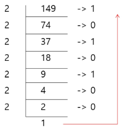

### 진법과 연산
#### 진법 변환
10진수 → 타 진수로 변환
- 원하는 타진법의 수로 나눈 뒤 나머지를 거꾸로 읽음

16진수와 2진수 변환
- 2진수, 10진수간 변환은 연산이 많으나, 2진수, 16진수간 변환은 연산이 없음

#### 비트 연산
비트와 바이트
- 1 bit: 0과 1을 표현하는 정보의 단위
- 1 Byte: 8-bit를 묶어 1 Byte라고 함(메모리 주소가 부여되는 단위)

비트 연산
- 컴퓨터의 CPU 내부적으로 비트 연산을 사용하여 덧셈, 뺄셈, 곱셈 등을 계산

AND와 OR 비트연산자 이해하기
- a AND b: a, b 둘 다 1일때만 결과가 1, 그 외에는 0
- a OR b: a, b 둘 중 하나만 1이면 결과가 1, 그 외에는 0
- ^: XOR(엑스오어) 연산자, 둘 다 1이거나 0인 경우는 0이다.
- Left Shift <<: 특정 수 만큼 비트를 왼쪽으로 밀어냄
- Right Shift >>: 특정 수 만큼 비트를 오른쪽으로 밀어냄(우측 비트들이 제거됨)
- ~: bitwise NOT(complement) 연산자, 모든 비트를 반전시킴
연산자|연산자의 기능
:---:|---
&|비트단위로 AND 연산
\||비트단위로 OR 연산
^| 비트단위로 XOR 연산
<<|피연산자의 비트 열을 왼쪽으로 이동
>>|피연산자의 비트 열을 오른쪽으로 이동

파이썬에서 2진수, 16진수, 10진수로 변환하여 출력하기
- 2진수는 숫자 0과 소문자b → **0b**를 접두사로 붙여 표현
- 16진수는 숫자 0과 소문자x → **0x**를 접두사로 붙여 표현
- 10진수 → 2진수: bin(num)
- 10진수 → 16진수: hex(num)
- 2진수 → 10진수: int('num', 2)
- 16진수 → 10진수: int('num', 16)

신기한 XOR
- 어떤 값이던 특정 수로 2회 XOR를 하면 원래 수로 돌아옴
- 암호화에 사용

비트 연산 응용
- 1<<n
  - 2**n개의 값을 갖는다
- i&(1<<n)
  - i의 n번째 비트가 1인지 아닌지 확인 가능
- t & 0xffff
  - t가 어떻게 비트로 나타나는지 확인 가능

음수 표현 방법
- 컴퓨터는 음수를 2의 보수로 관리
- A의 2의 보수 → ~A + 1
- 컴퓨터가 2의 보수를 사용하여 음수를 관리하는 이유
  - 뺄셈의 연산 속도를 올릴 수 있으며, +0과 -0을 따로 취급하지 않기 위해 사용

신기한 2의 보수
- 2의 보수를 취한 수를, 한번 더 2의 보수를 취하면 원래의 값으로 돌아옴

#### 실수
소수점 출력 방법
- {t:.2f}: t의 값을 소수점 셋째자리에서 반올림하여 표현

컴퓨터는 실수를 내부적으로 근사적으로 관리
- 실수는 정확한 값이 아니라 근사 값으로 저장되는데 이때 생기는 작은 오차가 계산 과정에서 다른 결과를 가져옴

실수를 저장하기 위한 형식
  - 32-bit 구조: 부호 1비트, 지수 8비트, 가수 23비트
  - 부호 1비트: 0이면 양수, 1이면 음수
  - 지수부(exponent): 부동소수점의 크기 + bias값
  - 가수부(mantissa)"실질적 수

#### 연습문제