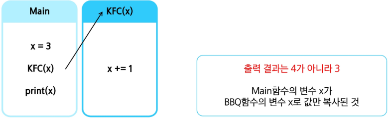

### 완전 탐색
#### 반복과 재귀
반복(Iterarion)과 재귀(Recursion)는 유사한 작업을 수행할 수 있다.

반복은 수행하는 작업이 완료될 때 까지 계속 반복
- 루프(for, while 구조)
- 반복문은 코드를 n번 반복시킬 수 있음

재귀는 주어진 문제의 해를 구하기 위해 동일하면서 더 작은 문제의 해를 이용하는 방법
- 하나의 큰 문제를 해결할 수 있는(해결하기 쉬운) 더 작은 문제로 쪼개고 결과들을 결합
- 재귀호출을 n중 반복문과 같은 효과

재귀를 연습하기 전, 알아야 할 함수의 특징
- KFC 함수 호출할 때, int 타입 객체를 전달하면 값만 복사됨
- 아래 예시에서, main 함수의 x와, KFC함수의 x는 서로 다른 객체
  - 마치 한국 사는 KIM과, 미국사는 KIM이 이름만 같고, 서로 다른 사람인 것과 같음

#### 순열
순열이란
- 서로 다른 N개에서, R개를 중복 없이, 순서를 고려하여 나열하는 것

중복순열이란
- 서로 다른 N개에서, R개를 중복을 허용하고, 순서를 고려하여 나열하는 것

중복순열 구현 원리
1. 재귀호출을 할 때 마다, 이동 경로를 흔적으로 남김
2. 가장 마지막 레벨에 도착했을 때, 이동 경로를 출력

중복을 취급하지 않는 순열 구현 방법
1. 중복순열 코드를 작성
2. 중복을 제거하는 코드를 추가

중복을 제거하는 원리
- 전역 리스트를 사용하여 이미 선택했던 숫자인지 구분
- 이를 used 배열 또는 visited 배열이라고 부름

#### 완전탐색
완전탐색(Brute-Force, 부르트 포스 알고리즘)
- 모든 가능한 경우를 모두 시도를 해보아 정답을 찾아내는 알고리즘
  1. 알고리즘 문제에서 가장 먼저 떠올려야 할 해결책
  2. 시간복잡도 계산 필수
