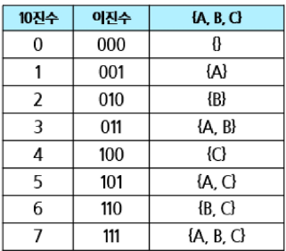

### 조합적 문제
#### 부분 집합
부분집합(powerset) : 어떤 집합의 공집합과 자기자신을 포함한 모든 부분
- 구하고자 하는 어떤 집합의 원소가 n개일 경우 부분집합의 수는 2^n개이다.

집합에서 부분 집합을 찾아내는 구현 방법
1. 완전탐색
  - 재귀호출을 이용한 완전탐색으로, 부분 집합을 구할 수 있음
  - 실전 보다는 완전탐색 학습용으로 추천
2. Binary Counting
  - 2진수 & 비트연산을 이용하여, 부분 집합을 구할 수 있음
  - 모든 부분 집합이 필요할 때 사용

완전 탐색(재귀함수) 설계 시 종료조건, 후보수 중요

+ : 새로운 객체 사용
+= : 기존 객체 사용

바이너리 카운팅(Binary Counting)
- 원소 수에 해당하는 N개의 비트열을 이용해 부분집합을 표시
- 001 이면 부분 집합 {A}를 나타냄
  - 0번 비트가 1이므로 첫 원소인 A만 포함된 부분집합을 나타냄
- 110 이면 부분 집합 {B, C}를 나타냄

#### 조합
조합(combination) : 서로 다른 n개의 원소 중 r개를 순서 없이 골라낸 것
순열과 조합의 차이
- 순열: n개 중 r개를 뽑아서 저장, 순서 중요
- 조합: n개 중 r개를 뽑아서 저장, 순서 없음

### 탐욕 알고리즘
#### Greedy
Greedy(탐욕 알고리즘) : 결정이 필요할 때, 현재 기준으로 가장 좋아 보이는 선택지로 결정하여 답을 도출하는 알고리즘

대표적인 문제 해결 기법
1. 완전 탐색(Brute-Force)
  - 답이 될 수 있는 모든 경우를 시도해보는 알고리즘
2. Greedy
  - 결정이 필요할 때 가장 좋아 보이는 선택지로 결정하는 알고리즘
3. DP
  - 현재에서 가장 좋아 보이는 것을 선택하는 것이 아닌, 과거의 데이터를 이용하여 현재의 데이터를 만들어내는 문제해결기법
4. 분할 정복
  - 큰 문제를 작은 문제로 나누어 해결하는 문제해결기법

Greedy 적용할 수 있는가?
1. 규칙성을 찾아야 한다.
  - 규칙을 못 찾으면 못 푼다.

그리디로 풀 수 있는가?
1. 탐욕적 선택 조건(Greedy Choice Property)
  - 각 단계의 최적해 선택이 이후 단계 선택에 영향을 주지 않는다.
  - 즉, 각 단계 규칙이 변경되면 안된다.
  - → 각 단계를 진행하면서 규칙이 유지
2. 최적  부분 구조(Optimal Substructure)
  - 각 단계의 최적해 선택을 합하면, 전체 문제의 해결책이 되어야 함
  - → 증명을 통해 해결
- 동전 문제 예시
  - [명제] 가장 큰 동전부터 고르면 최소 동전 수가 나온다.
  - 간접증명
    - [대우] 최대 동전수를 구하기 위해서는 가장 작은 동전부터 골라야한다.
    - [간접 증명]
      - 최적해보다 더 적은 동전으로 표현이 가능하다.(가정)
      - → 더 작은 값의 동전으로 더 작은 수로 할 수 있다.
      - → 동전이 배수로 있기 때문에 안됨
      - → 더 적은 값으로 나누면 무조건 더 큰수가 나옴
      - → 모순 발생 → 원래 명제가 참
3. 반례가 없는가?

동전문제에서 Greedy가 성립하는 경우 vs 성립하지 않는 경우
  - 10, 50, 100, 500 처럼 모든 동전이 배수 관계인 경우는 Greedy 적용 가능 
  - 10, 50, 70 처럼 모든 동전이 배수 관계가 아닌 경우 Greedy 적용 불가

#### Knapsack 문제

#### 활동 선택 문제
활동 선택 문제(Activity-selection problem)
- 종료 시간이 빠른 순서로 활동들을 정렬
- 첫 번째 활동을 선택
- 선택한 활동의 종료시간보다 빠른 시작 시간을 가지는 활동을 모두 제거
- 남은 활동들에 대해 앞의 과정을 반복
