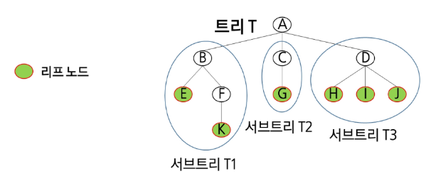
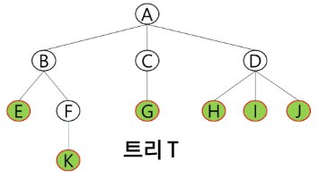

### 백트래킹
#### 백트래킹 응용
백트래킹(Backtracking) 개념
- 여러 가지 선택지(옵션)들이 존재하는 상황에서 한 가지 선택함
- 선택이 이루어지면 새로운 선택지들의 집합이 생성됨
- 이런 선택을 반복하면서 최종 상태에 도달함
  - 올바른 선택을 계속하면 목표 상태(goal state)에 도달

백트래킹과 깊이 우선 탐색(DFS)과의 차이
- 어떤 노드에서 출발하는 경로가 해결책으로 이어질 것 같지 않으면 더 이상 그 경로를 따라가지 않음으로써 시도의 횟수를 줄임
  - 이름 Pruning(가지치기)라고 함
- 깊이 우선 탐색이 모든 경로를 추적하는데 비해 백트래킹은 불필요한 경로를 조기에 차단
- 깊이 우선 탐색을 가하기에는 경우의 수가 너무나 많은 경우, 즉 N!가지의 경우의 수를 가진 문제에 대해 깊이 우선 탐색을 가하면 당연히 처리 불가능한 문제가 됨
- 백트래킹 알고리즘을 적용하면 일반적으로 경우의 수가 줄어들지만, 이 역시 최악의 경우에는 여전히 지수 함수 시간(Exponenrial Time)을 요하므로 처리 불가능함

백트래킹 개념
- 루트 노드에서 리프(leaf) 노드까지의 경로는 해답후보(candidate solution)가 되는데, 깊이 우선 검색을 하여 그 해답후보 중에서 해답을 찾을 수 있음
- 그러나 이 방법을 사용하면 해답이 될 가능성이 전혀 없는 노드의 후손 노드(descendant)들도 모두 검색해야 하므로 비효율적

#### 연습문제

### 트리
#### 트리 개요
트리(Tree)
- 트리는 싸이클이 없는 무향 연결 그래프
  - 두 노드(or 정점) 사이에는 유일한 경로가 존재
  - 각 노드는 최대 하나의 부모 노드가 존재할 수 있음
  - 각 노드는 자식 노드가 없거나 하나 이상이 존재할 수 있음

- 비선형 구조
  - 원소들 간에 1:n 관계를 가지는 자료구조
  - 원소들 간에 계층관계를 가지는 계층형 자료구조

트리의 정의
- 한 개 이상의 노드로 이루어진 유한 집합이며 다음 조건을 만족함
  - 노드 중 최상위 노드를 루트(root)라고 함
  - 나머지 노드들은 n(>-0)개의 분리 집합 T1, ..., TN으로 분리될 수 있음
- 이들 T1, ..., TN은 각각 하나의 트리가 되며 (재귀적 정의) 루트의 부 트리(subtree)라 함

트리 용어
- 노드(node) : 트리의 원소이고 정점(vertex)이라고도 함
  - 트리 T의 노드 - A, B, C, D, E, F, G, H, I, J, K
- 간선(edge): 노드를 연결하는 선
  - 부모 노드와 자식 노드를 연결
- 루트 노드(root node): 트리의 시작 노드
  - 트리 T의 루트 노드는 A
- 리프 노드(leaf node): 자식 노드가 없는 노드
  - E, K, G, H, I, J는 리프 노드
- 형제 노드(sibling node): 같은 부모 노드의 자식 노드들
  - B, C, D는 형제 노드
- 조상 노드: 간선을 따라 루트 노드까지 이르는 경로에 있는 모든 노드들
  - K의 조상 노드는 F, B, A
- 서브 트리(sub tree): 부모 노드와 연결된 간선을 끊었을 때 생성괴는 트리
- 자손 노드: 서브 트리에 있는 하위 레벨의 노드들
  - B의 자손 노드는 E, F, K

- 노드의 차수: 노드에 연결된 자식 노드의 수
  - B의 차수 = 2, C의 차수 = 1
- 트리의 차수: 트리에 있는 노드의 차수 중에서 가장 큰 값
  - 트리T의 차수 = 3
- 단말 노드(리프 노드): 차수가 0인 노드, 자식 노드가 없는 노드
- 노드의 높이: 루트에서 노드에 이르는 간선의 수, 노드의 레벨
  - B의 높이 = 1, F의 높이 = 2
- 트리의 높이: 트리에 있는 노드의 높이 중에서 가장 큰 값, 최대 레벨
  - 트리 T의 높이 = 3

#### 이진 트리
이진 트리(Binary Tree)
- 모든 노드들이 최대 2개의 서브트리를 갖는 특별한 형태의 트리
- 각 노드가 자식 노드를 최대한 2개 까지만 가질 수 있는 트리
  - 왼쪽 자식 노드(left child node)
  - 오른쪽 자식 노드(right child node)

이진 트리의 특성
- 레벨 i에서의 노드의 최대 개수는 2^i개
- 높이가 h인 이진 트리가 가질 수 있는 노드의 최소 개수는 (h+1)개, 최대 개수는 2^(h+1) -1

포화 이진 트리(Full Binary Tree)
- 모든 레벨에 노드가 포화상태로 차 있는 트리
- 높이가 h일 때, 최대의 노드 개수인 2^(h+1) -1의 노드를 가진 이진 트리
- 루트를 1번으로 하여 2^(h+1) -1까지 정해진 위치에 대한 노드 번호를 가짐

완전 이진 트리(Complete Binary Tree)
- 높이가 h이고 노드 수가 n개일 때(단, 2^h <= n <= 2^(h+1) -1>>), 포화 이진 트리의 노드 번호 1번부터 n번까지 빈자리가 없는 이진 트리

편향 이진 트리(Skewed Binary Tree)
- 높이가 h에 대한 최소 개수의 노드를 가지면서 한쪽 방향의 자식 노드만을 가진 이진 트리

순회(traversal) : 트리의 각 노드를 중복되지 않게 전부 방문(visit)하는것
- 트리의 노드들을 체계적으로 방문하는 것

3가지의 기본적인 순회 방법
- 전위순회(preorder traversal): VLR
  - 자손 노드 보다 현재 노드를 먼저 방문
- 중위순회(inorder traversal): LVR
  - 왼쪽 자손 노드, 현재 노드, 오른쪽 자손 노드 순으로 방문
- 후위순회(postorder traversal): LRV
  - 현재 노드보다 자식 노드를 먼저 방문

배열을 이용한 이진 트리의 표현
- 이진 트리에 각 노드 번호를 다음과 같이 부여
- 루트의 번호를 1로 부여
- 레벨 n에 있는 노드에 대하여 왼쪽부터 오른쪽으로 2^n, 2^(n+1)-1 까지 번호를 차례로 부여

이진트리의 표현 방법
1. 배열을 활용
2. 그래프 구조 활용
3. 연결 리스트

#### 이진탐색트리
이진탐색트리(BST, Binary Search Tree)
- 탐색 작업을 효율적으로 하기 위한 자료구조
- 모든 원소는 서로 다른 유일한 키를 가짐
- key(왼쪽 서브트리) < key < key(오른쪽 서브트리)
- 왼쪽 서브트리와 오른쪽 서브트리도 이진탐색트리
- 중위 순회하면 오름차순으로 정렬된 값을 얻을 수 있음

탐색 연산
- 루트에서 탐색 시작
- 탐색할 키 값 x를 루트 노드의 키 값 k와 비교
  - x == k: 탐색연산 성공
  - x < k: 루트 노드의 왼쪽 서브트리에 대해서 탐색연산을 수행
  - x > k: 루트 노드의 오른쪽 서브트리에 대해서 탐색연산을 수행
- 서브트리에 대해서 순환적으로 탐색 연산을 반복
- 탐색 수행할 서브 트리가 없으면 탐색 실패

삽입 연산
1. 먼저 탐색 연산을 수행
2. 탐색 실패한 위치에 원소를 삽입

삭제 연산
1. 먼저 탐색 연산을 수행
2. 탐색 성공한 위치의 노드 삭제
3. 자식이 하나인 경우, 자식을 부모와 연결
4. 자식이 둘인 경우, 삭제한 노드의 왼쪽 서브트리의 최대값 혹은 오른쪽 서브트리의 최소값을 삭제한 자리에 저장

이진탐색트리의 성능
- 탐색, 삽입, 삭제 시간은 트리의 높이만큼 시간이 걸린다.
  - O(h)
- 평균의 경우
  - 이진 트리가 균형적으로 생성되어 있는 경우
  - O(log n)
- 최악의 경우
  - 편향 이진트리
  - O(n)
  - 순차 탐색과 시간 복잡도가 같다

#### 힙
힙(heap)
- **완전 이진 트리**에 있는 노드 중에서 키 값이 가장 큰 노드나 키 값이 가장 작은 노드를 찾기 위해서 만든 자료구조
- 최대 힙(max heap)
  - 키 값이 가장 큰 노드를 찾기 위한 힙
  - 부모노드의 키 값 > 자식 노드의 키 값
  - 루트 노드는 키 값이 가장 큰 노드
- 최소 힙(min heap)
  - 키 값이 가장 작은 노드를 찾기 위한 힙
  - 부모 노드의 키 값 < 자식 노드의 키 값
  - 루트 노드는 키 값이 가장 작은 노드

힙 연산 - 삽입
1. 삽입할 자리 확장 후 삽입
2. 부모 노드와 비교 후 자리 전환 혹은 확정
3. 2에서 확정되지 않았다면 확정될 때까지 2를 반복

힙 연산 - 삭제
- 힙에서는 루트 노드의 원소만을 삭제할 수 있다.
- 루트 노드의 원소를 삭제하여 반환
- 힙의 종류에 따라 최대값 또는 최소값을 구할 수 있다.
  - 우선순위 큐와 비교
1. 루트 노드 삭제
2. 마지막 노드 삭제(루트 노드에 삽입)
3. 자식노드(자식노드 중 큰 것(max heap), 작은 것(min heap))와 비교 후 자리 바꾸기

힙의 활용
- 힙을 활용하는 대표적인 2가지 예는 우선순위 큐의 구현과 정렬
- 우선순위 큐를 구현하는 가장 효율적인 방법이 힙을 사용하는 것
  - 노드 하나의 추가/삭제가 시간 복잡도가 O(log n)이고 최대값/최소값을 O(1)에 구할 수 있음
- 힙 정렬은 O(n log n)을 보장
- 배열을 통해 트리 형태를 쉽게 구현 가능
  - 부모나 자식 노드를 O(1) 연산으로 쉽게 찾을 수 있음
  - n번 위치에 있는 노드의 자식은 2n, 2n+1에 위치
  - 완전 이진 트리의 특성에 의해 추가/삭제의 위치는 자료의 시작과 끝 인덱스로 쉽게 판단할 수 있음
- 힙 정렬은 힙 자료구조를 이용해서 이진 탐색과 유사한 방법으로 수행됨
- 힙 정렬의 시간 복잡도: O(n log n)
  - n개의 노드 삽입 연산(O(log n)) + n개의 노드 삭제 연산(O(log n))
- 힙 정렬은 배열에 저장된 자료를 정렬하기에 유용함

##### sort() vs heap
- srot()의 시간 복잡도 : O(n log n)
- 삽입과 삭제가 빈번한 경우 heap이 더 유리
  - heap의 삽입/삭제 시간복잡도: O(log n)