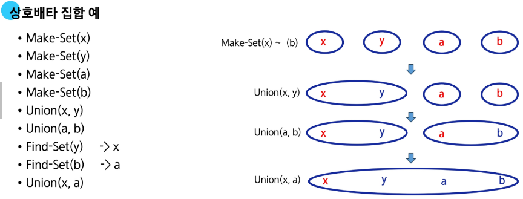
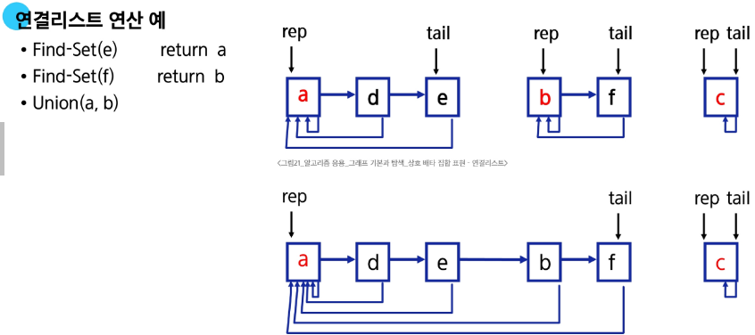
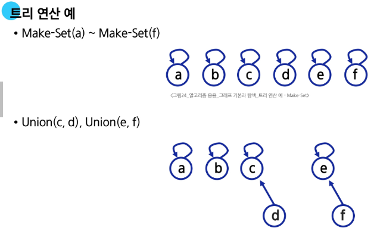
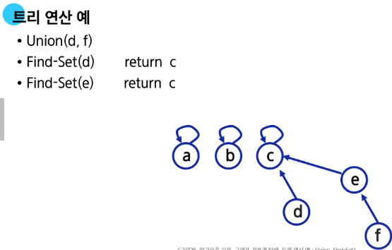
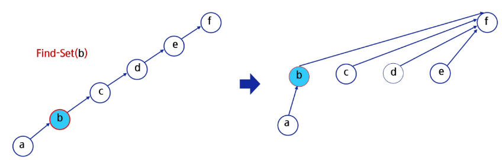

### 그래프의 기본과 탐색
#### 그래프의 기본
그래프 : 아이템(사물 또는 추상적 개념)들과 이들 사이의 연결 관계를 표현
- 정점(Vertex)들의 집합과 이들을 연결하는 간선(Edge)들의 집합으로 구성된 자료 구조
  - |V|: 정점의 개수, |E|: 그래프에 포함된 간선의 개수
  - |V|개의 정점을 가지는 그래프는 최대 |E| = |V| * (|V| - 1)/2개의 간선을 가질 수 있다.

그래프 유형
- 무향(무방향) 그래프(Undirected Graph)
- 유향(방향) 그래프(Directed Graph)
- 가중치 그래프(Weighted Graph)
- 사이클이 없는 방향 그래프(DAG, Directed  Acyclic Graph)
- 완전 그래프: 정점들에 대해 가능한 모든 간선들을 가진 그래프
- 부분 그래프: 원래 그래프에서 일부의 정점이나 간선을 제외한 그래프

인접 정점
- 인접(Adjacency)
  - 두 개의 정점에 간선이 존재(연결됨)하면 서로 인접해 있다고 합니다.
  - 완전 그래프에 속한 임의의 두 정점들은 모두 인접해 있습니다.

그래프 경로
- 경로란 간선들을 순서대로 나열한 것
- 경로 중 한 정점을 최대한 한번만 지나는 경로를 단순 경로라고 함
- 시작한 정점에서 끝나는 경로를 사이클(Cycle)이라고 함

그래프 표현
- 간선의 정보를 저장하는 방식, 메모리나 성능을 고려해서 결정
- 인접 행렬(Adjacent Matrix)
  - |V| x |V| 크기의 2차원 배열을 이용해서 간선 정보를 저장
- 인접 리스트(Adjacent List)
  - 각 정점마다 해당 정점과 인접한 정점 정보를 저장
- 간선의 배열
  - 간선(시작 정점, 끝 정점)을 배열에 연속적으로 저장

인접 행렬: 두 정점을 연결하는 건선의 유무를 행렬로 표현
- |V| x |V| 정방 행렬
- 행 번호와 열 번호는 그래프의 정점에 대응
- 두 정점이 인접되어 있으면 1, 그렇지 않으면 0으로 표현
- 무향 그래프
  - i번 행의 합 = i번 열의 합 = Vi의 차수
- 유향 그래프
  - i행의 합 = Vi의 진출 차수
  - i열의 합 = Vi의 진입 차수

인접 행렬의 장점
- 쉽다(직관적), 특정 연결 검색이 빠름

인접 행렬의 단점
- 정점 수에 비해 간선 수가 적은 경우 공간 낭비가 심함(메모리 낭비)

인접 리스트
- 각 정점에 대한 인접 정점들을 순차적으로 표현
- 하나의 정점에 대한 인접 정점들을 각각 노드로 하는 연결 리스트로 저장
- 무향 그래프의 인접 리스트
  - 무방향 그래프 노드 수 = 간선의 수 * 2
  - 각 정점의 노드 수 = 정점의 차수
- 유향 그래프의 인접 리스트
  - 방향 그래프 노드 수 = 간선의 수
  - 각 정점의 노드 수 = 정점의 진출 차수

인접리스트의 장점
- 메모리 효율적

인접리스트의 단점
- 특정 연결 정보 조회가 느림

#### DFS
DFS(Depth First Dearch, 깊이 우선 탐색) 알고리즘 - 재귀
- 모든 정점을 중복없이 빠짐없이 방문하는 경우
  - G: 탐색할 그래프
  - V: 방문하는 정점
```psuedo code
DFS_Recursive(G, V)
    visited[V] <= True

    for each all w in adjacency(G, V)
        if visited[w] != True
            DFS_Recursive(G, w)
```

DFS(Depth First Dearch, 깊이 우선 탐색) 알고리즘 - 반복
```psuedo code
staak s
visited[]
DFS(v)
    push(s, v)
    while not isEmpty(s)
        v <- pop(s)
        if not visited[v]
            visited(v)
            for each w in adjacency(v)
                if not visited[w]
                  push(s, w)
```

stack vs 재귀호출
- 재귀호출(코테용)
  - 장점: 구현이 쉽다
  - 느리다, 재귀 깊이 제한
- stack(개발용)
  - 장점: 빠르다
  - 단점: 구현이 어렵다

#### BFS
BFS(Breadth First Search, 너비 우선 탐색) 알고리즘

DFS vs BFS
- DFS
  - 경로를 출력
  - 갈 수 있는 경로의 수

- BFS
  - 몇 번 만에 가는 지
  - 최단 거리

#### Union-Find(Disjoint set)
서로 소 집합(Disjoint-sets)
- 서로 공통 원소가 없는 집합
  - 교집합이 없는 집합들

- 대표자(representative)
  - 각 집합을 대표하는 하나의 원소

- 상호 베타 집합
  - 확률, 논리, 집합론에서 동시에 일어날 수 없는 경우, 공통이 없는 경우

- 표현 방법
  - 연결리스트로 표현
  - 트리를 이용해 표현

서로 소 집합 연산
- Make-Set(x)
  - x를 원소로 가진 집합을 만든다.
- Find-Set(x)
  - x가 속한 집합의 대표 원소를 반환
- Union(x, y)
  - y가 속한 집합과 x가 속한 집합의 합집합을 만든다.
  - x가 합집합의 대표원소



상호 배타 집합 표현 - 연결리스트
- 같은 집합의 원소들은 하나의 연결리스트로 관리
- 연결리스트의 맨 앞의 원소가 집합의 대표 원소
- 각 원소는 집합의 대표원소를 가리키는 링크를 가짐



상호 배타 집합 표현 - 트리
- 하나의 집합(a disjoint set)을 하나의 트리로 표현
- 자식 노드가 부모 노드를 가리키며 루트 노드가 대표자가 됨




상호 배타 집합에 대한 연산 문제점
- 편향 트리가 되는 경우 Find_Set()에 시간이 오래 걸림
- Find_Set()에서 찾아진 대표 원소로 각 원소의 대표원소를 바꾸면 경로가 단축됨



연산의 효율을 높이는 방법
- Rank를 이용한 Union
  - 각 노드는 자신을 루트로 하는 subtree의 높이를 랭크Rank라는 이름으로 저장
  - 두 집합을 합칠 때 rank가 낮은 집합을 rank가 높은 집합에 붙임

Union-find를 혼자 쓰는 경우는 거의 없음
- 다른 알고리즘 + union-find
  - 그래프의 사이클 탐지