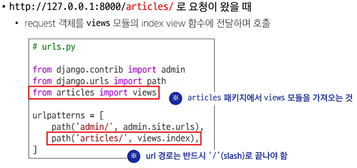

### Web Application
Web Application(Web service) 개발
- 인터넷을 통해 사용자에게 제공되는 소프트웨어 프로그램을 구축하는 과정
- 다양한 디바이스(모바일, 태블릿, PC등)에서 웹 브라우저를 통해 접근하고 사용할 수 있음

#### 클라이언트와 서버
클라이언트 - 서버 구조
- 클라이언트: 서비스를 요청하는 주체
  - 사용자의 웹 브라우저, 모바일 앱
- 서버: 클라이언트의 요청에 응답하는 주체
  - 웹 서버, 데이터베이스 서버

#### Frontend & Backend
Frontend
- 사용자가 인터페이스(UI)를 구성하고, 사용자가 애플리케이션과 상호작용할 수 있도록 함
  - HTML, CSS, JavaScript, 프론트엔드 프레임워크 등

Backend
- 서버 측에서 동작하며, 클라이언트의 요청에 대한 처리와 데이터베이스와의 상호작용 등을 담당
  - 서버언더(Pytuon, Java 등) 및 백엔드 프레임워크, 데이터베이스, API, 보안 등

### Framework
#### Web Framework
Web Framework: 웹 애플리케이션을 빠르게 개발할 수 있도록 도와주는 도구
- 개발에 필요한 기본 구조, 규칙, 라이브러리 등을 제공(로그인/로그아웃, 회원관리, 데이터베이스, 보안 등)

#### Django Framework
Django : Python 기반의 대표적인 웹 프레임워크

Django를 사용하는 이유
- 다양성 : Python 기반으로 웹, 모바일 앱 백엔드, API 서버 및 빅데이터 관리 등 광범위한 서비스 개발에 적합
- 확장성 : 대량의 데이터에 대해 빠르고 유연하게 확장할 수 있는 기능을 제공
- 보안 : 취약점으로부터 보호하는 보안 기능이 기본적으로 내장되어 있음
- 커뮤니티 지원 : 개발자를 위한 지원, 문서 및 업데이트를 제공하는 활성화 된 커뮤니티

### 가상 환경
가상 환경(Virtual Environment) : 하나의 컴퓨터 안에서 또 다른 '**독립된**' 파이썬 환경

#### 가상 환경 생성 및 활성화
가상 환경 생성 및 활성화 과정
1. 가상 환경 생성
```
python -m venv venv
// python -m venv : 가상 환경 생성
// venv: 가상 환경 이름
```
- 현재 디렉토리 안에 venv라는 폴더가 생성됨
- vennv 폴더 안에는 파이썬 실행 파일, 라이브러리 등을 담을 공간이 마련됨
- 임의의 이름으로 생성 가능하나 관례적으로 venv 이름을 사용

2. 가상 환경 활성화
```
source venv/Scripts/activate
```
- 활성화 후, 프롬프트 앞에 (venv)와 같이 표시된다면 성공
```Mac / Linux
source venv/bin/activate
```

3. 가상 환경 종료
```
deactivate
```
- 활성화한 상태에서 deactivate명령을 입력하면, 다시 Python Global 환경으로 돌아옴

#### 의존성 패키지
의존성(Dependencies) : 하나의 소프트웨어가 동작하기 위해 필요로 하는 다른 소프트웨어나 라이브러리

의존성 패키지 : 프로젝트가 의존하는 "개별 라이브러리"들을 가리키는 말
- 프로젝트가 실행되기 위해 꼭 필요한 각각의 패키지

1. 패키지 목록 확인
```
pip list
```
- 현재의 환경에 설치된 라이브러리 목록을 확인
- 갓 생성된 가상 환경은 별도의 패키지가 없음

2. 의존성 기록
```
pip freeze > requirments.txt
```
- pip freeze 명령어
  - 가상 환경에 설치된 모든 패키지를 버전과 함께 특정한 형식으로 출력
- 이를 requirments.txt라는 파일로 저장하면 나중에 동일한 환경을 재현할 때 유용
- 협업 시에도 팀원들이 똑같은 버전의 라이브러리를 설치하도록 공유 가능
- 다른 파일며으로도 가능하나 관례적으로 requirments.txt를 사용

의존성 리스트 예시
- requests 패키지 설치 후 목록을 보면 requests만 설티되는 것이 아니라 requests가 필요로 하는 의존성도 함께 설치

의존성 패키지 관리가 필요한 이유
- 패키지마다 버전이 다름
  - 버전이 다른 경우 함수명이나 동작이 달라질 수 있음
- 프로젝트가 커질수록 사용하는 패키지의 개수도 늘어나게 됨
  - 어떤 버전을 쓰고 있는지 기록 및 공유가 필수적
- 다른 PC나 팀원들이 같은 환경을 구성할 때, 의존성 리스트가 반드시 필요

#### 의존성 패기키 기반 설치
의존성 패기키 기반 설치
- requirments.txt를 활용하여 다른 환경(혹은 팀원의 PC)에서도 동일한 패키지 버전을 설치하는 방법
1. 가상 환경 준비
  - 새로운 가상 환경을 생성 및 활성화
```
python -m venv venv
source venv/Scripts/activate
```

2. requirments.txt로부터 패키지 설치
  - requirments.txt에 기록된 패키지 버전을 읽어와 같은 환경으로 설치
```
pip install -r requirments.txt
```

#### 가상 환경 주의사항
가상 환경 주의사항 및 권장사항
1. 가상 환경에 들어가고 나오는 것이 아니라 사용할 python환경을 on/off로 전환하는 개념
  - 가상 환경 활성화는 현재 터미널 환경에만 영향을 끼침
  - 새 터미널 창을 열면 다시 활성화해야 함

2. 프로젝트마다 별도의 가상 환경을 사용

3. 일반적으로 가상 환경 폴더 venv는 관련된 프로젝트와 동일한 경로에 위치시킴

4. 폴더 venv는 .gitignore파일에 작성되어 원격 저장소에 공유하지 않음
  - 저장소 크기를 줄여 효율적인 협업과 배포를 가능하게 하고
  - os별 차이점으로 인한 문제를 방지하기 위함
  - 대신 requirments.txt를 공유하여 각자의 가상 환경을 구성

요약
1. 가상 환경 생성()
2. 가상 환경 활성화()
3. 필요한 의존성 패키지 설치()
4. 현재 환경의 패키지 목록을 저장하여 의존성 관리()
5. 다른 컴퓨터나 팀원도 같은 환경이 필요하다면 동일한 라이브러리 설치()
6. 작업이 끝나면 가상환경 비활성화()

### Django 프로젝트
#### 프로젝트 생성 및 서버 실행
1. Django 설치
```
pip install django
```
  - 버전을 명시하지 않을 경우 최신버전 설치

2. 프로젝트 생성
```
django-admin startproject firstpjt .
```
  - 현재 디렉토리에 "firstpjt"라는 이름의 djago 프로젝트를 생성
  - .(현재 디렉토리)를 없이 사용하면 다른 디렉토리를 만들어서 안에 프로젝트를 생성

3. 서버 실행
```
python manage.py runserver
```
  - manage.py와 동일한 위치에서 명령어 진행

4. 서버 종료
  - ctrl + c

### Django Design Pattern
#### Design Pattern
디자인 패턴(Design Pattern) : 소프트웨어 설계에서 반복적으로 발생하는 문제에 대한, 검증되고 재사용 가능한 일반적인 해결책
- "애플리케이션의 구조는 이렇게 구성하자"라는 모범 답안 또는 관행

MVC 디자인 패턴
- 하나의 애플리케이션을 구조화하는 대표적인 구조적 디자인 패턴
- Model
  - 데이터 및 비즈니스 로직을 처리
- View
  - 사용자에게 보이는 화면을 담당
- Controller
  - 사용자의 입력을 받아 Model과 View를 제어
- 시각적 요소와 뒤에서 실행되는 로직을 서로 영향 없이, 독립적이고 쉽게 유지 보수할 수 있는 애플리케이션을 만들기 위함

MTV 디자인 패턴(Model, Template, View) : Django에서 애플리케이션을 구조화하는 디자인 패턴
- MVC 디자인 패턴과 동일(단순히 명칭을 달리 한 것)

#### 프로젝트와 앱
Django project
- 애플리케이션의 집합
  - DB 설정, URL 연결, 전체 앱 설정 등을 관리

Django application
- 독립적으로 작동하는 기능 단위 모듈
  - 각자 특정한 기능을 담당
  - 다른 앱들과 함께 하나의 프로젝트를 구성

1. 앱 생성
```
python manage.py startapp articles
```
- "article"라는 폴더와 내부에 여러 파일이 새로 생성됨
- 앱의 이름은 복수형으로 지정하는 것을 권장

2. 앱 등록
- project 폴더 안의 setting.py의 INSTALLED_APP 항목을 수정
  - INSTALLED_APP 리스트 안에 문자열로 작성(약속)
  - 사용자가 생성한 앱은 상단부터 작성하는 것을 권장, django의 내부 구동 순서 때문
- 반드시 앱을 생성한 후에 등록해야 함
  - 등록을 먼저 할 셩우, 생성을 위한 명령어 실행 중 아직 존재하지 않는 articles 앱을 찾으려다가 실패하기 때문

#### 프로젝트 및 앱 구조
프로젝트 구조
- settings.py
  - 프로젝트의 모든 설정을 관리
- urls.py
  - 요청 들어오는 URL에 따라 이에 해당하는 적절한 view를 연결
- __init__.py
  - 해당 폴더를 패키지로 인식하도록 설정하는 파일
- asgi.py
  - 비동기식 웹 서버와의 연결 관련 설정
- wsgi.py
  - 웹 서버와의 연결 관련 설정
- manage.py
  - Django프로젝트와 다양한 방법으로 상호작용하는 커맨드라인 유틸리티

앱 구조
- admin.py
  - 관리자용 페이지 설정
- models.py
  - DB와 관련된 Model을 정의
  - MTV 패턴의 M
- views.py
  - HTTP요청을 처리하고 해당 요청에 대한 응답을 반환
    - url, model, template과의 연동
  - MTV 패턴의 V
- apps.py
  - 앱의 정보가 작성된 곳
- tests.py
  - 프로젝트 테스트 코드를 작성하는 곳

### 요청과 응답
#### Django에서의 요청과 응답
사용자가 서버에 접속하는 과정
요청 -> urls.py -> views.py -> (models.py <-> views.py <-> templates) -> views.py -> 응답


1. URLs


2. Views


3. Templates


Django에서 templates을 인식하는 경로 규칙
기본경로 : app폴더/templates/
기본경로/articles/index.html

- Django는 이 지점까지 기본 경로로 인식
  - view함수에서 tmplate 경로 작성시 해당 지점 이후의 경로를 작성해야 함
```
# views.py
def index(request):
    return render(request, "articles/index.html")
```


데이터 흐름에 따른 코드 작성하기
- 사용자의 요청에서부터 데이터의 흐름은 URLs → Views → Template
- 코드의 작성도 마찬가지로 데이터의 흐름을 따라 작성할 것

### 참고
#### 가상 환경 생성 루틴
Django 프로젝트 생성 전 루틴
1. 가상 환경 생성
  - $ python -m venv venv
2. 가상 환경 활성화
  - $ source venv/Scripts/activate
3. Django 설치
  - pip install django
  - python3.9 이하인 경우 Django 4버전이 설치되니 주의
4. 패키지 목록 파일 생성
  - pip freeze > requirements.txt
  - 패키지 설치시마다 진행
5. .gitignore 파일 생성
  - 첫 add 전 진행
6. git 저장소 생성
  - git init
7. Django 프로젝트 생성

#### Django 관련
LTS(Long-Term Support)
- 프레임워크나 라이브러리 등의 소프트웨어에서 장기간 지원되는 안정적인 버전을 부를 때 사용
- 기업이나 대규모 프로젝트에서는 소프트웨어 업그레이드에 많은 비용과 시간이 필요하기 때문에 안정적이고 장기간 지원되는 버전이 필요


Django는 Fullstack framework
- 다른 전문적인 Frontend Framework에 비해서 Frontend 기능이 미비
- 엄밀히 말하자면 Fullstack영역에서의 Backend Framework 

#### Python 패키지 설치법
python 패키지 설치 시 버전 지정 방법
명령어 예시|기호|의미
---|---|---
pip install Somepakage|(없음)|최신 버전 설치(버전 지정 없음)
pip install Somepakage==10.4|==|특정 버전 정확히 설치
pip install Somepakage>=1.0.4|>=|최소 버전(1.0.4) 이상을 설치(새 버전도 허용)
pip install Somepakage~=1.0.4|~=|호환 버전 이상(1.0.4 이상) 다음 마이너 버전 미만(예:1.1.0)으로 설치(마이너 업데이트는 허용, 메이저 업데이트는 제한)

#### render 함수
render 함수
```
render(request, template_name, context)
```
- 주어진 템플릿을 주어진 컨텍스트 데이터와 결합하고 렌더링 된 텍스트와 함께 HttpResponse 응답 객체를 반환하는 함수

1. request
  - 응답을 생성하는 데 사용되는 요청 객체
2. template_name
  - 템플릿 이름의 경로
3. context
  - 템플릿에서 사용할 데이터(생략 가능)
  - 딕셔너리 타입으로 작성

#### MTV 디자인 패턴 정리
MTV 디자인 패턴 정리
- Model
  - 데이터와 관련된 로직을 관리
  - 응용프로그램의 데이터 구조를 정의하고 데이터베이스의 기록을 관리
- Template
  - 레이아웃과 화면을 처리
  - 화면상의 사용자 인터페이스 구조와 레이아웃을 정의
- View
  - Model & Template과 관련한 로직을 처리해서 응답을 반환
  - 클라이언트의 요청에 대해 처리를 분기하는 역할
- View 예시
  - 데이터가 필요하다면 Model에 접근해서 데이터를 가져오고,
  - 가져온 데이터를 Template으로 보내 화면을 구성하고,
  - 구성된 화면을 응답으로 만들어 클라이언트에게 반환


#### Trailing Comma
Trailing Comma 정의
- 후행 쉼표
- 리스트, 딕셔너리, 튜플 등의 자료구조에서 마지막 요소 뒤에 쉼표를 추가하는 것
- 문법적으로 아무런 영향을 주지 않음
- 일반적으로 선택사항
  - 단일 요소 튜플을 만들 때는 예외

Trailing Comma 사용 이유
- 새로운 요소를 추가하거나 순서를 변경할 때 편리
- 값의 목록, 인자, 또는 import 항목들이 시간이 지남에 따라 확장될 것으로 예상되는 경우에 주로 사용
- 여러 줄에 걸쳐 작성된 데이터 구조에서 유용하며, 코드의 가독성과 유지보수성을 향상시키는데 도움
- 일반적인 패턴은 
  - 각 값(등)을 별도의 줄에 배치
  - 항상 후행 쉼표를 추가한 뒤
  - 닫는 괄호 / 대괄호 / 중괄호를 다음 줄에 배치하는 것
- 닫는 구분 기호와 같은 줄에 후행 쉼표를 두는 것은 권장하지 않음

#### 프레임워크의 규칙 및 설계 철학
지금까지 등장한 Django의 규칙
1. urls.py에서 각 url 문자열 경로는 반드시 '/'로 끝남
2. views.py에서 모든 view 함수는 첫번째 인자로 요청 객체를 받음
  - 매개변수 이름은 반드시 request로 지정하기
3. Django는 특정 경로에 있는 template 파일만 읽어올 수 있음
  - 특정 결오: app폴더/templates

프레임워크의 규칙
- 프레임워크를 사용할 때는 일정한 규칙을 따라야 하며 이는 저마다의 설계 철학이나 목표를 반영하고 있음
  - 일관성 유지, 보안 강화, 유지보수성 향상, 최적화 등과 같은 이유
- 프레임워크는 개발자에게 도움을 주는 도구와 환경을 제공하기 위해 정해 놓은 것이며 우리는 이를 잘 활용하여, 특정 기능을 구현하는 방법을 표준화하고 개발 프로세스를 단순화할 수 있도록 해야함