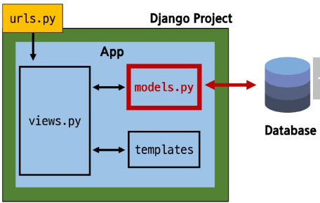

### Model
Model: 데이터베이스와 Python 클래스(객체)로 추상화된 형태로 상호작용
- Django의 강력한 기능: 데이터베이스에 대한 깊은 지식없이도 쉽게 데이터 관리 가능
- 유지보수 및 확장성 증대: 데이터베이스 변경 시에도 코드 수정 최소화, 재사용 가능한 데이터 모델을 통해 개발 효율성 향상

Model을 통한 DB(데이터베이스) 관리
- urls.py: 사용자 요청의 시작점
- views.py: 요청을 처리하고 models.py를 통해 데이터를 다룸
- models.py: 데이터베이스를 정의하고, 데이터베이스와 상호작용
- templates: views.py로부터 받은 데이터를 사용자에게 보여줌



#### Model class
Model class: DB의 테이블을 정의하고 데이터를 조작할 수 있는 기능들을 제공
- 작성한 모델 클래스는 최종적으로 DB에 테이블 구조를 만듦
- django.db.models 모듈의 Model이라는 부모 클래스를 상속받음
  - Model은 model에 관련된 모든 코드가 이미 작성되어 있는 class
    - 개발자는 가장 중요한 테이블 구조를 어떻게 설계할지에 대한 코드만 작성하도록 하기 위한 것(상속을 활용한 프레임워크의 기능 제공)
- 클래스 변수명
  - 테이블의 각 필드(열) 이름
- Model Field
  - 데이터베이스 테이블의 열(column)을 나타내는 중요한 구성 요소
  - 데이터의 유형과 제약 조건을 정의
### Model Field
Model Field: DB 테이블의 필드(열)정의, 데이터 타입 및 제약조건 명시
1. Field types(필드 유형)
  - 데이터베이스에 저장될 데이터의 종류를 정의
2. Field options(필드 옵션)
  - 필드의 동작과 제약 조건을 정의

#### Field types
Field types: 데이터베이스에 저장될 **데이터의 종류**를 정의(models 모듈의 클래스로 정의되어 있음)

CharField(): 제한된 길이의 문자열을 저장(필드의 최대 길이를 결정하는 max_length는 선택 옵션)

TextField(): 길이 제한이 없는 대용량 텍스트를 저장(무한대는 아니며 사용하는 시스템에 따라 달라짐)

주요 필드 유형
- 문자열 필드
  - CharField, TextField
- 숫자 필드
  - IntegerField, FloatField
- 날짜/시간 필드
  - DateField, TimeField, DateTimeField
- 파일 관련 필드
  - FileField, ImageField

#### Field options
Field options: 필드의 동작과 제약조건을 정의

제약 조건(constraint): 특정 규칙을 강제하기 위해 테이블의 열이나 행에 적용되는 규칙이나 제한사항

주요 필드 옵션
- null
  - 데이터베이스에서 NULL값을 허용할지 여부를 결정(기본값:False)
- blank
  - form에서 빈 값을 허용할지 여부를 결정(기본값:False)
- default
  - 필드의 기본값을 설정

### Migrations
Migrations: model클래스의 변경사항(필드 생성, 수정 삭제 등)을 DB에 최종 반영하는 방법

- 모델 정의부터 마이그레이션 파일 생성까지
  - models.py(스케치 설계도)를 바탕으로 migration파일(설계도)를 만드는 방법

```
python manage.py makemigrations
```

- 생성된 최종 설계도(migration 파일)을 DB에 반영하기

```
python manage.py migrate
```

#### 추가 Migrations
- 이미 기존 테이블이 존재하는 경우, 새 필드를 추가할 때 문제가 발생할 수 있음
  - 기존에 레코드가 있는 테이블에 새로운 필드를 추가하면 어떤 값으로 채울지 결정해야 함
  - Django의 makemigrations 실행 시 기본값 설정을 요구하는 프롬프트가 표시됨

### Admin site
#### 관리자 인터페이스
관리자 인터페이스: Django가 추가 설치 및 설정 없이 자동으로 제공하는 관리자 인터페이스
- Django 관리자 인터페이스는 추가 설정 없이 자동 생성되는 웹 기반 관리 도구입니다.
- 주요 기능: 데이터베이스 모델의 CRUD(생성, 읽기, 업데이트, 삭제) 작업을 간편하게 할 수 있습니다.
- 활용: 빠른 프로토타이핑, 비개발자 데이터 관리, 내부 시스템 구축에 이상적입니다.

1. Django admin 계정 생성
```
python manage.py createsuperuser
```
- 아이디
- 이메일(선택사항)
- 비밀번호
- 비밀번호 확인

2. DB에 생성된 admin 계정 확인

Admin site 모델 클래스 등록
- admin.py에 작성한 모델 클래스 등록해야만 admin site에서 확인 가능
```
admin.site.register(class)
```

### 참고
#### 데이터베이스 초기화
1. Migration 파일 삭제
  - __init__.py, migrations 폴더는 삭제 금지
2. db.sqlite3 파일 삭제

#### Migrations 관련
Migrations 기타 명령어
- showmigrations
  - migrations 파일들이 migrate 됐는지 여부를 확인하는 명령어
- sqlmigrate
  - 해당 migrations 파일이 SQL 언어(DB에서 사용하는 언어)로 어떻게 번역되어 DB에 전달되는지 확인하는 명령어
  - python manage.py sqlmigrate app_name migration_name

#### SQLite
SQLite: 데이터베이스 관리 시스템 중 하나이며 Django의 기본 데이터베이스로 사용됨
- 파일 기반: 데이터베이스가 하나의 파일로 저장되어, 설치/설정 없이 간편하게 복사/이동/백업 가능
- 가볍고 빠름: 별도 서버 없이 파일로 직접 데이터 처리. 소규모 앱이나 모바일 환경에 최적화
- 높은 호환성: 다양한 운영체제와 프로그래밍 언어에서 폭넓게 사용 가능

SQLite 주의사항
- db.sqlite3 파일은 git 등 버전 관리 시스템에서 관리하지 않는것이 원칙
  - 데이터가 변경될 때마다 파일 전체가 변경됨
- SQLite 파일은 로컬 컴퓨터에 저장된 데이터 기록
- .gitignore파일에 db.sqlite3츷 추가하여 git 버전 관리에서 제외해야 함
