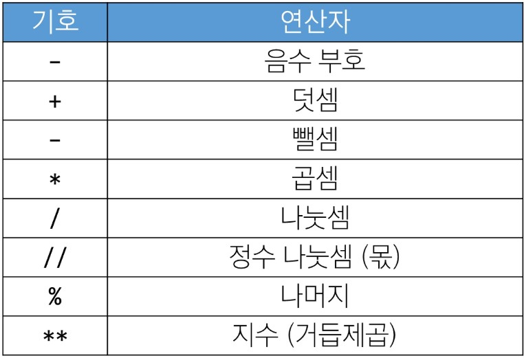
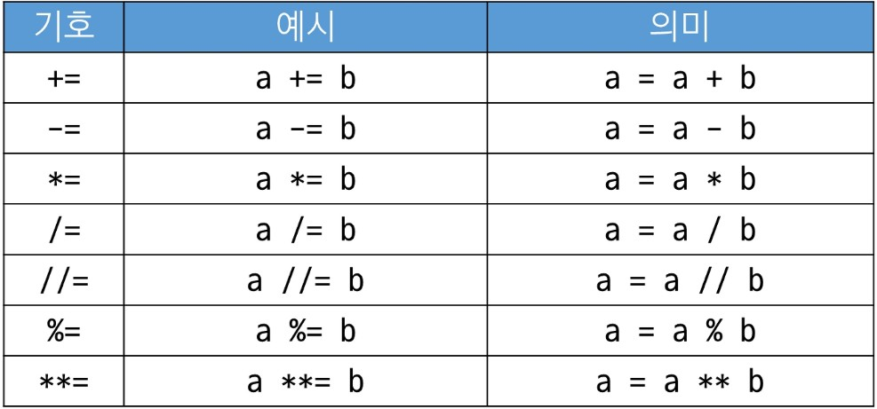
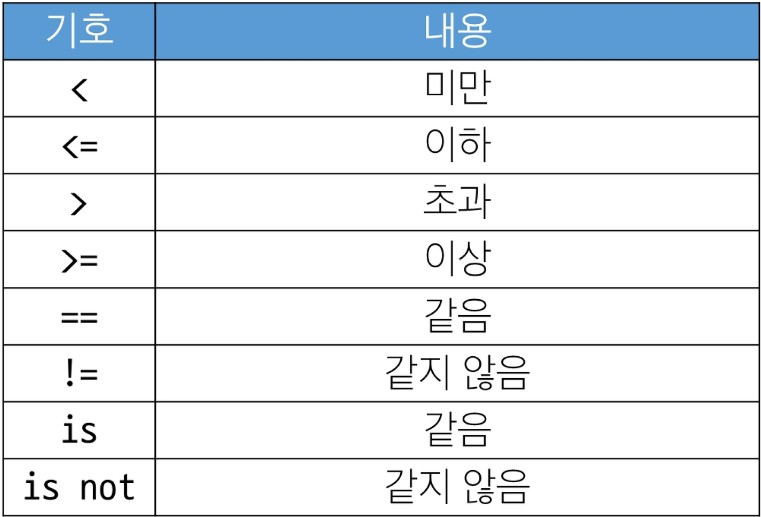

## 2025-07-22
### list : 여러 개의 값을 순서대로 저장하는, 변경 가능한 시퀀스 자료형
대괄호 안에 값들을 ,로 구분하여 저장하고 숫자, 문자열, 리스트등 모든 종류의 데이터 저장 가능
`list = [1, 2, 3, 'a', 'b', 'c', [1, 2, 'a', 'b']]`

시퀀스로서의 list
인덱싱, 슬라이싱, 길이 확인, 반복 등 공통 기능 사용 가능

중첩 리스트(nested list) : 다른 리스트를 값으로 가진 리스트

중첩 리스트 접근하기
```
my_list = [1, 2, 3, 'python', ['hello', 'world', '!!!']]
print(my_list[4][2]) # '!!!'
print(my_list[4][1][0]) # 'w'
```

리스트의 가변성 : 문자의 불변성과 반대되는 중요한 특성

```
my_list = [1, 2, 3, 4, 5]
my_list[1] = 'two' # index[1] 변경
print(my_list) # [1, 'two', 3, 4, 5]
```

```
my_list = [1, 2, 3, 4, 5]
my_list[2:4] = ['three', four']
print(my_list) # [1, 2, 'three', 'four', 5]
```


```
my_list_1 = [1, 2, 3, 4, 5]
my_list_2 = [1, 2, 3, 4, 5]

# my_list_1[2:4]삭제 후 그 자리에 'three', four, 'five'' 삽입
my_list_1[2:4] = ['three', four', 'five']
print(my_list_1) # [1, 2, 'three', 'four', 'five', 5]

# my_list_2[2:4]삭제 후 그 자리에 삽입하지 않음
my_list_2[2:4] = []
print(my_list_2) # [1, 2, 5]
```

### 튜플(tuple) : 여러 의 값을 순서대로 저장하는 변경 불가능한 시퀀스 자료형
주의>
소괄호 없이도 만들 수 있음
단일 요소 튜플을 만들때는 ,필요

```
my_tuple_1 = ()
my_tuple_2 = (1,)
my_tuple_3 = (1) # 정수 1, 튜플이 아님
my_tuple_4 = (1, 'a', 3, 'b', 5)
my_tuple_5 = 1, 'a', 3, 'b', 5
```
튜플이 불변 자료형인 이유 : 파이썬 내부 동작에 사용되는 자료형

### range : 연속된 정수 시퀀스를 생성하는 변경 불가능한 자료형
주로 반복문과 함께 사용

range(start, stop, step)
```
my_range_1 = range(5) # range(stop), 0에서 5전까지
my_range_2 = range(1, 10) # range(start, stop), 1에서 10전까지
my_range_3 = range(5, 0, -1) # range(start, stop, step), 5에서 0보다 큰값까지 -1

print(my_list_1) # range(0, 5)
print(my_list_2) # range(1, 10)
print(my_list_3) # range(5, 0, -1)

print(list(my_list_1)) # [0, 1, 2, 3, 4]
print(list(my_list_2)) # [1, 2, 3, 4, 5, 6, 7, 8, 9]
print(list(my_list_3)) # [5, 4, 3, 2, 1]
```

range 값의 규칙
stop값은 생성되는 시퀀스에 절대 포함되지 않음
증가/감소 값(step) 규칙
```
# step양수, 시작 값이 끝 값보다 작은 경우(정상)
print(list(range(1, 5))) # [1, 2, 3, 4]
# step양수, 시작 값이 끝 값보다 큰 경우
print(list(range(5, 1))) # []

# step음수, 시작 값이 끝 값보다 큰 경우(정상)
print(list(range(5, 1, -1))) [5, 4, 3, 2]
# step음수, 시작 값이 끝 값보다 작은 경우
print(list(range(1, 5, -1))) []
```

### 딕셔너리(dict) : key-value 쌍으로 이루어진 순서와 중복이 없는 변경 가능한 자료형
순서가 없다 : 인덱스가 없음 ->  key로 탐색 -> key는 중복 불가

```
my_dict_1 = {}
my_dict_2 = {'key' : 'value'} 
my_dict_3 = {'apple' : 12, 'list' : [1, 2, 3]}

print(my_dict_1) # {}
print(my_dict_2) # {'key' : 'value'}
print(my_dict_3) # {'apple' : 12, 'list' : [1, 2, 3]}
```

딕셔너리의 순서 : 파이썬에서 입력한 순서는 개발의 편의성을 위해 출력시 유지하지만 실제로는 순서가 없음

key의 규칙>
고유해야함, 중복될 수 없음
변경 불가능한 자료형만 사용가능

value의 규칙>
아무 값이나 자료형 사용 가능

딕셔너리 값 접근 방법
```
my_dict = {'name' : '홍길동', 'age' : 25}

print(my_dict['name']) # '홍길동'
print(my_dict['test']) # error메세지와 함께 프로그램 종료
```

딕셔너리 값 추가 및 변경 방법
```
my_dict = {'apple' : 12, 'list' : [1, 2, 3]}

# 추가
my_dict['banana'] = 50
print(my_dict) # {'apple' : 12, 'list' : [1, 2, 3], 'banana' : 50}

# 변경
my_dict['apple'] = 100
print(my_dict) # {'apple' : 100, 'list' : [1, 2, 3], 'banana' : 50}
```

세트(set) : 순서와 중복이 없는 변경 가능한 자료형,
수학에서의 집합과 동일한 연산 처리 가능

특징 : 중복을 허용하지 않음, 순서가 없음

```
my_set_1 = set() # 딕셔너리와 구별을 위해 빈 세트의 경우 소괄호
my_set_2 = {1, 2, 3}
my_set_3 = {1, 1, 1}

print(my_set_1) # set() 
print(my_set_2) # {1, 2, 3}
print(my_set_3) # {1}
```

세트의 집합 연산
```
my_set_1 = {1, 2, 3}
my_set_2 = {3, 6, 9}

# 합집합
print(my_set_1 | my_set_2) # {1, 2, 3, 6, 9}

#차집합
print(my_set_1 - my_set_2) # {1, 2}

#교집합
print(my_set_1 & my_set_2) # {3}
```

None : 파이썬에서 '값이 없음'을 표현하는 특별한 데이터 타입
```
a = 0  #  숫자 0
b = ""  # 빈 문자열
c = None  # 값이 할당되지 않음
```

Boolean : 참(True)과 거짓(False)  단 두가지 값만 가지는 데이터 타입

```
is_active = True
is_logged_in = False

print(is_active) # True
print(is_logged_in) # False
print(10 > 5) # True
print(10 == 5) # False
```

collection : 여러 개의 값을 하나로 묶어 관리하는 자료형을 통칭하는 말

| 컬렉션 명 | 변경 가능 여부 | 순서 존재 여부|
|:---|:---:|:---:|
| str | X | O |
| list | O | O |
| tuple | X | O |
| dict | O | X |
| set | O | X |

불변 : 변경불가, 안전성, 예측가능(종류 : str, tuple, range)
가변 : 변경가능, 유연성, 효율성(종류 : list, dict, set)
얕은 복사 깊은 복사 알아보기

형(Type) 변환 : 한 데이터 타입을 다른 데이터 타입으로 변환하는 과정
1.	암시적 형변환 : 파이썬이 연산 중에 자동으로 데이터 타입을 변환하는 것
#Boolean과 Numeric 사이에서만 가능
정수와 실수의 덧셈 ->  float 
불리언과 정수의 덧셈 -> int
불리언간의 덧셈 -> int
2.	명시적 형변환 : 개발자가 직접 지시
정수로 변환 : int("123") -> 123
실수로 변환 : float("3.14") -> 3.14
문자열로 변환 : str(100) -> "100"
리스트로 변환 : list("abc") -> ['a', 'b', 'c']
튜플로 변환 : tuple([1, 2]) -> (1, 2)
세트로 변환 : set([1, 2, 2]) -> {1, 2}

컬렉션 간 형변환 정리


### 연산자
산술 연산자



복합 연산자 : 연산과 할당이 함께 이뤄짐



```
x = 10
x -= 4
print(x) # 6

y = 7
y *= 2
print(y) # 14

z = 15
z /= 4
print(z) # 3.75

a = 20
a //= 3
print(a) # 6
```

비교 연산자 : 두 값을 비교하여 그 관계가 맞는지 틀리는지를 True 또는 False로 반환



|== 연산자 | is 연산자 |
|---|---|
| 값(데이터)이 같은지를 비교 | 객체(값, 주소) 자체가 같은지를 비교 |
| 동등성(equality) | 식별성(identity) |
```
# ==연산자
print(2 == 2.0) # True
print(2 != 2) # False
print('Hi' == 'hi') # False
print(1 == True) # True

# is 연산자
print(1 is True) # False
print(2 is 2.0) # False
```

is 대신 ==를 사용해야 하는 이유

두 객체의 값이 논리적으로 같은가? 를 주로 이용하므로

is 연산자를 사용하는 경우 : 싱글턴 객체를 비교할때 사용(None, True, False)

파이썬 전체에서 단 하나의 객체만 생성되어 재사용되는 싱글턴 객체 비교에 적합

```
x = None

#권장
if x is None:
	print('x는 None입니다')

#비권장
if x == None:
 	print('x는 None입니다')
```
```
x = True
y = True

print(x is y) # True
print(True is True) # True
print(False is False) # True
print(None is None) # True
```

논리 연산자 : 여러 개의 조건을 조합하거나, True/False 값을 반대로 뒤집을 때 사용(and, or, not 이 대표적)


```
# 비교 연산자와 함께 사용
num = 15
result = (num > 10) and (num % 2 == 0)
print(result) # False

name = 'Alice'
age =25
result = (name == 'Alice') or (age == 30)
print(result) # True
```

단축 평가 : 논리 연산에서 두 번째 피연산자를 평가하지 않고 결과를 결정하는 동작

파이썬에서 참/거짓으로 취급되는 값

거짓 : False, 숫자 0, 빈 문자열 "", 빈 리스트 [], None 등 '비어있거나 없다'는 느낌의 값들

참 : True 그리고 '거짓'이 아닌 모든 값;
	1, -10, "hello", [1, 2] 등 내용이 있는 값

단축평가 동작 정리
and : 하나라도 거짓이면 바로 거짓
or : 하나라도 참이면 바로 참


멤버십 연산자 : 특정 값이 시퀀스나 다른 컬렉션 안에 포함되어 있는지 확인하는 연산자


```
word = 'hello'
numbers = [1, 2, 3, 4, 5]

print('h' in word) # True
print('z' in word) # False
print('4' in numbers) # True
print('6' in numbers) # False
```


시퀀스형 연산자 : 시퀀스 자료형(문자열, 리스트, 튜플)에 특별한 의미로 사용되는 연산자


```
# Gildong Hong
print('Gildong' + ' Hong')
#hihihihihi
print('hi' * 5)

# [1, 2, 'a', 'b']
print([1, 2] + ['a', 'b'])
# [1, 2, 1, 2]
print([1, 2] * 2)
```

연산자 우선순위


### 참고
trailing comma : 컬렉션의 마지막 요소 뒤에 붙는 쉼표

일반적으로 선택사항

단 하나의 요소로 구성된 튜플의 경우 필수

기본규칙

각 요소를 별도의 줄에 작성

마지막 요소 뒤에 trailing comma 추가

닫는 괄호는 새로운 줄에 배치

```
# good 좋은 예시
items = [
	'item1',
	'item2',
]
my_func(
	'value1',
	'value2',
)
```
장점
1.	가독성 향상

	각 줄이 동일한 패턴을 가짐

	코드 리뷰가 용이함
2.	유지보수의 용이성

	항목 추가/제거가 간단

	실수로 인한 구문 오류 방지

