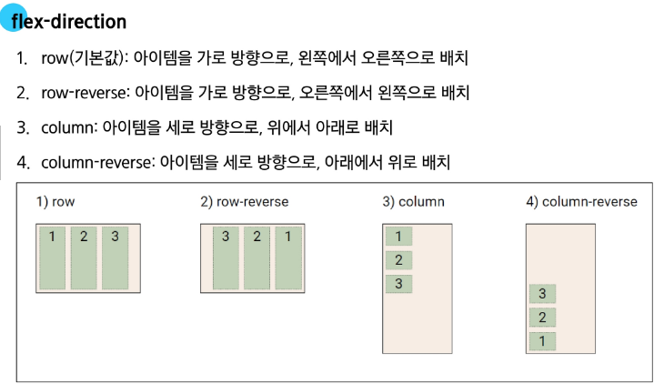

### CSS Box Model
#### display 속성(박스의 화면 배치 방식)
박스 타입
- 박스 타입에 따라 페이지에서의 배치 흐름 및 다른 박스와 관련하여 박스가 동작하는 방식이 달라짐

박스 타입 종류
1. Block 타입 : 블록 타입은 하나의 독립된 덩어리처럼 동작하는 요소
  - 항상 새로운 행으로 나뉨(한 줄 전체를 차지, 너비 100%)
  - width, height, margin, padding 속성을 모두 사용할 수 있음
  - width 속성을 지정하지 않으면 박스는 inline 방향으로 사용 가능한 공간을 모두 차지함
    - 상위 컨테이너 너비 100%로 채우는 것
  - 대표적인 block 타입 태그
    - h1~6, p, div, ul, li
  - block 타입의 대표 : div
    - 다른 HTML 요소들을 그룹화하여 레이아웃을 구성하거나 스타일링을 적용할 수 있음
    - 헤더, 푸터, 사이드바 등 웹 페이지의 다양한 섹션을 구조화하는 데 가장 많이 쓰이는 요소

2. Inline 타입 : 문장 안의 단어처럼 흐름에 따라 자연스럽게 배치되는 요소
  - 줄바꿈이 일어나지 않음(콘텐츠의 크기만큼만 영역을 차지)
  - width, height 속성을 사용할 수 없음
  - 수직 방향(상하)
    - padding, margin, border가 적용되지만, 다른 요소를 밀어낼 수는 없음
  - 수평 방향(좌우)
    - padding, margin, border가 적용되어 다른 요소를 밀어낼 수 있음
  - 대표적인 inline 타입 태그
    - a, img, span, strong
  - inline 타입의 대표 : span
    - 자체적으로 시각적 변화 없음
      - 스타일을 적용하기 전까지는 특별한 변화 없음
    - 텍스트 일부 조작
      - 문장 내 특정 단어나 구문에만 스타일을 적용할때 유용
    - 블록 요소처럼 줄바꿈을 일으키지 않으므로, 문서의 구조에 큰 변화를 주지 않음

#### Normal flow
Normal flow : 일반적인 흐름 또는 레이아웃을 변경하지 않은 경우 웹 페이지 요소가 배치되는 방식
- 블록은 한 줄 전체를, 인라인은 콘텐츠만큼의 공간만 차지하며 줄을 바꾸지 않음

#### 기타 display 속성
기타 display 속성
1. inline-block : inline과 block의 특징을 모두 가진 특별한 display 속성 값
  - Block과 Inline의 특징을 합친 것(줄바꿈 없이, 크기 지정 가능)
  - width 및 height 속성 사용 가능
  - padding, margin 및 border로 인해 다른 요소가 상자에서 밀려남
2. none : 요소를 화면에 표시하지 않고, 공간조차 부여되지 않음
3. flex

### CSS position
CSS Layout
- 각 요소의 위치와 크기를 조정하여 웹 페이지의 디자인을 결정하는 것
- 요솟들을 상하좌우로 정렬하고, 간격을 맞추고, 전테적인 페이지의 뼈대를 구성
- 핵심 속성 : display(block, inline, flex, grid, ...)

CSS Position
- 

Position 이동 방향
- 네 가지 방향 속성(상, 하, 좌, 우)을 이용해 요소의 위치를 조절할 수 있음
- 겹치는 요소의 쌓이는 순서를 조절할 수 있음

#### Position 유형
Position 유형
1. static
  - 요소를 Normal Flow에 따라 배치
  - top, right, bottom, left 속성이 적용되지 않음
  - 기본 값

2. relative
  - 요소를 Normal Flow에 따라 배치
  - 자신의 원래 위치(static)을 기준으로 이동
  - top, right, bottom, left 속성으로 위치를 조정
  - 다른 요소의 레이아웃에 영향을 주지 않음(요소가 차지하는 공간은 static일 때와 같음)

3. absolute
  - 요소를 Normal Flow에서 제거
  - 가장 가까운 relative 부모 요소를 기준으로 이동
    - 만족하는 부모 요소가 없다면 body 태그를 기준으로
  - top, right, bottom, left 속성으로 위치를 조정
  - 문서에서 요소가 차지하는 공간이 없어짐

4. fixed
  - 요소를 Normal Flow에서 제거
  - 현재 화면영역(viewport)을 기준으로 이동
  - 스크롤해도 항상 같은 위치에 유지됨
  - top, right, bottom, left 속성으로 위치를 조정
  - 문서에서 요소가 차지하는 공간이 없어짐

5. sticky
  - relative와 fixed의 특성을 결합한 속성
  - 스크롤 위치가 임계점에 도달하기 전에는 relative처럼 동작
  - 스크롤 위치가 임계점에 도달하면 fixed처럼 화면에 고정
  - 다음 sticky 요소가 나오면 이전 sticky 요소의 자리를 대체
    - 이전 sticky 요소와 다음 sticky 요소의 위치가 겹치게 되기 때문

#### z-index
z-index : 요소의 쌓임 순서를 정의하는 속성
- 정수의 값을 사용해 Z축 순서를 지정
- 값이 클수록 요소가 위에 쌓이게 됨
- static이 아닌 요소에만 적용됨
- 기본값은 auto로 부모 요소의 z-index 값에 영향을 받음
- 같은 부모 내에서만 z-index 값을 비교하고, 값이 같으면 HTML 문서 순서대로 쌓임
- 부모의 z-index가 낮으면 자식의 z-index가 아무리 높아도 부모보다 위로 올라갈 수 없음
- position 속성이 static(기본값)이 아닌 요소에만 z-index가 적용됨
- 음수 z-index 값은 요소를 부모 요소의 뒤(배경)로 보낼 때 사용할 수 있음

### CSS Flexbox
박스 표시(Display) 타입
1. Outer display 타입
  - block 타입
  - inline 타입

2. Inner display 타입
  - 박스 내부의 요소들이 어떻게 배치될지를 결정
  - CSS Flexbox(속성: flex)

CSS Flexbox : 요소를 행과 열 형태로 배치하는 1차원 레이아웃 방식 → 공간 배열 & 정렬

#### Flexbox 구성 요소
Flexbox 구성 요소
- main axis
  - flex item들이 배치되는 기본 축
  - main start에서 시작하여 main end 방향으로 배치(기본 값)
- cross axis
  - main axis에 수직인 축
  - cross start에서 시작하여 cross end 방향으로 배치(기본 값)
- flex container
  - display : flex; 혹은 display : inline-flex;가 설정된 부모 요소
  - 이 컨테이너의 1차 자식 요소들이 Flex Item이 됨
  - flexbox 속성 값들을 사용하여 자식 요소 Flex Item들을 배치하는 주체
- flex item
  - flex container 내부에 레이아웃 되는 항목
  - 이후 배우는 내용을 이용해 자유로운 순서 변경 및 정렬 가능

#### Flexbox 속성
Flexbox 속성 목록
- Flexbox Container 관련 속성
  - display
  - flex-direction
  - flex-wrap
  - justify-content
  - align-items
  - align-content

- Flex Item 관련 속성
  - align-self
  - flex-grow
  - flex-basis
  - order

1. Flex Container 지정
  - display 속성을 flex로 설정하면, Flex Container로 지정됨
  - flex item은 기본적으로 행(주 축의 기본값인 가로 방향)으로 나열
  - flex item은 주 축의 시작 선에서 시작
  - flex item은 교차 축의 크기를 채우기 위해 늘어남

2. flex-direction
  - flex item이 나열되는 방향을 지정
  - 속성
    - row(기본 값): 아이템을 가로 방향으로, 왼쪽에서 오른쪽으로 배치
    - column: 아이템을 세로 방향으로, 위에서 아래로 배치
    - "-reverse"로 지정하면 flex item 배치의 시작 선과 끝 선이 서로 바뀜

3. flex-wrap
  - flex item 목록이 flex container의 한 행에 들어가지 않을 경우, 다른 행에 배치할지 여부 설정
  - 속성
    - nowrap(기본 값): 줄 바꿈을 하지 않음
    - wrap: 여러 줄에 걸쳐 배치될 수 있게 설정

4. justify-ci=ontent
  - 주 축을 따라 flex item들을 정렬하고 간격을 조정
  - 속성
    - flex-start(기본 값): 주 축의 시작점으로 정렬
    - center: 주 축의 중앙으로 정렬
    - flex-end: 주 축의 끝점으로 정렬

5. align-content
  - 컨테이너에 여러 줄의 flex item이 있을 때, 그 줄들 사이의 공간을 어떻게 분배할지 지정
    - flex-wrap이 wrap 또는 wrap-reverse로 설정된 여러 행에만 적용됨
    - flex item이 두 줄 이상일 때만 의미가 있음(flex-wrap이 nowrap으로 설정된 경우)
  - 속성
    - stretch(기본 값): 여러 줄을 교차 축에 맞게 늘려 빈 공간을 채움
    - center: 여러 줄을 교차 축의 중앙에 맞춰 정렬
    - flex-start: 여러 줄을 교차 축의 시작점(보통 위쪽)에 맞춰 정렬
    - flex-end: 여러 줄을 교차 축의 끝점(보통 아래쪽)에 맞춰 정렬

6. align-items
  - 컨테이너 안에 있는 flex item 들의 교차 축 정렬 방법을 지정
  - 속성
    - stretch(기본 값): 아이템을 교차 축 높이를 꽉 채우도록 늘어남
    - center: 아이템을 교차 축의 중앙에 맞춰 정렬
    - flex-start: 아이템을 교차 축의 시작점(가로 방향일 경우 위쪽)에 맞춰 정렬
    - flex-end: 아이템을 교차 축의 끝점(가로 방향일 경우 아래쪽)에 맞춰 정렬

7. align-self
  - 컨테이너 안에 있는 flex item들을 교차 축을 따라 개별적으로 정렬
  - 속성
    - auto(기본 값): 부모 컨테이너의 align-items 속성 값을 상속
    - stretch: 해당 아이템만 교차 축 방향으로 늘어나 컨테이너를 꽉 채우도록 정렬
    - center: 해당 아이템만 교차 축의 중앙에 정렬
    - flex-start: 해당 아이템만 교차 축의 시작점(가로 방향일 경우 위쪽)에 정렬
    - flex-end: 해당 아이템만 교차 축의 끝점(가로 방향일 경우 아래쪽)에 정렬

8. flex-grow
  - 남는 행 여백을 비율에 따라 각 flex item에 분배
  - flex item이 컨테이너 내에서 확장하는 비율을 지정
  - 남는 여백을 각 flex item의 비율 만큼 추가

9. flex-basis
  - flex item의 초기 크기 값을 지정
  - flex-basis와 wifth값을 동시에 적용한 경우 flex-basis가 우선
목적에 따른 속성 분류
- 배치(flex-direction, flex-wrap)
- 공간 분배(justify-content, align-content)
- 정렬(align-items, align-self)

속성 쉽게 이해하는 방법
- justify : 주 축
- align : 교차 축

#### Flex-wrap 응용

### 참고
#### 마진 상쇄
Margin collapsing(마진 상쇄)
- 두 block 타입 요소의 margin top과 bottom이 만나 더 큰 margin으로 결합되는 현상(10 + 30 -> 30)

#### 박스 타입 별 수평 정렬
Block 요소의 수평 정렬
- margin: auto 사용
- 블록의 너비를 지정하고 좌우 마진을 auto로 설정

Inline 요소의 수평 정렬
- text-align 사용
- 부모 요소에 적용

Inline-block 요소의 수평 정렬
- text-align 사용
- 부모 요소에 적용

#### Flexbox Shorthand
shorthand: "flex-flow"
- flex-direction과 flex-wrap 속성을 한 번에 지정할 수 있는 단축 속성

shorthand: "flex"
- flex-grow, flex-shrink, flex-basis 속성을 한 번에 설정할 수 있는 단축 속성(기본 값으로는 1, 1, 0%로 설정)

#### Flexbox 속성 정리

