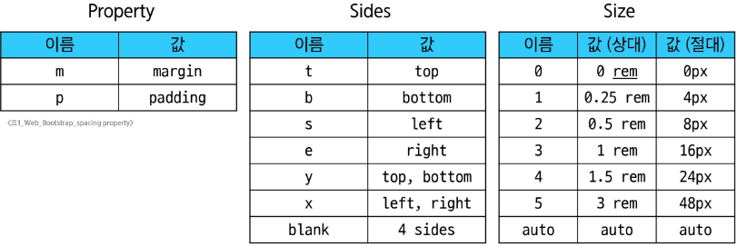
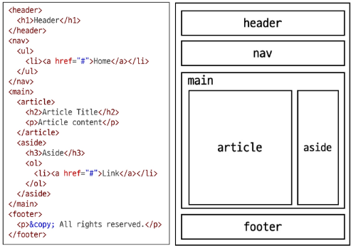

### Bootstrap
Bootstrap : CSS 프론트엔드 프레임워크 (ToolKit)
- 미리 만들어진 다양한 디자인 요소들을 제공하여 웹 사이트를 빠르고 쉽게 개발할 수 있도록 함

CDN
- 서버와 사용자 사이의 물리적인 거리를 줄여 콘텐츠 로딩에 소요되는 시간을 최소화
  - 웹 페이지 로드 속도를 높임
- 지리적으로 사용자와 가까운 CDN 서버에 콘텐츠를 저장해서 사용자에게 전달

#### Bootstrap 사용 가이드
Bootstrap 기본 사용법
- Bootstrap에는 특정한 규칙이 있는 클래스 이름으로 스타일 및 레이아웃이 미리 작성되어 있음
  - spacing을 표현하는 방법
    - property: margin 또는 padding
    - sides: 방향 (top, left, x, y 등)
    - size: spacing의 상대적 너비

### Reset CSS
Reset CSS : 모든 HTML 요소 스타일을 일관된 기준으로 재설정하는 간결하고 압축된 규칙 시트

Reset CSS 사용 배경
- 모든 브라우저는 각자의 'user agent stylesheet'를 가지고 있음
  - 웹사이트를 보다 읽기 편하게 하기 위해
- 문제는 이 설정이 브라우저마다 상이하다는 것
- 모든 브라우저에서 웹사이트를 동일하게 보이게 만들어야 하는 개발자에겐 매우 골치 아픈 일

User-agent stylesheets
- 모든 문서에 기본 스타일을 제공하는 기본 스타일 시트

Nomalize CSS
- Reset CSS 방법 중 대표적인 방법
- 웹 표준 기준으로 브라우저 중 하나가 불일치 한다면 차이가 있는 브라우저를 수정하는 방법
  - 경우에 따라 IE 또는 EDGE 브라우저는 표준에 따라 수정할 수 없는 경우도 있는데, 이 경우 IE 또는 EDGE의 스타일을 나머지 브라우저에 적용시킴

### Bootstrap 활용
#### Typography
Typography
- 제목, 본문 텍스트, 목록 등

Display headings
- 기존 Heading보다 더 눈에 띄는 제목이 필요할 경우
  - 더 크고 약간 다른 스타일

Inline text elements
- HTML inline 요소에 대한 스타일

List
- HTML list 요소에 대한 스타일

#### Colors
Bootstrap Color System
- Bootstrap이 지정하고 제공하는 색상 시스템
- 일관성 있는 의미론적 관점의 색상을 적용할 수 있게 해 줌
  - 'blue' 대신 'primary', 'red' 대신 'danger' 등

Colors
- Text, Border, Background

#### Component
Bootstrap Component : Bootstrap에서 제공하는 UI 관련 요소
- 버튼, 네비게이션 바, 카드, 폼, 드랍다운 등

Component
- 일관된 디자인을 제공하여 웹 사이트의 구성 요소를 구축하는데 유용하게 활용

대표 컴포넌트 사용해보기
- Alerts
- Badges
- Cards
- Navbar

### Semantic Web
Semantic Web : 웹 데이터를 의미론적으로 구조화된 형태로 표현하는 방식

#### Semantic in HTML
HTML 요소가 의미를 가진다는 것
- 외형보다는 요소 자체의 의미에 집중하는 것

HTML Semantic Element : 기본적인 모양과 기능 이외의 의미를 가지는 HTML 요소

HTML Semantic Element 예시
- header
  - 소개 및 탐색에 도움을 주는 콘텐츠
- nav
  - 현재 페이지 내, 또는 다른 페이지로의 링크를 보여주는 구획
- main
  - 문서의 주요 콘텐츠
- article
  - 독립적으로 구분해 배포하거나 될 수 있는 구성의 콘텐츠 구획
- section
  - 문서의 독립적인 구획
  - 더 적합한 요소가 없을 때 사용
- aside
  - 문서의 주요 내용과 간접적으로만 연관된 부분
- footer
  - 가장 가까운 조상 구획(main, article 등)의 작성자, 저작권 정보, 관련 문서

#### Semantic in CSS
CSS 방법론 : CSS를 효율적이고 유지 보수가 용이하게 작성하기 위한 일련의 가이드라인

OOCSS(Object Oriented CSS) : 객체 지향적 접근법을 적용하여 CSS를 구성하는 방법론
1. 구조와 스킨을 분리
  - 구조와 스킨을 분리함으로써 가능성을 높임
2. 컨테이너와 콘텐츠를 분리
  - 객체에 직접 적용하는 대신 객체를 둘러싸는 컨테이너에 스타일을 적용
  - 스타일을 정의할 때 위치에 의존적인 스타일을 사용하지 않도록 함
  - 콘텐츠를 다른 컨테이너로 이동시키거나 재배치할 때 스타일이 깨지는 것을 방지

### 참고
#### Bootstrap을 사용하는 이유
- 가장 많이 사용되는 CSS 프레임 워크
- 사전에 디자인된 다양한 컴포넌트 및 기능
  - 빠른 개발과 유지보수
- 손쉬운 반응형 웹 디자인 구현
- 커스터마이징(customizing)이 용이
- 크로스 브라우징(cross browsing) 지원
  - 모든 주요 브라우저에서 작동하도록 설계되어 있음

#### CDN 없이 사용하기
1. Bootstrap 코드 파일 다운로드
2. bootstrap.css와 bootstrap.bundle.js만 선택
3. CSS 파일은 HTML head 태그에 가져와서 사용
4. JS 파일은 HTML body 태그에 가져와서 사용

#### 의미론적 마크업
의미론적인 마크업이 필요한 이유
- 검색엔진 최적화(SEO)
  - 검색 엔진이 해당 웹 사이트를 분석하기 쉽게 만들어 검색 순위에 영향을 줌
- 웹 접근성(Web Accessibility)
  - 웹 사이트, 도구, 기술이 고령자나 장애를 가진 사용자들이 사용할 수 있도록 설계 및 개발하는 것